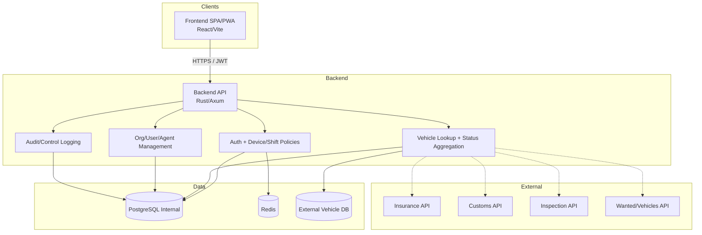
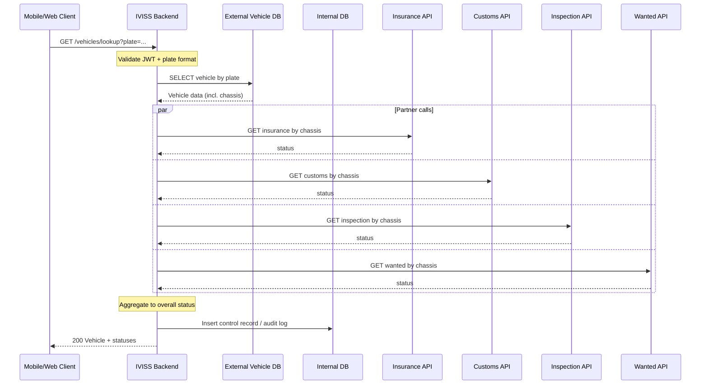
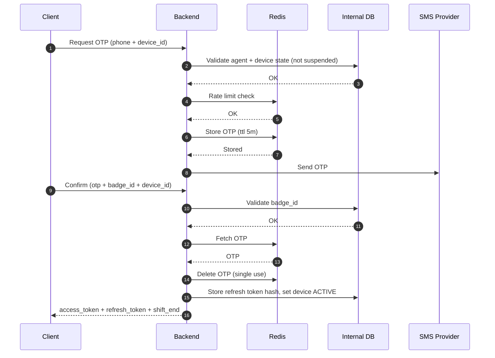
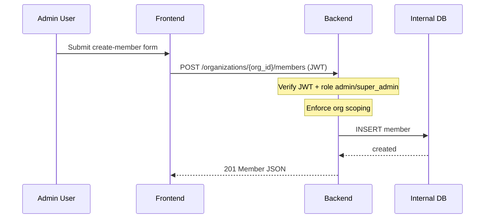
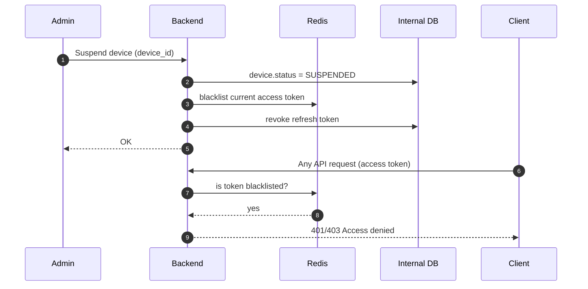
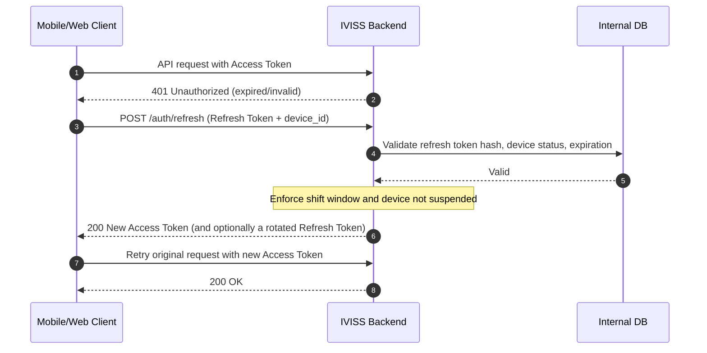
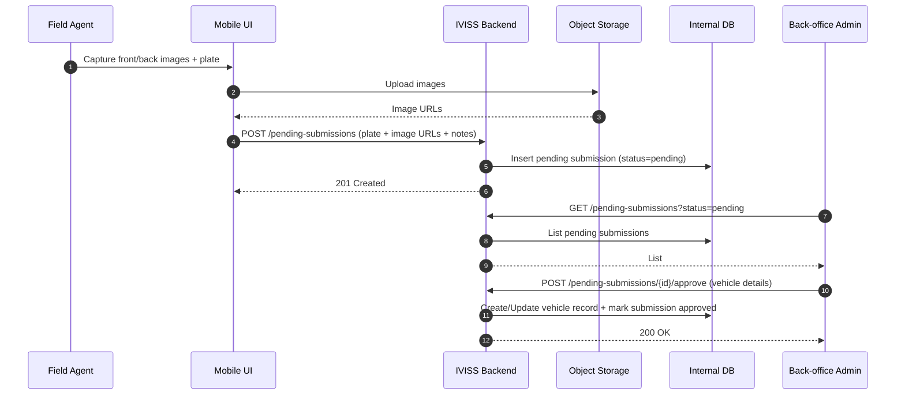
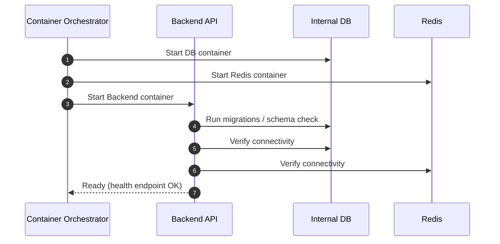
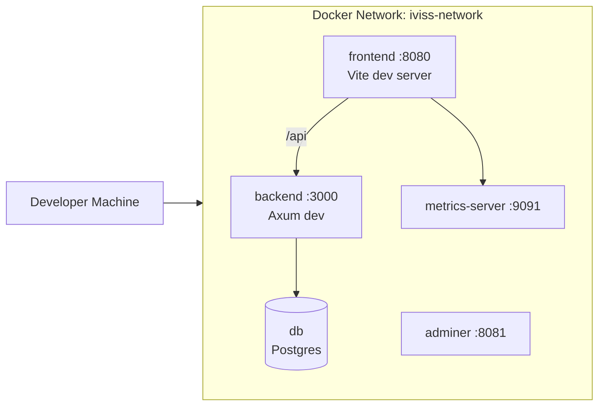
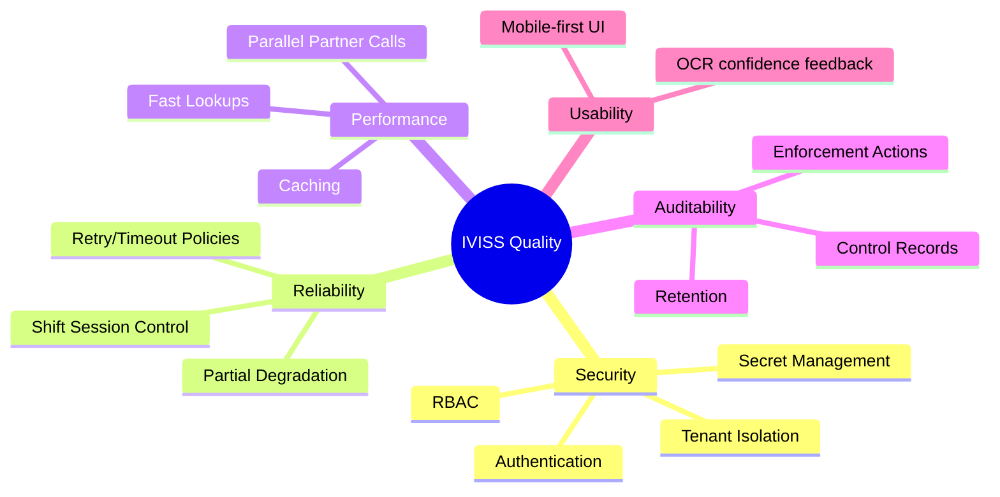

# IVISS — arc42 Architecture Documentation

**System**: IVISS (Integrated / Intelligent Vehicle Inspection and Surveillance System)

**Scope**: Backend (Rust/Axum), Web Frontend (React/Vite), operational infrastructure (Docker Compose; production on AWS Lightsail), and integrations (external vehicle registry DB + partner status APIs).

**Status**: Architecture documentation.

---

## 1. Introduction and Goals

### 1.1 Requirements Overview

IVISS is a multi-tenant platform for government agencies performing roadside vehicle inspections.

Core capabilities:

- Identify vehicles by license plate via:
  - Manual entry
  - Photo-based OCR
  - Continuous/live scan OCR
- Retrieve registration/vehicle information from an **external national vehicle registry database**.
- Verify vehicle legal/compliance status via **partner APIs** (e.g., insurance, customs, technical inspection, wanted/stolen).
- Record an auditable history of roadside controls and enforcement actions.
- Provide a back-office web application for admins/supervisors to manage:
  - Organizations (multi-tenancy)
  - Users and roles (RBAC)
  - Agents/devices
  - Review/processing of pending “gray card” submissions
  - Reporting and statistics

Primary business workflows:

- **Roadside control**: identify a plate, fetch registry data, evaluate compliance statuses, present results, store a control record.
- **Enforcement**: create one or more actions linked to a control (citation/impound/flag/warning/release).
- **Fallback registration**: if the vehicle is not found in the registry, capture gray-card evidence and create a pending submission for back-office review.
- **Administration**: manage organizations, users, agents/devices, suspend devices, and view dashboards/reports.

### 1.2 Quality Goals

Top quality goals that drive the architecture:

1. **Security & data isolation (multi-tenant + RBAC)**
   - Prevent cross-organization data leaks.
   - Strong authentication and session controls for agents/devices.
2. **Availability & operational resilience**
   - Field operations depend on the system during shifts; degraded modes (partial partner API failures) must still work.
3. **Performance & responsiveness**
   - Roadside checks should return quickly; partner API calls must be parallelized and time-bounded.
4. **Auditability & traceability**
   - Every control must be logged for accountability and legal evidence.
5. **Maintainability & evolvability**
   - Clear modular boundaries (handlers/services/db/DTOs) and documented decisions.

Measurable targets (to be confirmed with stakeholders):

- **Lookup latency**: typical vehicle lookup completes within a few seconds under normal connectivity.
- **Partner time budget**: each partner status check uses a strict timeout; timeouts do not fail the full lookup.
- **OTP robustness**: OTPs are short-lived and single-use; rate limits prevent abuse.
- **Tenant isolation**: all tenant-scoped resources are inaccessible across organizations.
- **Audit completeness**: control records must include who/when/where, the identification mode, and the resulting statuses.

### 1.3 Stakeholders

| Stakeholder | Expectations | Typical concerns |
| --- | --- | --- |
| **Field Agents** (Android / mobile UI users) | Fast vehicle lookup; clear status display; reliable shift login; minimal manual steps | Poor network; expired sessions; usability in the field |
| **Organization Admins** | Manage members/agents; view controls; suspend devices; enforce RBAC | Authorization bugs; “who did what” traceability |
| **Super Admin / Central Authority** | Cross-org oversight; onboarding agencies; audit access | Tenant boundaries; legal compliance |
| **Monitoring Operators** | Dashboards, statistics, trend analysis | Data quality; reporting accuracy |
| **Partner organizations** (Insurance/Customs/Inspection/Wanted APIs) | Controlled rate; secure integrations; correct identification keys | Rate limits; API key handling; request bursts |
| **Infrastructure / DevOps** | Repeatable deployment; secure secrets; observability | Single host capacity; certificate renewal; incident response |
| **Software Developers** | Clear module boundaries; testable services; stable contracts (OpenAPI) | Drift between docs and code; missing ADRs |

---

## 2. Constraints

### 2.1 Technical constraints

- **External registry database** exists and is queried by IVISS (read-only in many scenarios). Historically referenced as PostgreSQL 9.4 in requirements; current project uses Postgres containers and supports an `EXTERNAL_DATABASE_URL`.
- **Authentication tokens**:
  - **Access token**: JWT signed with **RS256**, short-lived.
  - **Refresh token**: long-lived opaque string; stored server-side hashed (SHA-256).
- **Shift policy**: daily agent access is bounded by `SHIFT_START_HOUR` and `SHIFT_END_HOUR` configuration.
- **Deployment baseline**:
  - Local/dev and production-like environments run via **Docker Compose**.
  - Production described as a “Lean Hybrid” stack on **AWS Lightsail**, single instance (Ubuntu 22.04).

Operational constraints:

- **Intermittent connectivity**: field usage must tolerate unstable mobile data.
- **External dependency variance**: external DB and partner APIs may have variable latency or partial outages.
- **Clock sensitivity**: shift boundaries and token expiration require consistent time handling.

### 2.2 Organizational/process constraints

- Stakeholders include multiple agencies with strict isolation requirements.
- Operational access 24/7 is expected for back-office; field operations have daily shifts.
- CI/CD uses GitHub Actions and GHCR images for production-like deployment.

### 2.3 Regulatory/compliance constraints

- Controls and enforcement actions must remain auditable.
- Sensitive data (user identities, device identifiers, potentially vehicle/owner info) must be protected in transit and at rest.

Data governance expectations:

- **Retention**: control history retention must match the governing legal framework (years rather than days).
- **Evidence integrity**: images and action logs must be tamper-resistant at the process level (access controls, audit logs, and restricted deletion).

---

## 3. Context and Scope

### 3.1 Business Context

IVISS is positioned between:

- Field and back-office users
- National vehicle registry data
- Partner compliance services

```mermaid
graph LR
  subgraph Users
    Agent[Field Agent]
    Admin[Org Admin / Supervisor]
  end

  subgraph IVISS[IVISS System]
    FE[Web Frontend (PWA/SPA)]
    BE[Backend API (Rust/Axum)]
    DB[(Internal DB)]
  end

  ExtDB[(External Vehicle Registry DB)]
  PartnerAPIs[Partner Status APIs]

  Agent -->|Search / Scan / Control logging| FE
  Admin -->|User/Org mgmt, dashboards| FE
  FE -->|HTTPS / JWT| BE
  BE --> DB
  BE -->|Vehicle lookup| ExtDB
  BE -->|Status checks| PartnerAPIs
```

Primary responsibilities:

- **Frontend**
  - Provides mobile-first and back-office UI flows.
  - Handles OCR capture and client-side plate normalization.
  - Manages session state (access/refresh tokens) and calls backend endpoints.
- **Backend API**
  - Authentication and device lifecycle (activation, suspension, shift policy enforcement).
  - Vehicle lookup orchestration (external DB lookup + partner checks + aggregation).
  - Admin operations (tenant/user/agent management).
  - Audit and reporting queries.
- **Internal DB**
  - System-of-record for IVISS-owned entities and control history.
- **Redis**
  - Short-lived operational state: OTPs, rate limits, and token blacklists.

### 3.2 Technical Context (External Interfaces)

- **Clients**:
  - Web frontend (React SPA/PWA) for mobile-oriented and back-office UI.
  - (Optional) Native Android app.
- **Backend API**:
  - REST endpoints; an OpenAPI specification is maintained for the API surface.
  - Protected endpoints require `Authorization: Bearer <access_token>`.
- **Datastores**:
  - Internal PostgreSQL: IVISS-owned data.
  - External PostgreSQL: national vehicle registry.
  - Redis: used for OTP/rate limits/token blacklist in the daily login concept.
- **Operational tooling**:
  - Prometheus + Grafana + metrics server for frontend monitoring.

External interfaces (conceptual):

- **External Vehicle Registry DB**
  - Purpose: authoritative registry data for plate/VIN and registration metadata.
  - Access pattern: read-only queries by plate and/or chassis/VIN.
- **Partner APIs**
  - Purpose: legal/compliance signals (insurance, inspection, customs, wanted/stolen).
  - Access pattern: HTTPS requests keyed by chassis/VIN (and sometimes plate).
  - Failure policy: strict timeouts; partial results allowed.

---

## 4. Solution Strategy

### 4.1 Architectural principles

- **API-first**: OpenAPI specification is generated/exposed to align FE/BE.
- **Separation of concerns**:
  - Handlers (HTTP) delegate to services.
  - Services own business rules and integration orchestration.
  - DB layer (SQLx) encapsulates persistence.
- **Multi-tenancy as a first-class concept**:
  - Organization scoping applied to core data reads/writes.
  - RBAC enforces user role constraints.
- **Resilient integrations**:
  - Partner API calls are executed in parallel and should be time-limited.
  - Partial failures result in “unknown/unavailable” statuses instead of full request failure.
- **Secure sessions**:
  - Short access tokens + server-stored refresh tokens.
  - Device status management (INACTIVE/ACTIVE/SUSPENDED) to quickly block compromised devices.

Additional strategy points:

- **Validation at boundaries**: plate formats, request payloads, and role permissions are validated at the API boundary.
- **Defensive integration**: partner calls are isolated (timeouts, error normalization, and partial aggregation).
- **Audit by default**: every lookup/control has an audit trail; enforcement actions are always linked to a control record.

### 4.2 Core technology choices

- **Backend**: Rust + Axum + Tokio + SQLx.
- **Frontend**: React + TypeScript + Vite + Tailwind + shadcn/ui.
- **Infra**: Docker Compose (dev/prod-like), Nginx for frontend reverse proxy, AWS Lightsail in production.

Key design trade-offs:

- **Single-instance deployment** simplifies operations but limits horizontal scaling and increases blast radius.
- **Stateless access tokens** reduce DB load; refresh tokens allow session continuity with revocation.
- **Parallel partner calls** reduce total lookup latency at the cost of more concurrent outbound requests.

---

## 5. Building Block View

### 5.1 Level 1: System Overview (Whitebox)



### 5.2 Level 2: Backend (Rust) decomposition

Backend decomposition:

- **Entry points**
  - `main.rs`: application bootstrap, server start.
  - `routes.rs`: route definitions.
- **HTTP layer**
  - `handlers/`: request handlers grouped by domain (e.g., `auth.rs`, `users.rs`, etc.).
  - `middleware/`: auth extractor and other middleware.
- **Business layer**
  - `services/`: JWT service, external integrations, domain services.
  - `app_cache.rs`: in-memory caching.
- **Data layer**
  - `db/`, `queries/`: SQLx queries and DB connections.
  - `models/`, `dto/`: persistence models and API DTOs.
- **Shared utilities**
  - `errors.rs`, `utils/`, `config.rs`.

Backend logical subsystems (technology-agnostic view):

- **Auth & Session subsystem**
  - OTP issuance and verification.
  - Access token issuance and verification.
  - Refresh token storage, verification, revocation/rotation policy.
  - Device state enforcement and shift boundary enforcement.
- **Vehicle Lookup subsystem**
  - Plate normalization and validation.
  - Registry lookup (external DB).
  - Partner status checks (parallel orchestration, timeouts, normalization).
  - Result aggregation into an overall status.
- **Control & Enforcement subsystem**
  - Control record creation for each check.
  - Action creation linked to a control record.
  - Evidence handling (image metadata, if applicable).
- **Administration subsystem**
  - Organization hierarchy and membership.
  - RBAC enforcement.
  - Device suspension/restore.
- **Reporting subsystem**
  - Dashboard queries, filters, exports.

Typical REST resources (illustrative, not exhaustive):

- `POST /auth/request-otp`
- `POST /auth/confirm-otp`
- `POST /auth/refresh`
- `POST /auth/logout`
- `GET /vehicles/lookup?plate=...`
- `POST /controls` (create control record)
- `POST /controls/{control_id}/actions`
- `GET /controls?start_date=&end_date=&agent_id=&status=&plate=`
- `POST /organizations`
- `POST /organizations/{org_id}/members`
- `POST /devices/{device_id}/suspend`
- `POST /devices/{device_id}/restore`

### 5.3 Level 2: Frontend decomposition

Frontend decomposition:

- `src/pages/` split into:
  - `auth/` (login)
  - `mobile/` (agent UI)
  - `backoffice/` (admin UI)
- Routing:
  - `router/AppRouter.tsx`, `ProtectedRoute.tsx`, `routes.ts`.
- State:
  - React Query + Context (`contexts/AuthContext`).
- OCR:
  - `tesseract.js` + `react-webcam` + `utils/imageProcessor`.

Frontend runtime responsibilities:

- **Session management**: attach access tokens to API calls; refresh on 401/expired; handle shift end messages.
- **RBAC routing**: prevent navigation to unauthorized sections.
- **Data fetching**: cache server state (vehicle lookups, control history) and deduplicate requests.
- **User experience in the field**: show OCR confidence and allow manual correction before submission.

Client-side plate handling:

- Normalize (uppercase, remove whitespace/special separators where applicable).
- Validate format according to local patterns.
- Display a confidence indicator when OCR is used.

---

## 6. Runtime View

This section describes key runtime scenarios and communication flows.

### 6.1 Vehicle lookup with partner status aggregation



Error and degraded-mode behavior:

- If the external registry lookup returns “not found”, the system returns a controlled outcome suitable for starting a pending-submission workflow.
- If one or more partner APIs time out or error, the system returns the vehicle data and any successful statuses, and marks the failing partner checks as `unknown`/`unavailable`.
- Timeouts are enforced per partner call so a single slow dependency does not block the full lookup.
- Audit persistence is expected; if audit logging fails, the system logs a technical error and applies a policy decision (either still return the result or fail closed).

### 6.2 Agent daily login (OTP + badge ID) and shift-bound sessions



Notes:

- OTP is short-lived, single-use, and protected by rate limiting and attempt limits.
- Device state transitions:
  - `INACTIVE -> ACTIVE` only on successful login.
  - `ACTIVE -> INACTIVE` at shift end.
  - `* -> SUSPENDED` on admin action.
- Shift policy is enforced at refresh time: a user cannot refresh into the next day’s shift without re-activation.

### 6.3 Admin creates a member (tenant-scoped RBAC)



Authorization rules (high level):

- Only privileged roles can create members.
- New members are created within the caller’s organization scope (or under super-admin scope).
- Administrative write operations are audited.

### 6.4 Device suspension (instant access cut)



Immediate-block semantics:

- Access tokens are short-lived; immediate blocking requires a blacklist check on protected requests.
- Refresh tokens must be revoked so the session cannot be silently renewed.

### 6.5 Access token refresh (silent renewal)



### 6.6 Pending submission (gray-card fallback) workflow



### 6.7 Startup and health check



---

## 7. Deployment View

### 7.1 Local / Development deployment (Docker Compose)

Key services:

- `db` (Postgres)
- `backend` (dev) / `backend-prod` (prod-like)
- `frontend` (dev) / `frontend-prod` (prod-like, Nginx)
- `metrics` (metrics-server)
- `adminer` (dev only)

Typical port mapping (example):

- Frontend: `8080/tcp`
- Backend API: `3000/tcp`
- Database: internal to the Docker network (optionally exposed for tooling)
- Metrics server: `9091/tcp`
- Prometheus (if enabled): `9090/tcp`
- Grafana (if enabled): `3001/tcp`

Local environment characteristics:

- Hot reload is typically enabled for developer productivity.
- The internal database runs with a persistent volume so data survives restarts.
- Local networking is isolated to a dedicated Docker bridge network.
- Service-to-service calls use container DNS names; client access uses published host ports.



### 7.2 Production deployment (AWS Lightsail single instance)

- Single Ubuntu 22.04 VM
- Docker Compose stack
- Nginx in `frontend-prod` proxies `/api/*` to the backend.
- Firewall: 22/80/443

Production traffic flow:

- Browser/mobile clients connect via HTTPS.
- Nginx serves the SPA and proxies API requests to the backend.
- The backend connects to internal DB/Redis and calls external systems.

Production networking and security:

- **TLS**: HTTPS termination at the edge (Nginx). Redirect HTTP to HTTPS.
- **Headers** (recommended): HSTS, X-Content-Type-Options, X-Frame-Options, Content-Security-Policy (CSP tuned for SPA).
- **CORS**: restrictive allowlist for administrative access origins; mobile clients use the same origin if served from the platform domain.
- **Rate limiting**: apply per-IP and per-identity limits at the edge and/or in the backend for abuse-sensitive endpoints (OTP, login, lookup).

Data and backup:

- Scheduled backups of the internal database (daily full + periodic verification restore).
- Backup encryption and restricted access to backup artifacts.
- Restore runbook tested periodically.

Availability considerations:

- Single instance is a single point of failure; mitigation includes snapshots, monitoring, and an “instance rebuild” playbook.
- External dependencies remain a dominant availability factor; timeouts and partial responses reduce user-visible impact.

Scaling considerations:

- Vertical scaling (larger instance) is the primary near-term scaling lever.
- If required, move to a multi-node deployment where:
  - the database becomes a managed service or clustered deployment
  - the backend becomes stateless and horizontally scaled
  - Redis becomes a shared managed cache

```mermaid
flowchart TB
  Internet((Internet)) -->|HTTPS 443| Nginx[Nginx (frontend-prod container)]
  Nginx -->|/ (static SPA)| SPA[Static files]
  Nginx -->|/api/*| API[Backend (backend-prod :3000)]
  API --> DB[(Internal Postgres)]
  API --> ExtDB[(External Vehicle DB)]
  API --> Partners[Partner APIs]

  subgraph Instance[AWS Lightsail Instance]
    Nginx
    API
    DB
  end
```

---

## 8. Crosscutting Concepts

### 8.1 Authentication and authorization

- **JWT access tokens (RS256)** for stateless request authentication.
- **Opaque refresh tokens** stored hashed in the database.
- **RBAC** roles: super_admin, admin, supervisor (planned), agent.
- **Tenant scoping**: organization_id boundaries enforced in service/handler layer.

Authentication flows:

- **OTP + badge ID** for daily activation (agent-centric).
- **Credential-based login** for back-office users (if enabled).
- **Access token verification** on every protected request.
- **Refresh token verification** for access renewal; revoked tokens block renewal.

Authorization rules:

- Every request carries identity (user id), role, and organization scope.
- Access to resources is granted by the intersection of role permissions and organization scope.

Authorization implementation guidelines:

- Always derive organization scope from verified identity claims; do not trust client-provided organization IDs.
- For list endpoints, enforce filters by organization at the query level, not only in application code.
- Use explicit permission checks on write endpoints (create/update/delete/suspend/approve).

### 8.2 Session, device, and shift management

- Device states: `INACTIVE`, `ACTIVE`, `SUSPENDED`.
- Shift-bounded access with automatic expiry at shift end.

Session invariants:

- Access tokens are short-lived and cannot be revoked easily unless checked against a blacklist.
- Refresh tokens are server-validated and can be revoked; revocation must be enforced for suspension.
- Shift end overrides refresh: an agent cannot refresh into the next day’s shift without re-activation.

### 8.3 Observability and monitoring

- Frontend monitoring pipeline:
  - Browser sends metrics to metrics-server (`POST /api/metrics`).
  - Prometheus scrapes metrics-server.
  - Grafana dashboards.
- Backend: log level configured by environment variable.

Logging and tracing:

- Log correlation via request IDs (recommended).
- Separate audit logs (business events) from technical logs (errors/perf).

Metrics:

- API latency and error rates per endpoint.
- External dependency timings (external DB, partner APIs).
- OTP issuance/verification counts and rate-limit rejections.

Alerting (recommended):

- Error-rate spikes (5xx) on critical endpoints.
- Dependency failure rate or latency thresholds (external DB, partner APIs).
- Database connection pool saturation.
- Disk usage thresholds (especially for database volumes and logs).

### 8.4 Data management and audit

- Control records and actions are stored for traceability.
- A retention/archival approach is required to balance compliance with storage costs.

Data model overview (conceptual):

- **Organizations**: tenant boundary.
- **Users/Members**: authentication identities with roles.
- **Agents/Devices**: device registration and operational status.
- **Vehicles**: registry entities (internal mirror and/or external registry lookup).
- **Vehicle status cache**: latest known external compliance statuses.
- **Control records**: immutable-ish audit trail of each check.
- **Control actions**: enforcement actions linked to a control record.
- **Pending submissions**: gray-card evidence awaiting processing.

Consistency and provenance:

- Responses should indicate whether data is:
  - authoritative from the external registry
  - derived from cached partner checks
  - derived from the internal IVISS database
- Store lookup timestamps to support later audits (“what did the agent see at the time?”).

Retention and archival (recommended technical approach):

- Partition large history tables (e.g., control records) by time to keep queries fast.
- Archive older partitions to cold storage while keeping queryable metadata.
- Ensure deletes are restricted and audited; prefer soft-delete for user/org entities where history must remain referentially intact.

### 8.6 Error handling and response standardization

Error handling goals:

- Provide consistent, machine-readable errors for clients.
- Avoid leaking internal details (SQL errors, stack traces).
- Include a request ID for support and incident correlation.

Recommended error envelope:

```json
{
  "error": {
    "code": "VEHICLE_NOT_FOUND",
    "message": "Vehicle not found in registry",
    "details": {
      "plate": "AB-123-CD"
    },
    "request_id": "..."
  }
}
```

### 8.7 Caching and timeouts

Caching strategies:

- **In-memory cache** in the backend for short-lived, high-frequency lookups.
- Optional **status cache** persisted in the internal DB for partner responses.
- Cache keys should include a stable identifier (e.g., chassis/VIN) and a version/TTL.

Timeout strategies:

- Partner API calls use strict per-call timeouts.
- External DB queries use bounded timeouts to prevent pool starvation.
- Aggregation uses an overall deadline to ensure predictable response time.

### 8.5 Security of secrets and config

- Secrets provided via environment variables (`JWT_*`, provider credentials, DB passwords).
- Production secrets are managed via a secure CI/CD secret store and are injected at deploy/runtime.

Security practices:

- TLS termination at the edge (Nginx).
- Encrypt sensitive secrets at rest (CI/CD secret store) and avoid hardcoding.
- Hash refresh tokens in storage.
- Apply least privilege for database credentials and partner API keys.
- Consider IP allowlisting or mTLS for partner APIs where feasible.

---

## 9. Architecture Decisions

For long-term maintainability, IVISS should adopt **Architecture Decision Records (ADRs)**.

Suggested ADR topics (to be written as separate records later):

1. RS256 JWT + opaque refresh token strategy
2. Multi-tenant isolation approach (org-scoped data model)
3. Partner API integration strategy (parallel calls + partial results)
4. Single-instance deployment on AWS Lightsail vs. multi-node
5. Frontend monitoring stack (metrics-server + Prometheus + Grafana)

---

## 10. Quality Requirements

### 10.1 Quality Tree



### 10.2 Quality scenarios

- **Security / Tenant isolation**
  - Given an authenticated user from organization A, when requesting control history of organization B, then the system returns 403 and no data is leaked.
- **Availability / Degraded partner**
  - Given partner API is down (503/timeout), when performing vehicle lookup, then IVISS returns vehicle data and marks that subsystem as `unknown/unavailable`.
- **Performance / Roadside lookup**
  - Given normal network, when scanning a plate, then aggregated status is returned within an acceptable time budget (target set by stakeholders; backend should enforce timeouts per partner).
- **Auditability**
  - Given any vehicle lookup, then a control record is created with timestamp, agent/device identity, and results summary.

Additional quality scenarios:

- **Security / Device suspension**
  - Given a device is suspended, when the client attempts to refresh an access token, then the refresh is rejected.
- **Reliability / External DB degradation**
  - Given the external registry is slow/unavailable, when searching by plate, then the system returns a controlled error response within a bounded time.
- **Data integrity / Idempotency**
  - Given a client retries a submission due to a network error, when the backend receives duplicate requests, then it avoids creating duplicate records (where applicable).
- **Observability / Incident response**
  - Given a partner API outage, dashboards and logs make it clear which dependency is failing and the user impact.

---

## 11. Risks and Technical Debt

Prioritized items:

1. **Single instance deployment**
   - Risk: one host is a single point of failure.
   - Mitigation: snapshot backups, monitored health, disaster recovery plan, consider multi-instance later.
2. **External DB dependency**
   - Risk: external registry availability/latency impacts lookups.
   - Mitigation: caching, fallbacks, queue-based sync (future option).
3. **Partner API rate limits / outages**
   - Risk: request bursts during operations.
   - Mitigation: timeouts, caching, circuit breakers (future), backoff.
4. **Shift/device rules not fully aligned between docs and implementation**
   - Risk: operational policy mismatch.
   - Mitigation: add integration tests for shift end behavior, suspension, refresh rotation.
5. **ADR process missing**
   - Risk: architectural knowledge scattered across docs.
   - Mitigation: introduce ADRs and link from this section.

Additional risks:

6. **Data consistency between external registry and internal records**
   - Risk: discrepancies lead to incorrect enforcement decisions.
   - Mitigation: display provenance (registry vs cached), record lookup timestamps, and implement periodic reconciliation policies.
7. **PII exposure through logs/exports**
   - Risk: sensitive vehicle/owner data leaks.
   - Mitigation: log scrubbing, access controls on exports, and audit export actions.
8. **Token theft on client devices**
   - Risk: stolen refresh token enables session hijack.
   - Mitigation: device binding, revocation on suspicion, short access TTL, and secure client storage.

---

## 12. Glossary

| Term | Definition |
| --- | --- |
| **IVISS** | Integrated/Intelligent Vehicle Inspection and Surveillance System |
| **Organization (tenant)** | Agency or unit with isolated data scope |
| **RBAC** | Role-Based Access Control |
| **Agent** | Field user performing roadside controls |
| **Control record** | Audit entry representing one vehicle check |
| **Control action** | Enforcement action linked to a control record (citation/impound/flag/etc.) |
| **Gray card / Carte grise** | Vehicle registration document; may be captured when registry lookup fails |
| **Pending submission** | Gray-card evidence package awaiting back-office validation and data entry |
| **External vehicle registry DB** | National database queried for official vehicle registration data |
| **Partner API** | External compliance/status system (insurance/customs/inspection/wanted) |
| **Access token** | Short-lived JWT used for authenticated API calls |
| **Refresh token** | Long-lived opaque token used to renew access tokens |
| **OTP** | One-time password used for daily activation |
| **Identification mode** | How a plate was captured: manual, photo OCR, or live OCR |
| **Overall status** | Aggregated compliance result derived from multiple partner checks |
| **Partial response** | Response containing available results when one or more dependencies fail |
| **Device suspension** | Admin action blocking a device (and its tokens) immediately |
| **Shift** | Daily operational window in which an agent session is valid |
