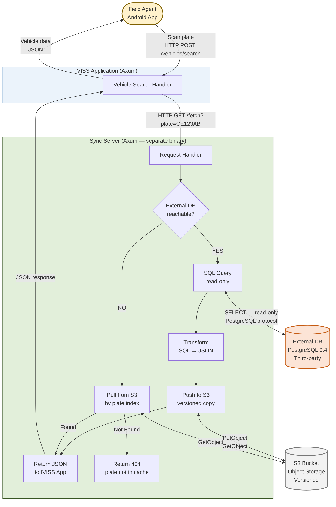
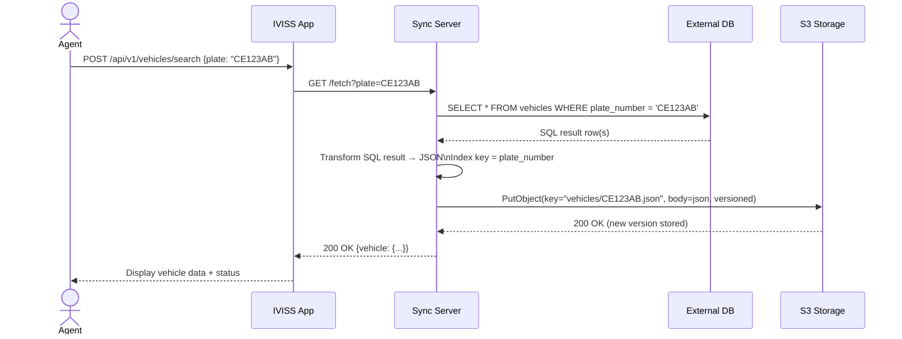
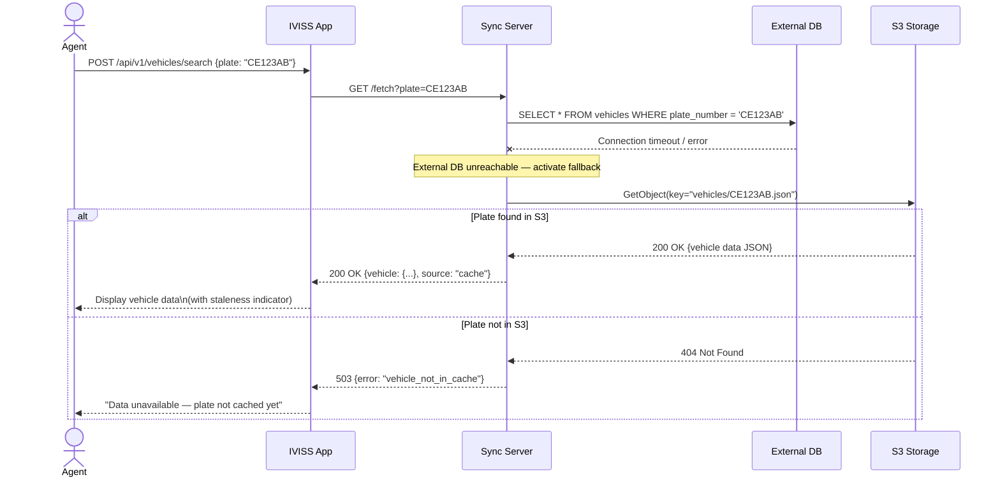

# IVISS — Sync Server Architecture

**Version:** 1.0
**Date:** May 2026
**Status:** Concept — Pending Benchmark Validation
**Classification:** Internal / Confidential

---

## Table of Contents

1. [Overview](#1-overview)
2. [Entities &amp; Responsibilities](#2-entities--responsibilities)
3. [Architecture Diagram](#3-architecture-diagram)
4. [Communication Flow](#4-communication-flow)
   - [Happy Path — External DB Available](#41-happy-path--external-db-available)
   - [Fallback Path — External DB Unavailable](#42-fallback-path--external-db-unavailable)
5. [Data Model — JSON Index Structure](#5-data-model--json-index-structure)
6. [S3 Storage Strategy](#6-s3-storage-strategy)
   - [Key Naming Convention](#61-key-naming-convention)
   - [Versioning](#62-versioning)
   - [Lifecycle Policy](#63-lifecycle-policy)
7. [Security Considerations](#7-security-considerations)
8. [Deployment Topology](#8-deployment-topology)
9. [Known Challenges &amp; Trade-offs](#9-known-challenges--trade-offs)

---

## 1. Overview

The IVISS application enables field agents to identify vehicles in real time by scanning
license plates. Vehicle registration data (carte grise, owner, chassis number, etc.) is
held in an **external database** owned and operated by a third party. IVISS has **read-only access** to this database and must never
write to it.

The core operational risk is **availability**: the external database has historically
experienced extended downtime periods. A hard dependency on it would make IVISS unusable
during those outages.

This document describes the **Sync Server Architecture**, which decouples IVISS from the
external database through an intermediary service that:

- Fetches vehicle data from the external database on demand.
- Transforms and indexes that data as JSON, keyed by license plate number.
- Persists a versioned copy to an S3-compatible object storage bucket.
- Serves cached data from S3 when the external database is unreachable.

---

## 2. Entities & Responsibilities

| Entity                       | Technology                    | Role                                                                                  |
| ---------------------------- | ----------------------------- | ------------------------------------------------------------------------------------- |
| **IVISS App**          | Rust / Axum                   | Main application. Serves agent requests. Never contacts the external DB directly.     |
| **Sync Server**        | Rust / Axum (separate binary) | Intermediary service. Owns all communication with the external DB and S3.             |
| **External Database**  | PostgreSQL 9.4 (third-party)  | Source of truth for vehicle registration data. Read-only access for IVISS.            |
| **S3 Backup Storage**  | AWS S3 (or compatible)        | Versioned object store. Serves as both the backup layer and the fallback data source. |
| **Agent (Mobile App)** | Android                       | End user. Triggers vehicle lookups via the IVISS App.                                 |

### Responsibility Boundary

```
Agent
  └── IVISS App          ← only entity the agent talks to
        └── Sync Server  ← only entity that talks to the external DB and S3
              ├── External DB  (primary source, read-only)
              └── S3           (backup data + fallback)
```

The IVISS App has **no direct connection** to the external database and **no direct
connection** to S3. All data access is mediated through the Sync Server. This boundary
is enforced at the network level (firewall rules / security groups).

---

## 3. Architecture Diagram



---

## 4. Communication Flow

### 4.1 Happy Path — External DB Available

This is the normal operation flow when the external database is reachable.



**Key properties of this flow:**

- The S3 write is **synchronous** in this design — the Sync Server waits for S3
  confirmation before responding to IVISS App. This guarantees the backup copy exists
  before the response is sent.
- If the S3 write fails, the Sync Server logs the error but **still returns the data**
  to IVISS App. A failed backup write must never block an agent's operation.
- Every successful lookup against the external DB produces or updates a versioned object
  in S3 at the key indexed by plate number.

---

### 4.2 Fallback Path — External DB Unavailable

When the external database is unreachable (connection timeout, network failure, server
down), the Sync Server automatically falls back to S3.



**Key properties of this flow:**

- The fallback activates **automatically** on any connection error or timeout to the
  external DB. No manual intervention required.
- The response includes a `source` field (`"live"` vs `"cache"`) so the IVISS App can
  optionally display a staleness indicator to the agent.
- If the plate has never been queried before, there is no S3 object for it. The Sync
  Server returns a `503` and IVISS App handles it gracefully (the agent can submit a
  pending submission with carte grise photos instead).
- The fallback is **read-only from S3** — no writes occur during fallback mode.

---

## 5. Data Model — JSON Index Structure

Each vehicle record is stored in S3 as a single JSON object, indexed by its unique
license plate number. The plate number is the natural unique identifier across the
external database.

### Object key format

```
vehicles/{PLATE_NUMBER}.json
```

Examples:

```
vehicles/CE123AB.json
vehicles/LT456CD.json
vehicles/SW789EF.json
```

### JSON schema

```json
{
  "plate_number": "CE123AB",
  "chassis_number": "VF1AA000123456789",
  "brand": "Toyota",
  "model": "Land Cruiser",
  "year": 2018,
  "color": "White",
  "engine_power": "177kW",
  "fuel_type": "Diesel",
  "registration_expiry": "2027-03-15",
  "owner": {
    "name": "Jean-Pierre Mbarga",
    "national_id": "123456789",
    "address": "Rue de la Paix, Yaoundé"
  },
  "_meta": {
    "fetched_at": "2026-05-25T14:32:00Z",
    "source": "external_db",
    "sync_server_version": "1.0.0"
  }
}
```

The `_meta` block is internal metadata added by the Sync Server. It is **not** returned
to the IVISS App in the response — it is stripped before the response is sent.

---

## 6. S3 Storage Strategy

### 6.1 Key Naming Convention

All vehicle objects live under the `vehicles/` prefix. The plate number is the full key
suffix, no subdirectory partitioning is needed since S3 is a flat key-value store (no
inode limits unlike a filesystem).

```
s3://iviss-backup/
└── vehicles/
    ├── CE123AB.json
    ├── LT456CD.json
    └── SW789EF.json
```

### 6.2 Versioning

S3 versioning is **enabled at the bucket level**. Every `PutObject` call on an existing
key creates a new version rather than overwriting the previous one.

**Why this matters:**

When a vehicle's registration data changes in the external DB (new owner, expired carte
grise, updated chassis record), IVISS will naturally query it again and push a new
version to S3. The previous version is retained automatically by S3.

This means:

- The **latest version** is always what the Sync Server returns during fallback.
- Older versions serve as an **audit trail** — you can reconstruct what IVISS knew about
  a given vehicle at any point in time.
- No deduplication logic is needed in the Sync Server — S3 handles it natively.

### 6.3 Lifecycle Policy

To control storage costs and prevent unbounded accumulation of old versions, a lifecycle
policy is configured on the bucket:

```json
{
  "Rules": [
    {
      "ID": "expire-old-vehicle-versions",
      "Status": "Enabled",
      "Filter": { "Prefix": "vehicles/" },
      "NoncurrentVersionExpiration": {
        "NoncurrentDays": 30,
        "NewerNoncurrentVersions": 3
      }
    }
  ]
}
```

**Effect:** For each plate key, S3 retains the **3 most recent non-current versions**,
and expires any version older than **30 days**. The current (latest) version is never
expired by this rule.

This means at steady state, each vehicle object has at most **4 versions** in S3
(1 current + 3 non-current), regardless of how many times it has been queried and updated.

---

## 7. Security Considerations

### 7.1 External Database Access

- The Sync Server connects to the external DB using a **dedicated read-only PostgreSQL
  user** (`iviss_reader`). This user has `SELECT` privileges only — `INSERT`, `UPDATE`,
  and `DELETE` are explicitly revoked.
- Admin credentials for the external DB are **never** stored in the Sync Server
  configuration. They are kept separately by the designated database administrator.
- Connection transport:
  - **Separate machines (Case 1):** TLS enforced (`hostssl` in `pg_hba.conf`), or a
    Wireguard VPN tunnel between the two hosts.
  - **Same machine (Case 2):** Unix socket only. No network transport, no TLS overhead.

### 7.2 S3 Access

- The Sync Server uses an **IAM role with minimal permissions**:
  - `s3:PutObject` — to write new/updated vehicle JSON.
  - `s3:GetObject` — to read during fallback.
  - `s3:ListObjectVersions` — for operational monitoring only.
  - No `s3:DeleteObject` — prevents accidental or malicious deletion of backup data.
- Server-side encryption is enabled at the bucket level (**SSE-KMS**).
- The bucket has **no public access** (Block Public Access enabled on all four settings).
- **MFA Delete** is enabled — deleting a version requires multi-factor authentication.

### 7.3 Network Boundary

- The IVISS App has **no direct network route** to the external DB. Firewall rules
  enforce this: only the Sync Server's IP is whitelisted on the external DB's port 5432.
- The IVISS App has **no direct network route** to S3. Only the Sync Server holds S3
  credentials.
- Communication between IVISS App and Sync Server is over an internal network
  (same VPC or same host loopback), not exposed to the public internet.

### 7.4 Audit Trail

Every request the Sync Server makes to the external DB is logged with:

- Timestamp
- Plate number queried
- Source of response (`external_db` or `s3_cache`)
- Response latency

These logs feed into the existing `audit_logs` table in the IVISS PostgreSQL database
(action: `VEHICLE_SEARCHED`).

---

## 8. Deployment Topology

Two deployment scenarios are being benchmarked in parallel:

### Case 1 — Separate machines

```
[AWS Lightsail]                    [VPS Cameroun — ST Digital]
┌─────────────────────┐            ┌──────────────────────────┐
│  IVISS App          │            │  External DB             │
│  Sync Server        │◄──TLS/VPN─►│  PostgreSQL 9.4          │
└─────────────────────┘            │  2 GB RAM / 2 vCPU       │
         │                         │  30 GB disk / 2 Mbps     │
         │ HTTPS                   └──────────────────────────┘
         ▼
[AWS S3]
```

**Advantage:** Lightsail has good international connectivity. S3 writes from Lightsail
are fast and do not consume the VPS's 2 Mbps bandwidth.

### Case 2 — Same machine

```
[VPS Cameroun — ST Digital]
┌──────────────────────────────────────┐
│  IVISS App                           │
│  Sync Server                         │
│  External DB (PostgreSQL 9.4)        │
│                                      │
│  2 GB RAM / 2 vCPU / 30 GB / 2 Mbps │
└──────────────────────────────────────┘
         │
         │ HTTPS (constrained to 2 Mbps)
         ▼
[S3-compatible storage]
```

**Advantage:** SQL queries are local (< 1ms latency, no TLS overhead, no WAN exposure).
**Constraint:** S3 writes compete with agent traffic on the 2 Mbps uplink. Write
operations must be rate-limited and scheduled to avoid saturating the connection.

---

## 9. Known Challenges & Trade-offs

| Challenge                                    | Impact                                                                          | Mitigation                                                                                                                    |
| -------------------------------------------- | ------------------------------------------------------------------------------- | ----------------------------------------------------------------------------------------------------------------------------- |
| **S3 write latency on agent path**     | Every successful DB lookup blocks on S3 PutObject (~50-200ms added latency)     | If unacceptable: make S3 write async (fire-and-forget). Accept small window of inconsistency between DB response and S3 copy. |
| **Cold start — plate not in S3**      | During fallback, a plate never queried before returns 503                       | Agents fall back to pending submission flow (carte grise photos). Document this behavior clearly.                             |
| **Data staleness during fallback**     | S3 data reflects the last time that plate was queried, not the current DB state | Add `fetched_at` in response metadata. Display staleness indicator in IVISS App UI.                                         |
| **No updated_at on external DB**       | Proactive sync (nightly cron) requires full table checksum scan — expensive    | Verify external DB schema first. If no `updated_at`, reactive-only model (on-demand fetch) may be sufficient.               |
| **2 Mbps uplink (Case 2)**             | S3 PutObject for each agent request consumes bandwidth                          | A 2KB JSON object over 2 Mbps takes ~8ms. At 10 concurrent agents: ~80ms overhead. Acceptable.                                |
| **S3 cost growth**                     | Versioning accumulates objects over time                                        | Lifecycle policy caps at 3 non-current versions + 30-day expiry. Cost remains bounded.                                        |
| **Sync Server is a new failure point** | If Sync Server crashes, IVISS App cannot serve vehicle data                     | Deploy with `restart: always` in Docker Compose. Add health check. IVISS App surfaces clear error to agent.                 |

---

---

*Document maintained by the IVISS development team.*
*To be reviewed with the DevOps team before implementation.*
