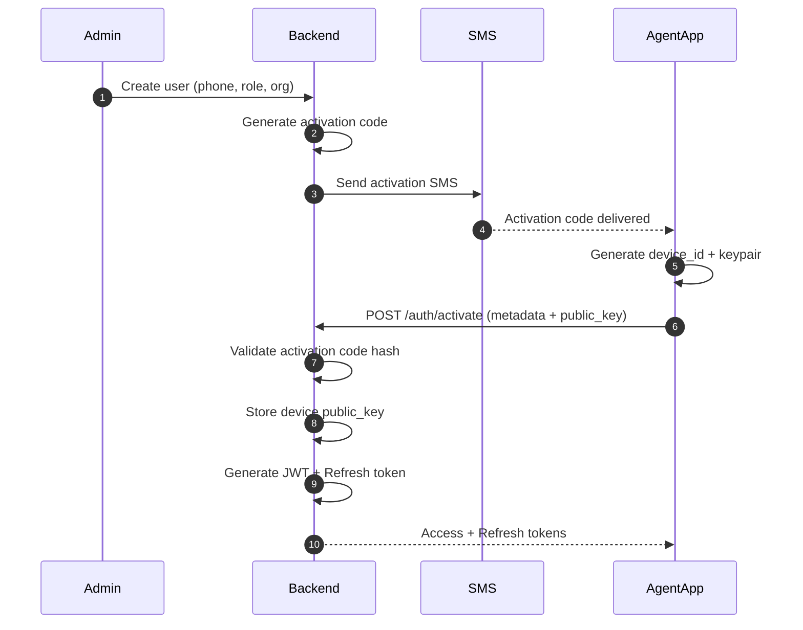
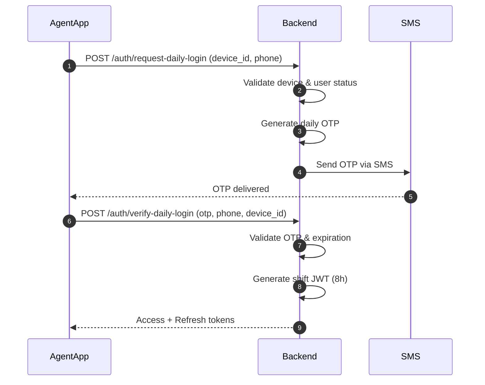
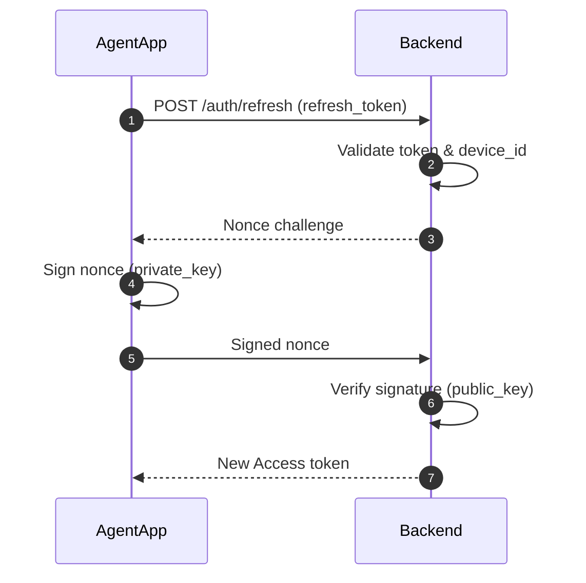
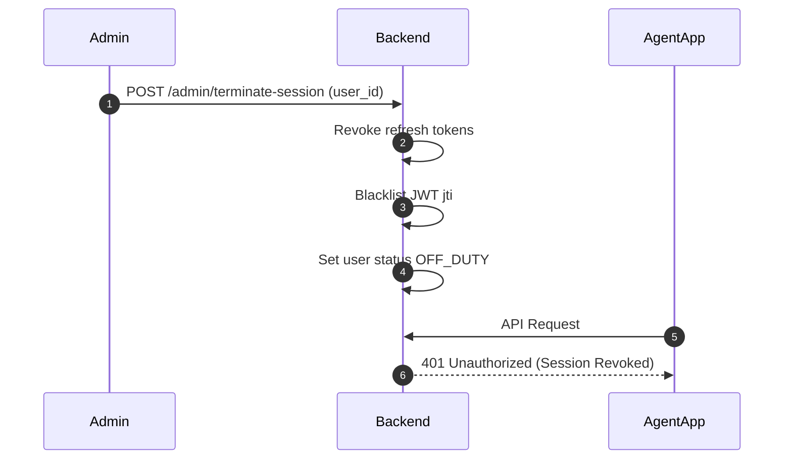
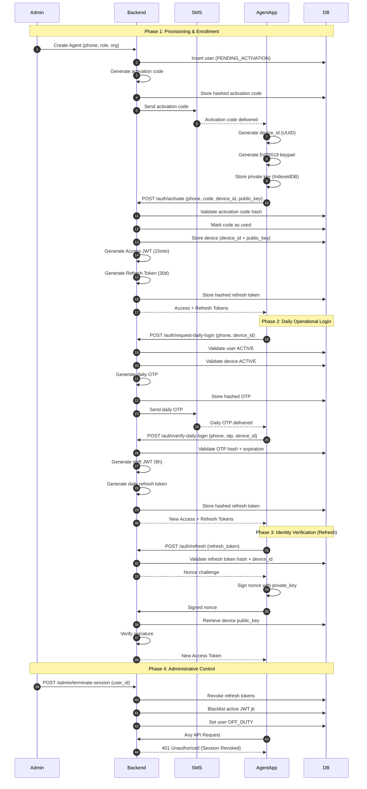
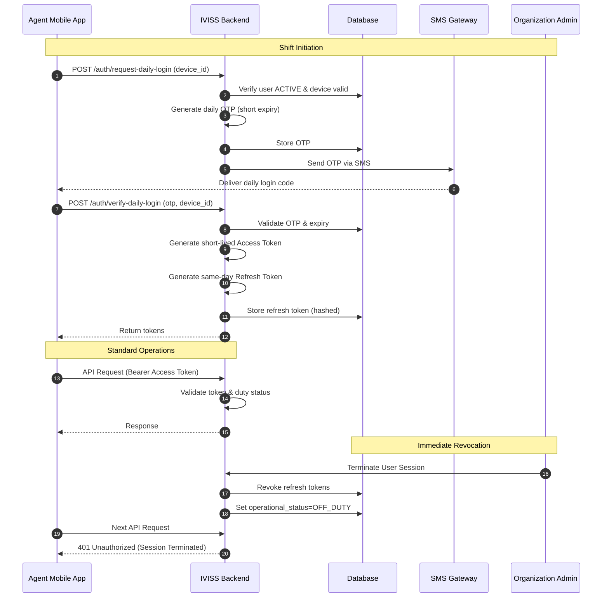

# IVISS Authentication & Device Binding Architecture

## 1. Overview

IVISS implements a **passwordless authentication architecture** designed for government-grade security. The system ensures that every agent is verified through physical device identity, SMS-based multi-factor verification, and shift-based operational controls.

### 1.1 Core Security Principles

- **Admin-Controlled Provisioning**: No self-registration; all users are provisioned by a central authority.
- **SMS-Based Activation**: Initial identity verification via out-of-band communication.
- **Device Cryptographic Identity**: Persistent binding of accounts to specific hardware via Ed25519 keypairs.
- **JWT Authorization**: Short-lived tokens for secure API access.
- **Device-Bound Refresh Tokens**: Prevents session hijacking by tethering long-lived tokens to the hardware identity.
- **Daily OTP Enforcement**: Mandatory re-verification for shift-based operation.
- **Admin Revocation**: Instant termination of any active session by administrators.
- **Challenge-Response**: Real-time cryptographic proof-of-possession for sensitive operations.

---

## 2. High-Level Architecture

### 2.1 Security Layers

| Layer                | Responsibility                                     |
| :------------------- | :------------------------------------------------- |
| **TLS (HTTPS)**      | Transport layer security and data integrity.       |
| **JWT**              | Secure identity and granular authorization claims. |
| **Device Keypair**   | Device-level cryptographic proof of possession.    |
| **Daily OTP**        | Per-shift operational enforcement.                 |
| **Admin Revocation** | Centralized authority over all active sessions.    |

### 2.2 System Components

- **Backend (Rust)**: Auth Service, Device Registry, OTP Service, JWT Service, Refresh Token Service, Admin Control Service, and Audit Logging.
- **Frontend (React)**: Device Bootstrap Module, Secure Storage (IndexedDB), Activation UI, Daily Login UI, JWT Handler, and Signature Utility.
- **External Dependencies**: SMS Service Provider and PostgreSQL Database.

---

## 3. User Registration Flow

### 3.1 Purpose

The registration flow ensures a government agent is securely provisioned, their physical device is cryptographically bound to their account, and initial secure tokens are issued.

### 3.2 Step-by-Step Flow

#### Step 1 — Admin Provisioning

- An Administrator enters the agent's phone number, role, and organization.
- Backend creates the user record with status `PENDING_ACTIVATION`.
- Backend generates an activation code (hashed and stored securely).
- An SMS is dispatched to the agent containing the activation code.

#### Step 2 — Device Bootstrap (Frontend)

On the first application launch on the agent's device:

- The app generates a unique `device_id` (UUID).
- The app generates an **Ed25519 keypair**.
- The **private key** is securely stored in IndexedDB.
- The **public key** is prepared for registration.

#### Step 3 — Agent Activation

The agent enters their phone number and the activation code received via SMS.
The frontend sends the following payload:

```json
{
  "phone_number": "...",
  "activation_code": "...",
  "device_id": "...",
  "public_key": "...",
  "device_metadata": "{...}"
}
```

#### Step 4 — Backend Validation

1. Backend validates the activation code hash.
2. Checks for expiration and failed attempt limits.
3. Marks the code as "consumed".
4. Registers the device (`device_id` + `public_key`).
5. Issues an **Access Token** (15 min) and a **Refresh Token** (30 days).
6. User status is updated to `ACTIVE`.

### 3.3 Registration Sequence Diagram



---

## 4. Daily Operational Login Flow

### 4.1 Purpose

Enforces operational compliance by ensuring agents can only access the system during authorized hours via daily OTP verification.

### 4.2 Step-by-Step Flow

#### Step 1 — Request Daily OTP

- The agent opens the application at the start of their shift.
- Frontend calls: `POST /auth/request-daily-login` with `phone_number` and `device_id`.
- Backend verifies both the User and Device are `ACTIVE`.
- Backend generates a daily OTP (5–10 min expiry) and dispatches it via SMS.

#### Step 2 — OTP Verification

- Frontend sends the validation request: `POST /auth/verify-daily-login`.
- Backend validates the OTP hash, expiration, and attempt count.
- Backend issues a **Shift-based Access Token** (8h) and a **Same-day Refresh Token**.

### 4.3 Daily Login Sequence Diagram



---

## 5. Refresh Token with Device Signature

### 5.1 Purpose

To prevent stolen refresh tokens from being reused on unauthorized hardware by requiring a cryptographic "Proof-of-Possession" signature.

### 5.2 Flow Details

1. The agent requests a token refresh using the `refresh_token`.
2. Backend validates the token hash and associated `device_id`.
3. Backend generates and sends a random **Nonce Challenge**.
4. Frontend signs the nonce using the **private key** stored on the device.
5. Backend verifies the signature using the stored **public key**.
6. If valid, a new Access Token is issued.

### 5.3 Refresh Sequence Diagram



---

## 6. Admin Session Termination

### 6.1 Purpose

Provides a centralized "Kill-Switch" allowing administrators to immediately revoke access for any user or compromised device.

### 6.2 Revocation Flow

1. An administrator triggers the termination for a specific `user_id`.
2. The Backend revokes all active refresh tokens in the database.
3. Active JWTs are blacklisted via their `jti` (unique ID).
4. The user's status is set to `OFF_DUTY`.
5. The next API request from the agent returns a `401 Unauthorized` response.

### 6.3 Admin Termination Sequence Diagram



---

## 7. Security Standards & Logic

### 7.1 Data Binding Hierarchy

A strict cryptographic hierarchy ensures that authorization is always rooted in the verified physical device.

```text
User
 └── Device (device_id + public_key)
       └── Refresh Token (Bound to Device)
             └── Access Token (Short-lived, Shift-bound)
```

### 7.2 Security Matrix

| Feature              | Threat Protection                                          |
| :------------------- | :--------------------------------------------------------- |
| **Activation SMS**   | Verifies ownership of the registered phone number.         |
| **Device Keypair**   | Prevents token reuse on unauthorized hardware.             |
| **JWT**              | Securely encapsulates identity and authorization claims.   |
| **Daily OTP**        | Enforces strict shift-based operational compliance.        |
| **Nonce Challenge**  | Protects against replay attacks and token theft.           |
| **Admin Revocation** | Provides immediate centralized control over system access. |
| **Audit Logs**       | Ensures accountability and non-repudiation.                |

### 7.3 Operational Rules

- **Storage Clearing**: Deleting browser storage (IndexedDB) removes the private key, requiring a new device enrollment flow.
- **Revocation**: Backend-triggered revocation invalidates all associated refresh tokens immediately.
- **Throttling**: OTP and activation attempts are capped to prevent brute-force attacks.
- **Expiration**: Nonces and OTPs have very short lifespans; JWTs expire in 15 min; Shift tokens expire in 8h.

---

## 8. Master Sequence Flow Diagrams

### 8.1 Complete System Lifecycle



### 8.2 Daily Login & Administrative Control Details



---

## 9. Conclusion

The IVISS authentication architecture ensures a frictionless but highly secure passwordless experience. By tightly coupling identities to physical hardware and enforcing daily operational verification, it establishes a high-trust environment suitable for critical government-scale mobile applications.
