# IVISS — arc42 Architecture Documentation

> **System:** IVISS — Integrated / Intelligent Vehicle Inspection and Surveillance System
> **Version:** 1.0 | **Status:** Architecture Documentation — Draft for Review
> **Stack:** Rust/Axum · React/Vite · PostgreSQL · In-memory cache · Docker Compose · AWS Lightsail

---

## Table of Contents

1. [Introduction and Goals](#1-introduction-and-goals)
   - 1.1 [System Overview](#11-system-overview)
   - 1.2 [Quality Goals](#12-quality-goals)
   - 1.3 [Stakeholders](#13-stakeholders)
2. [Constraints](#2-constraints)
   - 2.1 [Technical Constraints](#21-technical-constraints)
   - 2.2 [Organizational Constraints](#22-organizational-constraints)
   - 2.3 [Regulatory and Compliance Constraints](#23-regulatory-and-compliance-constraints)
3. [Context and Scope](#3-context-and-scope)
   - 3.1 [Business Context](#31-business-context)
   - 3.2 [Technical Context — External Interfaces](#32-technical-context--external-interfaces)
4. [Solution Strategy](#4-solution-strategy)
   - 4.1 [Architectural Principles](#41-architectural-principles)
   - 4.2 [Technology Choices](#42-technology-choices)
   - 4.3 [Key Trade-offs](#43-key-trade-offs)
5. [Building Block View](#5-building-block-view)
   - 5.1 [Level 1 — System Boundary](#51-level-1--system-boundary-whitebox)
   - 5.2 [Level 2 — Backend Subsystems](#52-level-2--backend-subsystems)
   - 5.3 [Level 2 — Backend Code Structure](#53-level-2--backend-code-structure)
   - 5.4 [Level 2 — Frontend Structure](#54-level-2--frontend-structure)
   - 5.5 [API Endpoint Reference](#55-api-endpoint-reference-illustrative)
6. [Runtime View](#6-runtime-view)
   - 6.1 [Vehicle Lookup with Partner Status Aggregation](#61-vehicle-lookup-with-partner-status-aggregation)
   - 6.2 [Agent Daily Login — OTP + Badge ID](#62-agent-daily-login--otp--badge-id)
   - 6.3 [Access Token Refresh — Silent Renewal](#63-access-token-refresh--silent-renewal)
   - 6.4 [Device Suspension — Instant Access Cut](#64-device-suspension--instant-access-cut)
   - 6.5 [Admin Creates a Member — Tenant-Scoped RBAC](#65-admin-creates-a-member--tenant-scoped-rbac)
   - 6.6 [Pending Submission — Gray-Card Fallback Workflow](#66-pending-submission--gray-card-fallback-workflow)
   - 6.7 [Application Startup and Health Check](#67-application-startup-and-health-check)
7. [Deployment View](#7-deployment-view)
   - 7.1 [Local / Development Deployment](#71-local--development-deployment)
   - 7.2 [Production Deployment — AWS Lightsail](#72-production-deployment--aws-lightsail)
8. [Crosscutting Concepts](#8-crosscutting-concepts)
   - 8.1 [Authentication and Authorization](#81-authentication-and-authorization)
   - 8.2 [Session, Device, and Shift Management](#82-session-device-and-shift-management)
   - 8.3 [Error Handling and Response Standardization](#83-error-handling-and-response-standardization)
   - 8.4 [Observability and Monitoring](#84-observability-and-monitoring)
   - 8.5 [Data Management and Audit](#85-data-management-and-audit)
   - 8.6 [Caching and Timeouts](#86-caching-and-timeouts)
   - 8.7 [Security of Secrets and Configuration](#87-security-of-secrets-and-configuration)
9. [Architecture Decisions (ADRs)](#9-architecture-decisions-adrs)
10. [Quality Requirements](#10-quality-requirements)
    - 10.1 [Quality Tree](#101-quality-tree)
    - 10.2 [Quality Scenarios](#102-quality-scenarios)
    - 10.3 [Quality Attribute Summary](#103-quality-attribute-summary)
11. [Risks and Technical Debt](#11-risks-and-technical-debt)
12. [Glossary](#12-glossary)

---

## 1. Introduction and Goals

### 1.1 System Overview

IVISS is a **multi-tenant, cloud-deployed platform** enabling government agencies to conduct roadside vehicle inspections. Field agents identify vehicles by license plate, verify compliance status against multiple partner services, and create an auditable record of every control. A back-office web application supports administration, reporting, and case management.

#### Core Capabilities

- **C-01 Plate Identification**
  - Identify vehicles by license plate via:
    - Manual entry
    - Photo-based OCR
    - Live/continuous scan OCR

- **C-02 Registry Lookup**
  - Retrieve authoritative vehicle registration data from an external national vehicle registry database.

- **C-03 Compliance Verification**
  - Verify compliance status via partner APIs (insurance, customs, technical inspection, wanted/stolen).

- **C-04 Audit Trail**
  - Record a complete, tamper-resistant audit trail of every roadside control and enforcement action.

- **C-05 Back-Office Management**
  - Manage organizations, users, roles, agents/devices, pending submissions, and reporting dashboards.

#### Primary Business Workflows

- **Roadside control (Field agent)**
  - Identify plate → fetch registry data → evaluate compliance → store control record.

- **Enforcement (Field agent / supervisor)**
  - Create citation, impound, flag, warning, or release action linked to a control record.

- **Fallback registration (Field agent / admin)**
  - If vehicle not found in registry, capture gray-card images → create pending submission for back-office processing.

- **Administration (Org admin / super admin)**
  - Manage organizations, users, agents/devices; view dashboards and reports.

- **Pending submission review (Back-office admin)**
  - Validate gray-card evidence, create/update vehicle records, approve or reject submissions.

---

### 1.2 Quality Goals

The following quality attributes are the primary drivers of all architectural decisions in this document. They are listed in priority order.

| Priority | Quality Attribute | Architectural Significance | Measurable Target |
|----------|------------------|---------------------------|-------------------|
| **1** | **Security & Data Isolation** | Multi-tenant architecture; RBAC; strict org-scoping on every query; RS256 JWT + revocable refresh tokens. | Cross-tenant requests return HTTP 403 with zero data leakage. All refresh tokens hashed server-side. PII encrypted in transit (TLS). |
| **2** | **Availability & Resilience** | Field ops must continue during partial partner failures. Fallback strategies prevent total service loss. | Partner API timeout does not fail the full lookup. Degraded mode returns partial results. DR runbook validated periodically. |
| **3** | **Performance & Responsiveness** | Parallel partner calls; per-call timeouts; in-memory caching; bounded overall response deadline. | Typical vehicle lookup completes within a stakeholder-agreed time budget. Each partner call has a strict individual timeout. |
| **4** | **Auditability & Traceability** | Every lookup/control creates an immutable audit record including who/when/where, identification mode, and status results. | 100% of lookups produce a control record with agent identity, device ID, timestamp, plate, ID mode, and partner statuses. |
| **5** | **Maintainability & Evolvability** | Layered architecture (handlers → services → db). ADRs capture key decisions. OpenAPI spec maintained. | Module boundaries enforced by directory structure. API contracts tracked via OpenAPI. ADRs linked from §9. |

---

### 1.3 Stakeholders

Stakeholders and expectations:

- **Field agents**
  - Role/context: mobile users performing roadside controls during daily shifts.
  - Expectations: fast lookups; reliable sessions; minimal manual steps.
  - Concerns: poor network; expired sessions; field usability.

- **Organization admins**
  - Role/context: manage users, agents, and devices within their agency.
  - Expectations: authorization correctness; traceability; device control.
  - Concerns: authorization bugs; audit gaps.

- **Central authority / super admin**
  - Role/context: cross-organization oversight and onboarding.
  - Expectations: strict tenant boundaries; compliance; audit.
  - Concerns: legal risk; misconfiguration; over-privileged access.

- **Back-office operators**
  - Role/context: review pending submissions and maintain data quality.
  - Expectations: efficient queues; clear evidence; safe approvals.
  - Concerns: data errors; conflicting sources; performance of reporting/search.

- **Partner organizations**
  - Role/context: provide compliance signals via external APIs.
  - Expectations: predictable traffic; secure integration; correct identifiers.
  - Concerns: rate limits; credential management; request bursts.

- **Infrastructure / DevOps**
  - Role/context: operate deployments and respond to incidents.
  - Expectations: repeatable deployment; observability; backups.
  - Concerns: single-host capacity; certificate renewal; recovery time.

- **Software developers**
  - Role/context: implement features and maintain the system.
  - Expectations: clear boundaries; testability; stable contracts.
  - Concerns: documentation drift; missing ADRs; hard-to-debug integration failures.

---

## 2. Constraints

Constraints restrict the solution space and must be respected by all architectural decisions.

### 2.1 Technical Constraints

- **TC-01 External registry DB is read-only (PostgreSQL; compatibility constraints may apply)**
  - Impact: IVISS cannot modify registry data; queries must be optimized and time-bounded.

- **TC-02 RS256 JWT access tokens + opaque refresh tokens stored as SHA-256 hashes**
  - Impact: prevents forgery; enables revocation; private key rotation and secure key management are mandatory.

- **TC-03 Shift-bounded access** (`SHIFT_START_HOUR` / `SHIFT_END_HOUR`)
  - Impact: refresh is rejected outside the shift window; daily re-activation required.

- **TC-04 Docker Compose as baseline runtime** (dev and production-like)
  - Impact: simplifies parity; limits horizontal scaling unless the deployment model evolves.

- **TC-05 Single-instance production on AWS Lightsail (Ubuntu 22.04)**
  - Impact: single point of failure; vertical scaling is the primary lever.

- **TC-06 CI/CD produces container images**
  - Impact: deployments are image-based; secrets injected at runtime.

- **TC-07 Intermittent mobile connectivity**
  - Impact: clients must handle retries, timeouts, and user-friendly degraded UX.

- **TC-08 Clock consistency**
  - Impact: enforce UTC; handle client/server clock skew for shift and token expiry.

---

### 2.2 Organizational Constraints

- **OC-01 Multiple agencies share one deployment with strict isolation**
  - Impact: multi-tenancy is core; org scoping must be enforced everywhere.

- **OC-02 24/7 back-office, shift-based field operations**
  - Impact: shift/session logic must not block administrative access.

- **OC-03 Onboarding without redeploy**
  - Impact: organization setup and user provisioning are runtime administrative workflows.

---

### 2.3 Regulatory and Compliance Constraints

- **RC-01 Audit retention**
  - Requirement: control records and enforcement actions remain auditable for legally mandated retention windows (often years).
  - Impact: prefer soft-delete; restrict deletion; ensure referential integrity across history.

- **RC-02 Protect sensitive data in transit and at rest**
  - Requirement: TLS; secure secret storage; avoid PII in logs.

- **RC-03 Evidence integrity (gray-card images and logs)**
  - Requirement: strict access controls; audit any access/deletion; avoid public buckets.

- **RC-04 Evidentiary standards**
  - Requirement: record provenance and timestamps so the system can show “what was known at the time”.

---

## 3. Context and Scope

### 3.1 Business Context

IVISS sits at the intersection of field enforcement operations, authoritative national vehicle data, and compliance status services. The diagram below shows all actors and their interactions with the IVISS system boundary.

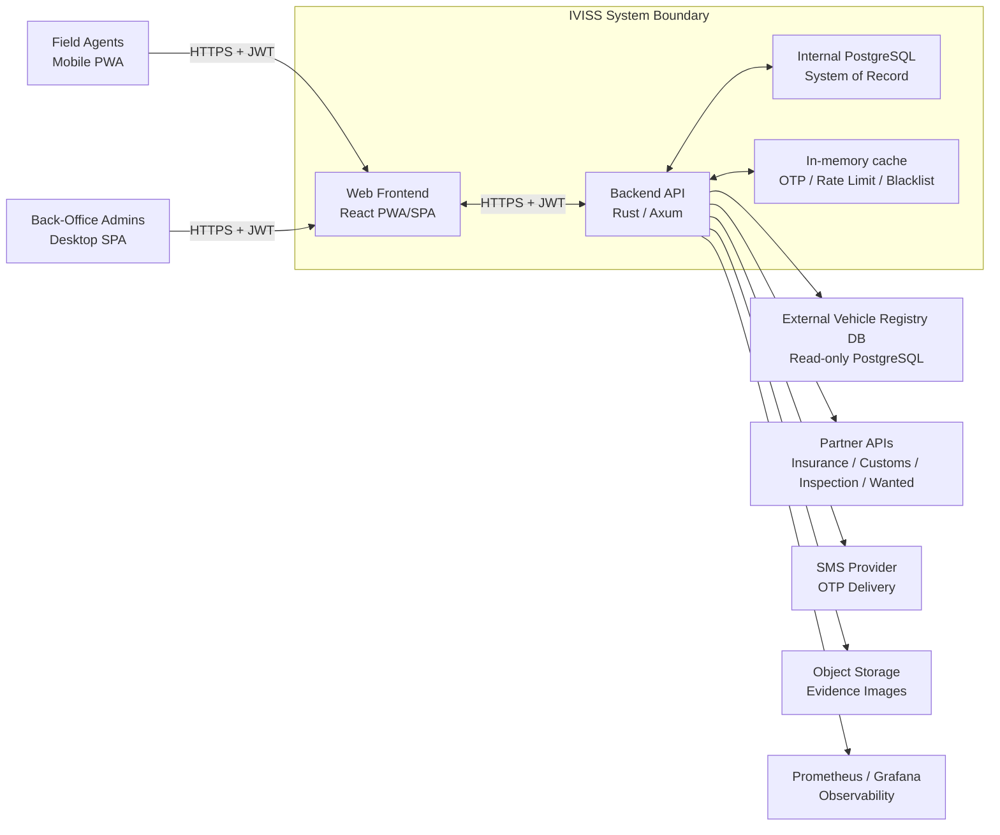

#### System Responsibilities

- **Frontend (React PWA/SPA)**: Mobile-first UI for field agents; back-office UI for admins; OCR capture; session token management; RBAC-gated navigation; React Query data caching.
- **Backend API (Rust/Axum)**: Authentication and authorization; vehicle lookup orchestration; partner API fan-out; admin operations; audit logging; reporting queries.
- **Internal PostgreSQL**: System-of-record for all IVISS-owned data: organizations, users, devices, control records, actions, pending submissions.
- **In-memory cache (backend process-local)**: OTP short-lived storage (TTL); rate limiting counters; access token blacklist for instant revocation.

---

### 3.2 Technical Context — External Interfaces

External interfaces:

- **REST API (clients ↔ backend)**
  - Technology: HTTP/HTTPS + JSON.
  - Constraints: bearer JWT on protected endpoints; CORS restricted; versioning recommended.

- **External registry database (backend → registry)**
  - Technology: PostgreSQL.
  - Constraints: read-only; time-bounded queries; schema controlled externally.

- **Partner APIs (backend → partners)**
  - Technology: HTTPS REST.
  - Constraints: strict per-call timeouts; partial failures allowed; API keys stored securely.

- **SMS provider (backend → SMS)**
  - Technology: HTTPS API.
  - Constraints: rate-limited OTP delivery; graceful failure handling.

- **Object storage (backend → storage)**
  - Technology: S3-compatible HTTPS.
  - Constraints: signed URLs for time-limited access; access policies prevent public exposure.

- **In-memory cache (backend ↔ process memory)**
  - Technology: in-process cache (no network dependency).
  - Constraints: OTP TTL storage; rate limiting counters; token blacklist; state resets on restart; not shared across multiple backend instances.

- **Metrics pipeline (frontend → metrics server → Prometheus/Grafana)**
  - Technology: HTTP POST for ingestion; Prometheus scrape format.
  - Constraints: sampling/aggregation to avoid excessive traffic.

---

## 4. Solution Strategy

### 4.1 Architectural Principles

These principles directly guide every architectural decision and map back to the quality goals in §1.2.

- **API-first**
  - The API contract is treated as the product boundary: request/response formats, status codes, and error semantics are stable and documented.
  - This reduces integration friction and makes the system evolvable (backend and UI can be developed and deployed independently as long as the contract is preserved).

- **Separation of concerns**
  - The backend is layered to keep responsibilities clear:
    - HTTP handlers: parse/validate requests and map them to domain operations.
    - Services: own business rules (RBAC decisions, shift/device policies, workflow orchestration).
    - Data access layer: encapsulates persistence details and tenant-safe queries.
  - This structure improves testability (services are unit-testable) and reduces risk of inconsistent rule enforcement.

- **Multi-tenancy as a first-class concern**
  - Every request is evaluated in a tenant context derived from verified identity (JWT claim), not from client-provided input.
  - Tenant isolation is enforced at the earliest safe boundary (DB queries and repository methods) to prevent accidental cross-tenant reads/writes.

- **Resilient integrations**
  - External dependencies (registry DB and partner APIs) are treated as unreliable:
    - Calls execute in parallel to minimize end-to-end latency.
    - Each call has its own timeout, and the overall lookup has a global deadline.
  - If one dependency fails, the lookup returns a *partial* response with available results (and clear indication of what is missing) instead of failing the entire operation.

- **Secure sessions by default**
  - Access tokens are short-lived JWTs to reduce the blast radius of token exposure.
  - Refresh tokens are opaque and validated server-side; they can be revoked instantly (logout, device suspension, policy changes).
  - For immediate access cut, the backend checks a server-side revocation list (implemented as an in-memory blacklist in the single-instance deployment).

- **Audit by default**
  - Every operational lookup is persisted as an immutable control record with correlation identifiers.
  - Enforcement actions must always reference a control record, ensuring traceability for legal review and operational oversight.

- **Validation at boundaries**
  - Validate inputs (plate format, required fields) and authorization (role + tenant scope + device/shift policy) before calling expensive dependencies.
  - This protects external systems, avoids wasted partner calls, and keeps error behavior consistent.

---

### 4.2 Technology Choices

Technology choices and rationale:

- **Backend**: Rust + Tokio + Axum
  - Rationale: memory safety, high concurrency, good fit for parallel outbound calls.

- **Persistence**: PostgreSQL (internal) + PostgreSQL (external registry)
  - Rationale: relational integrity and reporting queries; external registry is authoritative.

- **Cache/session support**: in-memory cache (process-local)
  - Rationale: fast OTP TTL storage, rate limiting counters, and token blacklist without an extra network dependency.
  - Note: because it is process-local, it is aligned with the current single-instance deployment. If the backend is later scaled horizontally, these concerns move to a shared store.

- **Frontend**: React + TypeScript + Vite
  - Rationale: single codebase for mobile-first and back-office UI; fast iteration.

- **UI system**: Tailwind CSS + component primitives
  - Rationale: consistent design system and accessibility.

- **OCR**: client-side OCR with camera input
  - Rationale: reduces backend load; improves responsiveness.

- **Reverse proxy**: Nginx
  - Rationale: TLS termination, static assets, API proxy.

- **Packaging/deployment**: container images + Docker Compose
  - Rationale: repeatable environments; easy rollbacks.

- **Monitoring**: Prometheus + Grafana + metrics ingestion server
  - Rationale: standard observability stack.

---

### 4.3 Key Trade-offs

Key trade-offs:

- **Single-instance deployment**
  - Benefit: simpler operations; lower cost.
  - Trade-off: single point of failure; vertical scaling only.

- **Stateless access tokens (JWT)**
  - Benefit: no DB lookup per request.
  - Trade-off: immediate revocation requires a server-side revocation list.
    - Current deployment: in-memory blacklist (simple, fast, but cleared on restart).
    - Future scaling: replace with a shared revocation store.

- **Parallel partner API calls**
  - Benefit: overall latency approaches the slowest dependency rather than the sum.
  - Trade-off: higher outbound concurrency; rate-limit coordination required.

- **Client-side OCR**
  - Benefit: reduces backend load; works with device camera.
  - Trade-off: OCR quality varies; confidence and manual correction are needed.

- **Docker Compose in production**
  - Benefit: parity and simplicity.
  - Trade-off: manual scaling and more operational responsibility.

---

## 5. Building Block View

### 5.1 Level 1 — System Boundary (Whitebox)

At the highest level, IVISS consists of four internal components and several external systems.

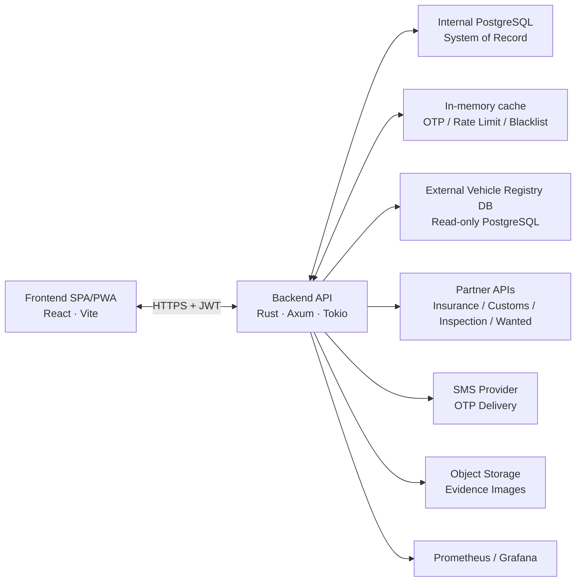

End-to-end communication view (major calls and protocols):

```mermaid
flowchart TB
  subgraph Clients
    Agent[Field Agent\nMobile PWA]
    BO[Back-Office\nDesktop SPA]
  end

  subgraph Edge
    Nginx[Nginx\nTLS termination + SPA + /api proxy]
  end

  subgraph IVISS[IVISS Backend Boundary]
    FE[Frontend SPA/PWA\nReact + Vite]
    BE[Backend API\nRust + Axum]
    Cache[In-memory cache\nOTP + rate-limit + token blacklist]
    IntDB[(Internal PostgreSQL\nSystem of Record)]
  end

  subgraph External
    ExtDB[(External Vehicle Registry\nPostgreSQL (read-only))]
    Partners[Partner APIs\nInsurance/Customs/Inspection/Wanted]
    SMS[SMS Provider\nOTP delivery]
    Storage[Object Storage\nEvidence images]
  end

  subgraph Observability
    MS[metrics-server\nfrontend metrics ingestion]
    Prom[Prometheus]
    Graf[Grafana]
  end

  Agent -->|HTTPS| Nginx
  BO -->|HTTPS| Nginx

  Nginx -->|/ (static SPA)| FE
  Nginx -->|/api/* (proxy)| BE

  FE -->|HTTPS + JWT| BE

  BE <--> IntDB
  BE <--> Cache

  BE -->|SQL read| ExtDB
  BE -->|HTTPS REST| Partners
  BE -->|HTTPS| SMS
  FE -->|HTTPS upload| Storage
  BE -->|HTTPS signed URLs / metadata| Storage

  FE -->|POST /api/metrics| MS
  Prom -->|scrape /metrics| MS
  Graf --> Prom
```

Component inventory:

- **Frontend SPA/PWA** (internal; React/Vite)
  - Responsibility: mobile-first UI; back-office UI; OCR capture; session token management; RBAC-gated navigation.
- **Backend API** (internal; Rust/Axum)
  - Responsibility: REST API gateway; authentication; vehicle lookup orchestration; admin operations; audit logging.
- **Internal PostgreSQL** (internal)
  - Responsibility: system-of-record (organizations, users, devices, control records, actions, pending submissions).
- **In-memory cache** (internal)
  - Responsibility: OTP TTL storage; rate limiting counters; access token blacklist for instant revocation (process-local).
- **External vehicle registry DB** (external)
  - Responsibility: authoritative vehicle registration data; read-only from IVISS.
- **Partner APIs** (external)
  - Responsibility: compliance signals (insurance, customs, inspection, wanted/stolen).
- **SMS provider** (external)
  - Responsibility: OTP delivery.
- **Object storage** (external)
  - Responsibility: evidence image storage for pending submissions.

---

### 5.2 Level 2 — Backend Subsystems

The backend is logically decomposed into five subsystems, each mapping to a set of Rust modules (handlers + services + DB queries).

#### 5.2.1 Auth & Session Subsystem

Manages the complete authentication lifecycle for both agents (OTP-based) and back-office users (credential-based).

Responsibilities:

- OTP issuance: generate short-lived, single-use OTP; store in the in-memory cache with TTL; dispatch via SMS provider.
- OTP verification: fetch OTP from the in-memory cache; verify OTP + badge_id; delete after first use; enforce rate limits and max attempts.
- Access token issuance: issue RS256-signed JWT containing identity, scope, and expiry.
- Refresh token lifecycle: issue opaque refresh token; store SHA-256 hash server-side; validate on refresh; support rotation; revoke on logout/suspension.
- Device state enforcement: block activation/refresh when device is `SUSPENDED`; manage `INACTIVE→ACTIVE→INACTIVE` transitions.
- Shift boundary enforcement: reject refresh outside the configured shift window.

#### 5.2.2 Vehicle Lookup Subsystem

Orchestrates the multi-source data retrieval that makes up a roadside check.

Responsibilities:

- Plate normalization: uppercase; strip whitespace/separators; validate plate pattern.
- Registry lookup: query external registry by plate; handle not-found to support pending submissions.
- Partner orchestration: execute checks in parallel with per-call timeouts; normalize partner errors to `unknown`/`unavailable`.
- Aggregation: compute overall status and include timestamps/provenance.
- Audit: persist a control record for every lookup.

#### 5.2.3 Control & Enforcement Subsystem

Creates and manages the legal record of each roadside interaction.

Responsibilities:

- Control record creation: insert a record linked to agent, device, organization, plate, identification mode, and lookup results.
- Action management: create citation/impound/flag/warning/release actions linked to a control.
- Evidence handling: associate gray-card image URLs with pending submissions.
- Control history queries: filtered and paginated queries by date, agent, plate, status, and organization.

#### 5.2.4 Administration Subsystem

Provides all runtime configuration and management capabilities.

Responsibilities:

- Organization management: create/manage tenants (super admin only).
- User/member management: invite/update/deactivate users; role assignment; RBAC enforcement.
- Device management: register/activate/suspend/restore devices; instant revocation on suspension.
- RBAC enforcement: validate permissions on every write operation; derive org scope from JWT.

#### 5.2.5 Reporting Subsystem

Supports analytics and oversight without affecting operational performance.

Responsibilities:

- Dashboard queries: aggregate controls/actions/submissions by time, org, and status.
- Filtered control history: paginated list with filters.
- Exports: generate CSV/JSON exports with access controls and auditing.
- Statistics: trends (controls per shift, action rates, partner availability).

---

### 5.3 Level 2 — Backend Code Structure
### 5.5 API Endpoint Reference

Representative API surface:

- **Authentication & session**
  - `POST /auth/request-otp`: request OTP for daily activation.
  - `POST /auth/confirm-otp`: confirm OTP + badge_id → issue access + refresh tokens.
  - `POST /auth/refresh`: exchange refresh token for a new access token.
  - `POST /auth/logout`: revoke refresh token / end session for device.

- **Vehicle lookup**
  - `GET /vehicles/lookup?plate=...`: lookup vehicle by plate and aggregate partner statuses.

- **Control & enforcement**
  - `POST /controls`: create a control record (audit trail).
  - `POST /controls/{id}/actions`: add an enforcement action to a control.

- **Reporting**
  - `GET /controls?start_date=&end_date=&agent_id=&status=&plate=`: list controls by filters.

- **Administration**
  - `POST /organizations/{id}/members`: create members under an organization with RBAC checks.
  - `POST /devices/{id}/suspend`: suspend a device and revoke its ability to refresh tokens.
  - `POST /devices/{id}/restore`: restore a device.

---

## 6. Runtime View

Runtime view shows the dynamic interactions for key use cases.

### 6.0 End-to-End Operational Flow (Daily shift)

This scenario provides the complete “day in the life” flow: daily activation (OTP), vehicle lookup with partner aggregation, audit/control creation, and the gray-card fallback when the external registry does not return a vehicle.

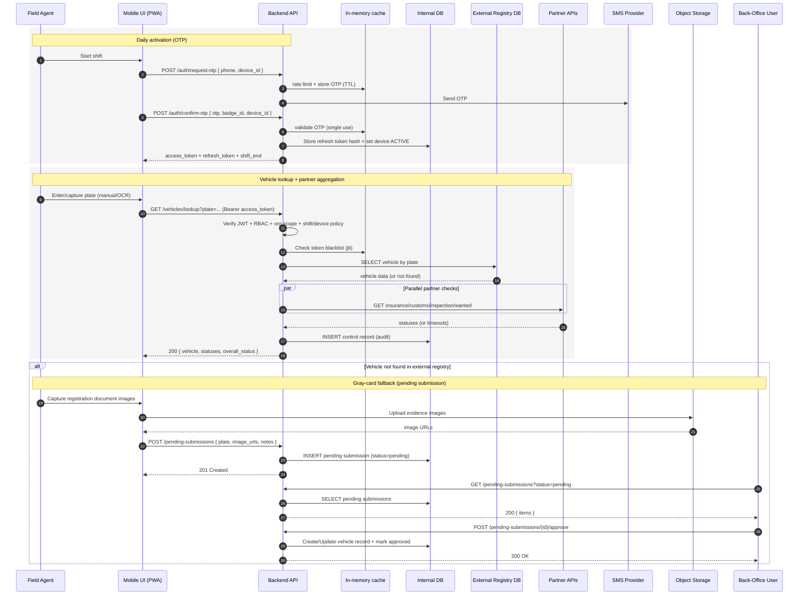

---

### 6.1 Vehicle Lookup with Partner Status Aggregation

This is the **core operational flow** triggered every time a field agent searches for a vehicle.

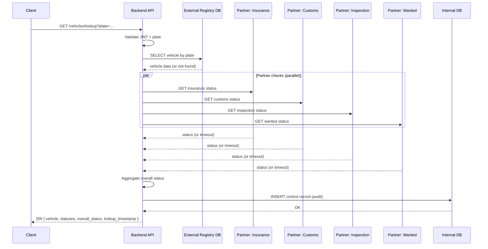

**Error and Degraded-Mode Behavior:**

- **Vehicle not found in registry**
  - Behavior: return a controlled not-found response; client prompts pending submission workflow.

- **One partner API times out**
  - Behavior: return vehicle + successful statuses; failing partner marked `unknown`; HTTP `200`.

- **All partner APIs fail**
  - Behavior: return vehicle + all partner statuses as `unknown`; HTTP `200`.

- **External registry slow/unavailable**
  - Behavior: return a bounded-timeout dependency error (e.g., `503`) within the deadline.

- **Audit log write fails**
  - Behavior: log technical error; apply policy decision (best-effort vs fail-closed).

- **JWT expired**
  - Behavior: return `401`; client refreshes and retries.

> **Note on timeouts:** Each partner call uses `tokio::time::timeout`. The overall lookup uses a global deadline. A single slow partner never delays the full response beyond the global deadline.

---

### 6.2 Agent Daily Login — OTP + Badge ID

Agents authenticate each shift via a two-step process: OTP delivery to their phone, then confirmation with OTP + badge ID.

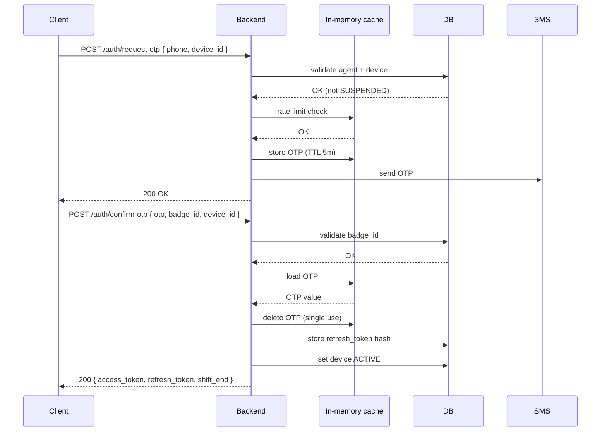

**OTP Security Properties:**

- Short-lived: stored in the in-memory cache with TTL (e.g., 5 minutes).
- Single-use: deleted immediately after first successful verification.
- Rate-limited: counter per device or phone number; exceeding limits blocks new OTP issuance.
- Attempt-limited: maximum failed confirmations before temporary lockout.

**Device State Transitions:**

- `INACTIVE -> ACTIVE`: successful OTP confirmation.
- `ACTIVE -> INACTIVE`: shift end or logout.
- `* -> SUSPENDED`: admin suspension (immediate).
- `SUSPENDED -> INACTIVE`: admin restore.

---

### 6.3 Access Token Refresh — Silent Renewal

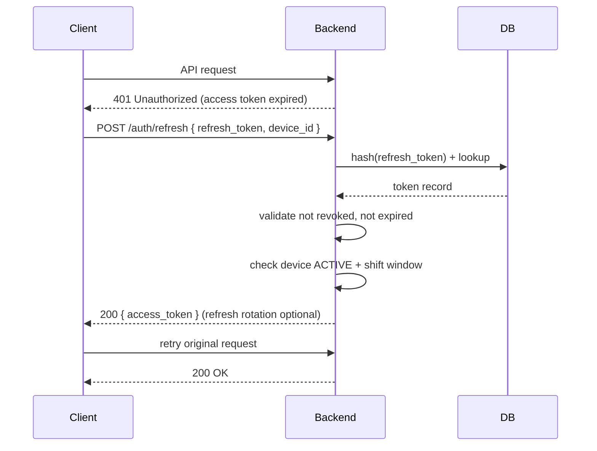

**Refresh Rejection Conditions:**

- Device `SUSPENDED` → `403 DEVICE_SUSPENDED`: show suspension message; no retry.
- Refresh token revoked → `401 TOKEN_REVOKED`: force full re-login.
- Refresh token expired → `401 TOKEN_EXPIRED`: force full re-login.
- Shift ended → `403 SHIFT_ENDED`: require next-day re-activation.
- Device mismatch → `401 DEVICE_MISMATCH`: force re-login and investigate compromise.

---

### 6.4 Device Suspension — Instant Access Cut

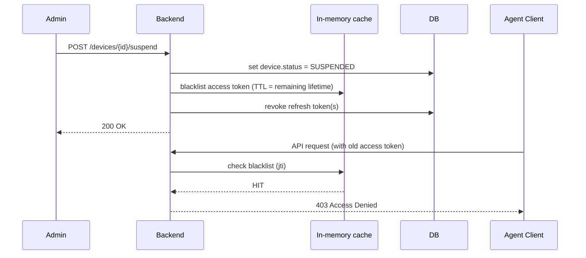

> ⚠️ **Critical:** Immediate token blocking requires a blacklist check on **every** protected request. In the current single-instance deployment, this is implemented as an in-memory blacklist and the system must **fail closed** if revocation cannot be evaluated (deny access) rather than grant access.

---

### 6.5 Admin Creates a Member — Tenant-Scoped RBAC

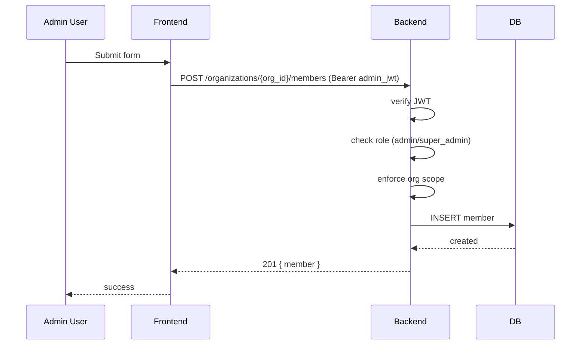

**Authorization Rules:**

- Only `admin` or `super_admin` roles can create members.
- `admin` can only create members in their own organization; org scope is derived from JWT claims.
- `super_admin` can create members in any organization.
- All admin write operations are audited (actor identity + timestamp + org context).

---

### 6.6 Pending Submission — Gray-Card Fallback Workflow

Used when a vehicle plate returns no result from the external registry. The agent captures physical documentation for later back-office processing.

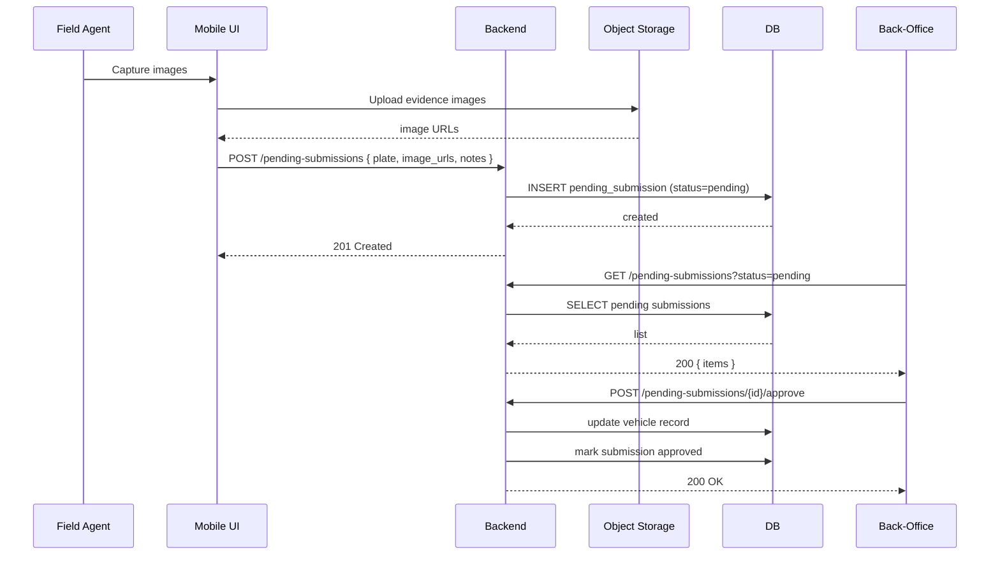

---

### 6.7 Application Startup and Health Check

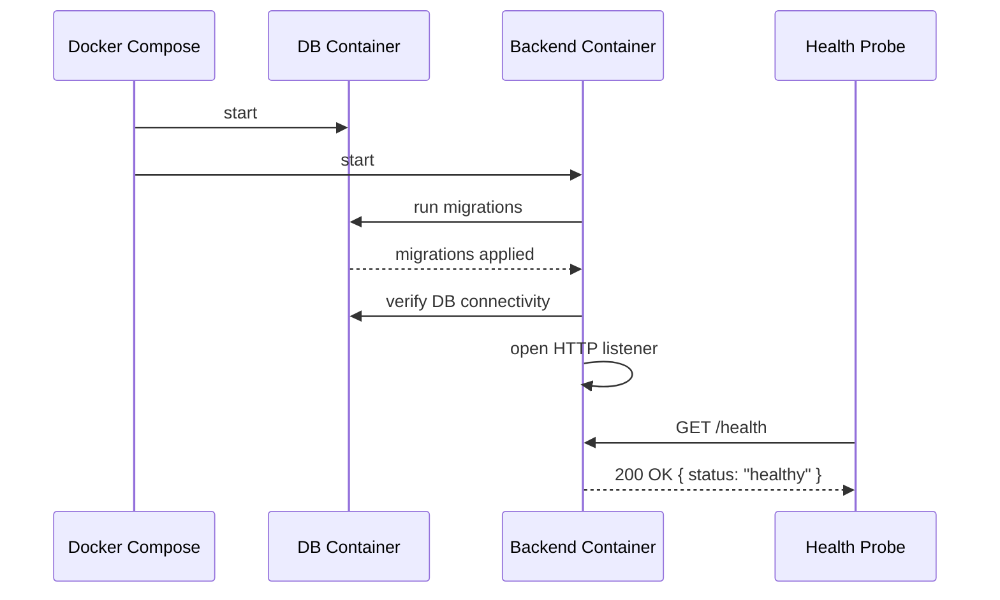

> ⚠️ **Migration Safety:** SQLx migrations run automatically on startup. Backward-incompatible schema changes must use the **expand/contract pattern** to avoid downtime during rolling restarts.

---

## 7. Deployment View

### 7.1 Local / Development Deployment

All development work runs inside a Docker Compose stack that mirrors the production topology.

```mermaid
flowchart TB
  Dev[Developer Machine] --> Net[Docker Compose Network\niviss-network]

  subgraph Net
    FE[frontend :8080\nVite HMR]
    BE[backend :3000\ncargo-watch]
    DB[(db\nPostgreSQL)]
    Adminer[adminer :8081]
    Metrics[metrics-server :9091]
    Prom[prometheus :9090\noptional]
    Graf[grafana :3001\noptional]

    FE -->|/api (proxy)| BE
    BE <--> DB
    Prom --> Metrics
    Graf --> Prom
  end

  BE --> ExtDB[External Vehicle Registry\n(external network)]
  BE --> Partners[Partner APIs\n(external network)]
```

Local services (typical):

- Frontend dev server: `8080`.
- Backend API: `3000`.
- Database: internal to the Docker network (optionally exposed for tooling).
- Metrics server: `9091`.
- Prometheus (optional): `9090`.
- Grafana (optional): `3001`.

**Local Environment Characteristics:**
- Service-to-service calls use container DNS names (e.g., `http://backend:3000`). External access uses published host ports.
- The internal database uses a persistent named volume — data survives container restarts.
- Hot reload is enabled for both frontend (Vite HMR) and backend (cargo-watch).

---

### 7.2 Production Deployment — AWS Lightsail

Production runs on a **single Ubuntu 22.04 AWS Lightsail instance** using the Docker Compose `prod` profile.

```mermaid
flowchart TB
  Internet[(Internet)] -->|HTTPS :443 / HTTP :80 (redirect)| Nginx[Nginx\nfrontend-prod]
  Nginx -->|/api/* proxy| BE[backend-prod\nRust release]
  BE --> PG[(Internal PostgreSQL\nNamed volume + backups)]
  BE --> ExtDB[External Vehicle Registry\n(external network)]
  BE --> Partners[Partner APIs\n(external network)]

  subgraph Lightsail[AWS Lightsail Instance\nUbuntu 22.04]
    Nginx
    BE
    PG
  end
```

#### 7.2.1 Security Hardening

Security hardening measures:

- TLS termination at the edge; enforce HSTS; redirect HTTP to HTTPS.
- Security headers: `X-Content-Type-Options`, `X-Frame-Options`, and a CSP tuned for a SPA.
- CORS allowlist for known client origins.
- Rate limiting per IP and per identity for OTP, login, and lookup endpoints.
- Secret management via encrypted CI/CD secret store; never committed to source control.
- Least-privilege DB role for the backend; avoid DDL permissions in production.
- Firewall policy: only SSH and HTTP/HTTPS exposed.

#### 7.2.2 Backup and Recovery

Backup and recovery approach:

- Database backup: daily backups to encrypted offsite storage; periodically verify with test restores.
- RPO target: up to 24 hours data loss (can be reduced with WAL archiving if needed).
- RTO target: service restored within a few hours using a documented rebuild playbook.
- Snapshots: instance snapshots before deployments and on a regular schedule.
- Restore testing: execute and validate restore runbook at least quarterly.

#### 7.2.3 Scaling Path

The current single-instance topology is sufficient for early operations. The following evolution path is defined for when load demands it:

1. **Vertical scaling** — Upgrade to a larger Lightsail instance (more CPU/RAM). Fastest lever.
2. **Extract managed database** — Migrate Internal PostgreSQL to Amazon RDS (managed backups, failover, read replicas).
3. **Extract shared cache / revocation store** — If scaling beyond one backend instance, move OTP/rate-limit/blacklist to a shared cache (e.g., managed cache).
4. **Horizontal backend scaling** — Deploy backend as stateless containers behind a load balancer. Tokens are already stateless; shared cache + shared DB become shared resources.
5. **CDN for SPA** — Front Nginx static assets with CloudFront to reduce instance load.

> **Trigger for revisiting:** Sustained CPU > 70% or memory > 80% over a week, or a production outage attributable to single-instance constraints.

---

## 8. Crosscutting Concepts

Crosscutting concepts are recurring architectural concerns that span multiple building blocks. They are defined here once and applied consistently.

### 8.1 Authentication and Authorization

#### Authentication Flows

Authentication flows:

- Agent daily activation: OTP + badge ID; issues access + refresh tokens.
- Back-office login: credential-based; issues access + refresh tokens.
- Token refresh: exchange refresh token for a new access token; validates device state and shift window.
- Logout: revoke refresh token and blacklist current access token.

#### JWT Access Token Claims

JWT access token claims:

- `sub`: user identifier.
- `org`: organization identifier (tenant scope).
- `role`: role (`super_admin`, `admin`, `supervisor`, `agent`).
- `device_id`: device identifier (agents only).
- `exp`: expiration timestamp.
- `iat`: issuance timestamp.
- `jti`: token ID used for blacklist revocation.

#### RBAC Permission Matrix

RBAC overview (high level):

- Agents: operational flows (lookup, create control, create action) within their organization.
- Supervisors: similar to agents plus broader visibility within the same organization.
- Admins: manage members and devices within their organization.
- Super admins: cross-organization operations and organization creation.

- Approve pending submissions: only admins and super admins.
- Access reports / dashboards: all roles except agents.

> **Authorization Implementation Rule:** Organization scope is **always** derived from verified JWT claims. Client-provided `org_id` parameters are validated against the JWT `org` claim — they are never trusted as the authoritative scope. For list endpoints, org filtering is enforced at the SQL query level (`WHERE org_id = $1`), not only in application code.

---

### 8.2 Session, Device, and Shift Management

#### Device State Machine

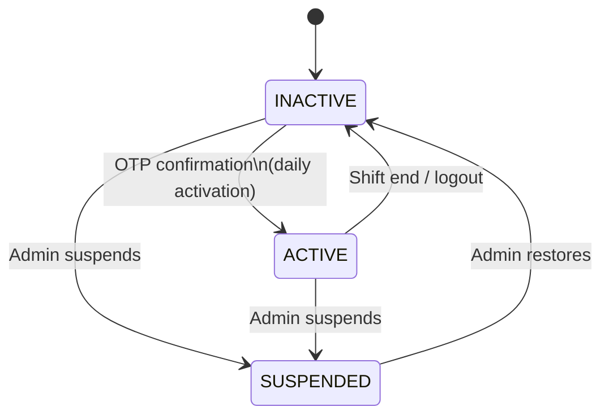

#### Session Invariants

- Access tokens are short-lived. Immediate revocation requires a blacklist check on every protected request (implemented in-memory in the current deployment).
- Refresh tokens are server-stored hashes. Revocation is instant and permanent until a new token is issued.
- **Shift end prevents token refresh** even if the refresh token itself is still technically valid.
- A suspended device cannot issue new tokens or renew existing ones under any path.

---

### 8.3 Error Handling and Response Standardization

All API errors use a consistent JSON envelope to enable reliable client-side handling and incident correlation.

#### Standard Error Envelope

```json
{
  "error": {
    "code": "VEHICLE_NOT_FOUND",
    "message": "Vehicle not found in registry.",
    "details": {
      "plate": "AB-123-CD"
    },
    "request_id": "req_01HXQ9ABCDE..."
  }
}
```

#### HTTP Status Code Reference

HTTP status guidance (representative):

- `400` (`INVALID_PLATE_FORMAT`, `MISSING_FIELD`): malformed/invalid input.
- `401` (`TOKEN_EXPIRED`, `TOKEN_INVALID`, `REFRESH_INVALID`): authentication failed; client may refresh or re-login.
- `403` (`INSUFFICIENT_ROLE`, `ORG_SCOPE_VIOLATION`, `DEVICE_SUSPENDED`, `SHIFT_ENDED`): authorization denied; requires user/admin action.
- `404` (`VEHICLE_NOT_FOUND`, `CONTROL_NOT_FOUND`): resource not found.
- `409` (`DUPLICATE_SUBMISSION`): conflict; idempotency guard triggered.
- `422` (`VALIDATION_ERROR`): semantically invalid input.
- `429` (`RATE_LIMIT_EXCEEDED`): too many requests.
- `503` (`DEPENDENCY_UNAVAILABLE`): upstream dependency timeout/unavailable.
- `500` (`INTERNAL_ERROR`): unexpected server error; internal details not exposed.

---

### 8.4 Observability and Monitoring

#### Logging

- Log level configurable via `RUST_LOG` environment variable (backend).
- All logs include a `request_id` for correlation across services.
- **Audit logs** (business events: login, lookup, action creation) are separate from **technical logs** (errors, performance warnings).
- PII scrubbing applied before log output — no raw vehicle owner data, plate data, or user credentials in logs.

#### Metrics and Alerting

Recommended metrics and alerts:

- API latency p50/p95/p99 per endpoint
  - Alert example: p95 > 3s on `/vehicles/lookup`.
- HTTP 5xx error rate per endpoint
  - Alert example: > 1% sustained > 5 minutes.
- External registry query latency
  - Alert example: p95 > 500ms.
- Partner API latency and success rate
  - Alert example: success rate < 80% over 5 minutes.
- In-memory cache operation latency
  - Alert example: p95 > 5ms.
- DB connection pool saturation
  - Alert example: active connections > 80% of pool size.
- Disk usage (DB volume + logs)
  - Alert example: > 80%.
- Frontend page load time
  - Alert example: p95 > 5s.
- OTP issuance/verification anomaly rate
  - Alert example: exceeds configured abuse threshold per IP.

#### Frontend Monitoring Pipeline

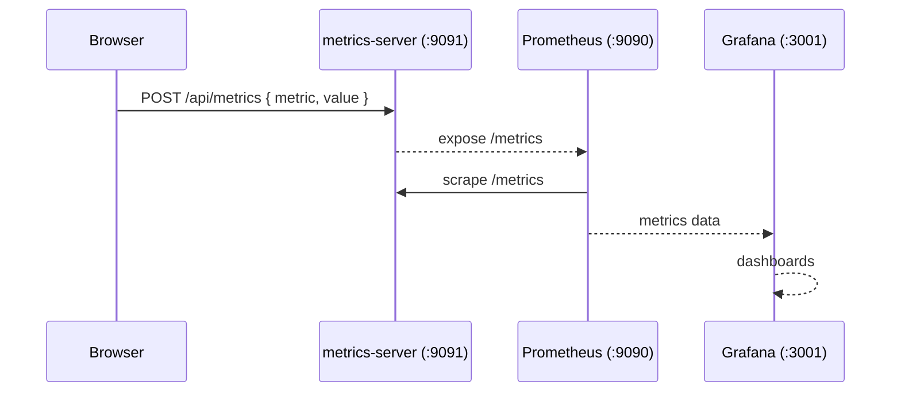

---

### 8.5 Data Management and Audit

#### Conceptual Data Model

Core entities and ownership:

- Organization: tenant boundary; all scoped data links to this.
- User/member: back-office identity linked to an organization; includes role and status.
- Device: field device registration and status (`INACTIVE` / `ACTIVE` / `SUSPENDED`).
- Vehicle: registry entity (external source) optionally mirrored internally.
- Control record: immutable audit record of each check.
- Control action: enforcement action linked to a control record.
- Pending submission: gray-card evidence workflow (pending/approved/rejected).
- Refresh token: server-side refresh token record (hashed, expiring, revocable).

#### Data Provenance

Responses must indicate whether data is:
- **Authoritative** — from the external registry (real-time query)
- **Cached** — derived from a previous partner check (include cache timestamp)
- **Internal** — from the IVISS internal database

> Store lookup timestamps on every control record to support later audits: _"What exactly did the agent see at the moment of the check?"_

#### Retention and Archival

- Control records **partitioned by time** (monthly/yearly) to keep queries fast as history grows.
- Older partitions **archived to cold storage** with queryable metadata retained in the active database.
- User/org deletes are **soft-deletes** (`status = INACTIVE`). Referential integrity preserved for historical records.
- Hard deletes on any audited entity require privileged approval and are themselves logged.

---

### 8.6 Caching and Timeouts

Caching and timeouts:

- In-memory LRU cache (backend)
  - Strategy: short-lived cache for frequently read, slowly changing data; invalidate on writes.
- Partner status cache (optional; internal DB)
  - Strategy: persist last-known partner statuses to reduce redundant calls for repeated lookups.
- OTP TTL (in-memory cache)
  - Strategy: short TTL; auto-expire; delete on first successful use.
- Token blacklist TTL (in-memory cache)
  - Strategy: TTL equals remaining access-token lifetime; key by `jti`.
- Per-partner call timeout (backend service layer)
  - Strategy: strict per-call deadline; normalize failures to `unknown`.
- External DB query timeout (backend query layer)
  - Strategy: bounded query timeout to prevent connection pool starvation.
- Global lookup deadline (backend service layer)
  - Strategy: overall deadline for lookup aggregation regardless of individual partner results.

---

### 8.7 Security of Secrets and Configuration

- All secrets (`JWT_*` keys, DB connection strings, partner API keys, SMS credentials) provided via **environment variables**.
- Production secrets stored in **GitHub Actions encrypted secrets store**. Never in source control.
- Refresh tokens stored as **SHA-256 hashes**. Raw tokens never persisted.
- Database credentials use a **least-privilege role** (no DDL permissions in production).
- Partner API keys rotated on a scheduled basis and immediately on suspected compromise.
- Consider **IP allowlisting** or **mTLS** for partner API calls where partners support it.
- Nginx serves the SPA with `Content-Security-Policy` headers to mitigate XSS risks.

---

## 9. Architecture Decisions (ADRs)

For long-term maintainability, IVISS adopts **Architecture Decision Records (ADRs)**. New ADRs should be written using a consistent format and referenced from this section.

> **ADR Format:** Context → Decision → Consequences (positive and negative).

---

### ADR-001 — RS256 JWT + Opaque Refresh Token Strategy

Status: Accepted

Date: 2025

**Context:** The system needs stateless, verifiable authentication tokens for a distributed client base. Tokens must be revocable on device compromise or suspension.

**Decision:** Use RS256-signed JWTs as short-lived access tokens. Use long-lived opaque refresh tokens stored server-side as SHA-256 hashes. Access token revocation uses an in-memory blacklist keyed by `jti` with TTL equal to remaining token lifetime.

**Consequences:**
- ✅ No shared secret between services.
- ✅ Refresh tokens fully revocable.
- ⚠️ In-memory blacklist is cleared on restart and is not shared across instances.
- ⚠️ RS256 key pair must be securely managed and rotated.

---

### ADR-002 — Multi-Tenant Isolation via Organization Scoping

Status: Accepted

Date: 2025

**Context:** Multiple independent government agencies share a single IVISS deployment. Data leakage between tenants would be a critical security incident.

**Decision:** Organization ID is always derived from the verified JWT (never from client input). All data queries on tenant-scoped entities include a `WHERE org_id = $1` clause enforced at the SQLx query layer, not only in application code.

**Consequences:**
- ✅ Defense in depth — DB query layer enforces isolation even if application logic has a bug.
- ⚠️ Every query must be authored with `org_id` filtering. Code review must verify compliance.

---

### ADR-003 — Parallel Partner API Calls with Partial Results

Status: Accepted

Date: 2025

**Context:** A vehicle lookup requires status from four partner APIs. Sequential calls would produce unacceptable latency. Partner APIs have variable reliability.

**Decision:** Execute all partner API calls concurrently using Tokio join semantics. Apply a strict per-call timeout. Failures and timeouts are normalized to `unknown/unavailable` and do not fail the parent request. The response always includes whatever results were available.

**Consequences:**
- ✅ Total lookup latency ≈ `max(individual latencies)`, not sum.
- ✅ Individual partner failures do not degrade the overall system.
- ⚠️ Higher burst outbound concurrency — must be managed with rate limiting per partner.
- ⚠️ Client must handle `unknown` statuses gracefully in the UI.

---

### ADR-004 — Single-Instance Deployment on AWS Lightsail

Status: Accepted (with defined review trigger)

Date: 2025

**Context:** IVISS is in early operational deployment. Multi-instance infrastructure adds cost and complexity not yet justified by load requirements.

**Decision:** Deploy on a single AWS Lightsail instance using Docker Compose. Mitigate single-point-of-failure risk with snapshots, health monitoring, and a tested DR runbook.

**Consequences:**
- ✅ Lower operational cost and complexity.
- ✅ Simpler debugging and deployment.
- ⚠️ Single point of failure *(see Risk R-01)*.
- ⚠️ Vertical scaling only.
- **Review trigger:** Sustained CPU > 70% or memory > 80% over a week, or a production outage attributable to single-instance constraints.

---

### ADR-005 — Frontend Monitoring Stack (metrics-server + Prometheus + Grafana)

Status: Accepted

Date: 2025

**Context:** Browser-side performance and error data cannot be captured by backend-only monitoring. A lightweight pipeline is needed without introducing a third-party SaaS dependency.

**Decision:** Deploy a `metrics-server` sidecar that accepts `POST` requests from the browser. Prometheus scrapes `metrics-server`. Grafana dashboards surface frontend metrics alongside backend metrics.

**Consequences:**
- ✅ Unified observability across FE and BE.
- ✅ No SaaS dependency for metrics.
- ⚠️ Additional container to maintain.
- ⚠️ Frontend must implement the metrics push logic.

---

### Pending ADRs (to be written)

- ADR-006: client-side OCR strategy (tesseract.js vs. server-side OCR API)
- ADR-007: object storage provider selection for gray-card evidence
- ADR-008: database partitioning strategy for control record history
- ADR-009: partner API rate limiting and circuit breaker implementation
- ADR-010: credential-based back-office login vs. SSO/SAML integration

---

## 10. Quality Requirements

### 10.1 Quality Tree

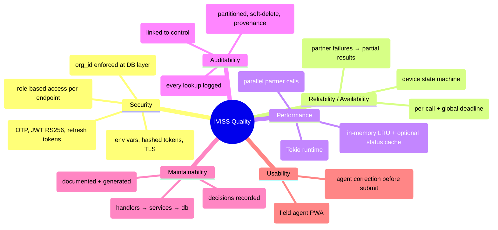

---

### 10.2 Quality Scenarios

Quality scenarios:

- **QS-01 Security / tenant isolation**
  - Scenario: authenticated user from Org A requests control history of Org B.
  - Expected: HTTP 403; zero Org B records in response.

- **QS-02 Security / device suspension**
  - Scenario: admin suspends a device; agent sends next request with still-valid access token.
  - Expected: request rejected quickly (403); subsequent requests blocked.

- **QS-03 Security / refresh after suspension**
  - Scenario: suspended device calls `POST /auth/refresh`.
  - Expected: `403 DEVICE_SUSPENDED`; no new token.

- **QS-04 Availability / partner API down**
  - Scenario: one partner API returns 503 during lookup.
  - Expected: HTTP 200 with partial results; failing partner marked unavailable.

- **QS-05 Availability / external registry slow**
  - Scenario: registry query exceeds timeout.
  - Expected: controlled dependency error within bounded time.

- **QS-06 Performance / roadside lookup**
  - Scenario: agent scans a plate under normal network.
  - Expected: p95 lookup latency meets agreed budget.

- **QS-07 Performance / partner timeout isolation**
  - Scenario: one partner exceeds its timeout.
  - Expected: partner result `unknown`; global deadline still enforced.

- **QS-08 Auditability / control record**
  - Scenario: any lookup.
  - Expected: control record exists and contains identity + timestamps + statuses.

- **QS-09 Auditability / enforcement action**
  - Scenario: create enforcement action.
  - Expected: action linked to control; deletion restricted and audited.

- **QS-10 Data integrity / idempotency**
  - Scenario: duplicate pending submission request due to retry.
  - Expected: no duplicate record; conflict or idempotent response.

- **QS-11 Reliability / shift end**
  - Scenario: shift ends, then refresh attempt.
  - Expected: `403 SHIFT_ENDED`; require re-activation.

- **QS-12 Observability / partner outage**
  - Scenario: partner outage > 10 minutes.
  - Expected: dashboards show degraded success rate; alert fires within minutes.

---

### 10.3 Quality Attribute Summary

Quality attribute summary (targets and verification):

- Tenant data isolation
  - Target: zero cross-organization data leakage.
  - Verification: cross-org API tests return 403 with no data.

- Token revocation speed
  - Target: immediate blocking for revoked sessions.
  - Verification: suspend device → verify requests rejected immediately.

- Lookup latency (p95)
  - Target: within agreed budget.
  - Verification: load tests with simulated partner latency.

- Partner failure tolerance
  - Target: partial results even when partners fail.
  - Verification: integration tests with forced partner timeouts/500s.

- Control record completeness
  - Target: every lookup produces a control record.
  - Verification: integration tests assert persisted records.

- OTP brute-force protection
  - Target: maximum attempts and rate limits enforced.
  - Verification: rate-limit and lockout tests.

- Evidence integrity
  - Target: evidence images not publicly accessible and not deletable without privileged action.
  - Verification: access-control tests and audit log assertions.

- Startup time
  - Target: backend ready within a bounded startup time.
  - Verification: deployment pipeline measurements.

---

## 11. Risks and Technical Debt

- **R-01 Single-instance deployment**
  - Risk: one host failure takes down the entire system.
  - Current mitigation: snapshots; health monitoring; DR runbook.
  - Next step: formalize RTO/RPO; evaluate managed DB / multi-instance.

- **R-02 External vehicle registry unavailability**
  - Risk: primary data source is outside IVISS control.
  - Current mitigation: query timeouts; fallback to pending submission.
  - Next step: optional read-through cache.

- **R-03 Partner API rate limits / bursts**
  - Risk: operational tempo triggers partner bans.
  - Current mitigation: timeouts; partial results.
  - Next step: per-partner queue + circuit breaker; monitor `429`.

- **R-04 Token blacklist persistence/scaling**
  - Risk: process-local blacklist/OTP/rate-limit state is cleared on restart and cannot support horizontal scaling.
  - Current mitigation: single-instance deployment and short TTLs.
  - Next step: when scaling or if restart durability is needed, move these concerns to a shared cache/revocation store.

- **R-05 Audit log write failures**
  - Risk: failed DB writes reduce legal traceability.
  - Current mitigation: transactional inserts.
  - Next step: durable queue if strict guarantees required.

- **R-06 External registry vs internal discrepancy**
  - Risk: enforcement based on stale/inconsistent data.
  - Current mitigation: timestamps and provenance.
  - Next step: reconciliation job and staleness policy.

- **R-07 PII exposure via logs/exports**
  - Risk: sensitive data leaks.
  - Current mitigation: access controls.
  - Next step: log scrubbing; audit export actions; data classification.

- **R-08 Refresh token theft on client devices**
  - Risk: session hijack until expiry.
  - Current mitigation: short access TTL; revocation.
  - Next step: stronger token binding and suspicious activity detection.

- **R-09 DB migration failures on startup**
  - Risk: inconsistent schema.
  - Current mitigation: migration tracking.
  - Next step: expand/contract migration pattern and pre-deploy testing.

- **R-10 Object storage access control**
  - Risk: evidence images publicly accessible.
  - Current mitigation: bucket policies.
  - Next step: signed URLs and periodic permission audits.

---

## 12. Glossary

| Term | Definition | Context |
| --- | --- | --- |
| **IVISS** | Integrated / Intelligent Vehicle Inspection and Surveillance System — the system documented in this file. | System name |
| **Organization (Tenant)** | An independent government agency or unit with isolated data scope within IVISS. | Multi-tenancy |
| **RBAC** | Role-Based Access Control — permissions granted based on a user's role. | Security |
| **Super Admin** | Cross-tenant administrator who can create organizations and perform global operations. | Administration |
| **Admin** | Tenant-scoped administrator who manages members, devices, and approvals within one organization. | Administration |
| **Supervisor** | Tenant-scoped role with broader operational visibility than an agent (e.g., oversight/reporting). | Operations |
| **Agent** | Field user performing roadside checks using the mobile interface. | Operations |
| **Back-office** | Administrative interface and workflows (member/device management, reporting, approvals). | Operations |
| **Device** | A registered phone/tablet used by a field agent, identified by `device_id`. | Operations |
| **Device State** | One of: `INACTIVE` (registered, no session), `ACTIVE` (within shift), `SUSPENDED` (blocked). | Auth |
| **Shift** | Daily operational window in which agent access is valid (e.g., `SHIFT_START_HOUR` → `SHIFT_END_HOUR`). | Auth |
| **OTP** | One-Time Password — short-lived, single-use numeric code delivered via SMS for daily activation. | Auth |
| **Access Token** | Short-lived RS256-signed JWT used on API requests. Contains scope (`org`, `role`) and expiry (`exp`). | Auth |
| **Refresh Token** | Long-lived opaque token stored server-side as a SHA-256 hash. Used to renew access tokens. | Auth |
| **JWT** | JSON Web Token — signed token format used for access tokens. | Technology |
| **RS256** | JWT signing algorithm using an RSA private/public key pair. | Security |
| **`jti`** | JWT Token ID claim. Used to identify a token instance for revocation checks. | Auth |
| **Token blacklist** | Server-side list of revoked access-token identifiers (`jti`) with TTL equal to remaining token lifetime (in-memory in the current deployment). | Security |
| **Rate limiting** | Mechanism to reduce abuse by limiting OTP requests or API requests over time. | Security |
| **Control record** | Immutable audit entry representing one completed vehicle check (who/when/where/what). | Audit |
| **Control action** | Enforcement action linked to a control record: citation, impound, flag, warning, release, etc. | Operations |
| **Gray card / Carte grise** | Vehicle registration document captured as evidence when registry lookup fails. | Operations |
| **Pending submission** | Gray-card evidence package (images + plate + notes) awaiting back-office review. | Workflow |
| **External vehicle registry DB** | National authoritative vehicle registration database queried read-only by IVISS. | Integration |
| **Partner API** | External compliance/status services queried per lookup (insurance/customs/inspection/wanted). | Integration |
| **Overall status** | Aggregated compliance result derived from all available partner checks for a lookup. | Domain |
| **Partial response** | Response containing available partner statuses when some dependencies fail/time out, still returning HTTP 200. | Resilience |
| **Identification mode** | How plate was captured: manual entry, photo OCR, live/continuous OCR. | Operations |
| **OCR** | Optical Character Recognition — reading plate text from images (e.g., using `tesseract.js`). | Technology |
| **Provenance** | Metadata indicating data source and freshness (registry vs internal data, timestamps). | Data quality |
| **Timeout (per-call)** | Maximum duration allowed for one external dependency call (registry/partner) before marking it failed. | Resilience |
| **Global deadline** | Overall bound for a vehicle lookup, regardless of how many partner calls are made. | Resilience |
| **Audit log** | Business-relevant records (lookups/actions/admin changes) stored for accountability and legal review. | Audit |
| **Request ID** | Correlation identifier attached to logs/errors so incidents can be traced end-to-end. | Observability |
| **Health check** | Endpoint (e.g., `/health`) used by orchestration to determine if the service is ready/healthy. | Operations |
| **TLS** | Transport Layer Security — encrypts communication between clients and server. | Security |
| **CORS** | Cross-Origin Resource Sharing — browser policy controlling which origins can call the API. | Security |
| **HSTS** | HTTP Strict Transport Security — forces browsers to use HTTPS. | Security |
| **Nginx** | Reverse proxy used for TLS termination, SPA hosting, and API proxying (`/api/*`). | Deployment |
| **Docker Compose** | Container orchestration used for local and single-instance production deployment. | Deployment |
| **Prometheus** | Metrics collection system; scrapes `/metrics` from the metrics server. | Observability |
| **Grafana** | Dashboarding system for metrics and operational visibility. | Observability |
| **ADR** | Architecture Decision Record — captures context, decision, and consequences for key choices. | Process |
| **Expand/contract pattern** | Two-phase database migration approach enabling zero-downtime deploys. | Operations |

---

## Document Version

**Version:** 1.0
**Last Updated:** April 30, 2026
**Author:** IVISS Development Team

For the latest version of this guide, check the Help section in the IVISS back-office or contact your system administrator.

---

**Welcome to IVISS. We're here to make your work safer, faster, and more effective.**