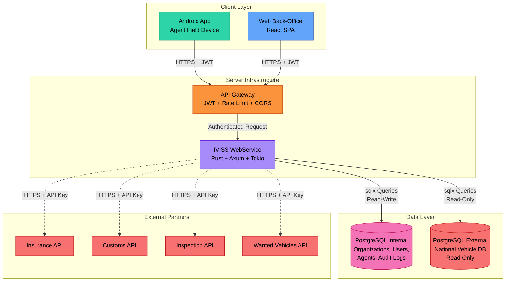
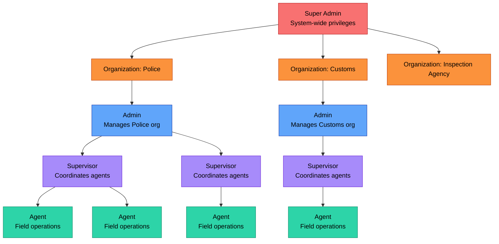
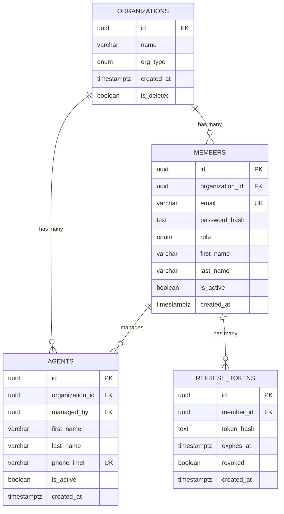

# IVISS — Technical Architecture & System Design Documentation

**Version:** 1.0
**Date:** February 2026
**Author:** IVISS Development Team

---

## Table of Contents

1. [System Overview](#1-system-overview)
2. [High-Level Architecture](#2-high-level-architecture)
3. [Multi-Tenant Organization Hierarchy](#3-multi-tenant-organization-hierarchy)
4. [External Partner API Integration](#5-external-partner-api-integration)
5. [Sequence Diagrams](#6-sequence-diagrams)
6. [Client-Server Communication](#7-client-server-communication)

---

## 1. System Overview

**IVISS** is a multi-tenant platform enabling law enforcement and regulatory organizations to:

- Identify vehicles via license plate recognition (manual entry, photo capture, or live scan)
- Query national vehicle databases for registration details
- Verify vehicle compliance status through partner APIs (insurance, customs, technical inspection, wanted status)

**Key Components:**

- **Rust Backend :** Core API server, business logic, database orchestration
- **Android Mobile App:** Field agent interface for vehicle scanning and lookup
- **Web Back-Office :** Administrative interface for supervisors and admins
- **PostgreSQL (Internal):** IVISS-owned data (users, organizations, audit logs)
- **PostgreSQL (External):** National vehicle registry 
- **Partner APIs:** Third-party services (insurance, customs, inspection, wanted list)

---


## 2. High-Level Architecture



**Legend:**

- **Green:** Mobile client (Android)
- **Blue:** Web client (React)
- **Orange:** API gateway / router
- **Purple:** Core backend service
- **Pink:** Internal database (IVISS-owned)
- **Red:** External systems (not owned by IVISS)


---

## 3. Multi-Tenant Organization Hierarchy

IVISS supports a hierarchical, multi-tenant organization structure with role-based access control (RBAC).

### 3.1 Organization Hierarchy



### 3.2 Role Definitions

| Role                  | Scope               | Permissions                                                                                                                                          | Implementation (MVP)                                                                  |
| --------------------- | ------------------- | ---------------------------------------------------------------------------------------------------------------------------------------------------- | ------------------------------------------------------------------------------------- |
| **Super Admin** | System-wide         | • Create/delete organizations ``• View all organizations``• System configuration``• Access all audit logs                                        | ✅ Implemented `role = "super_admin"` in `members` table                          |
| **Admin**       | Single organization | • Manage members (create/update/delete admins)``• Manage agents (assign/unassign)``• View organization statistics``• Access org-level audit logs | ✅ Implemented `role = "admin"` in `members` table``Scoped to `organization_id` |
| **Supervisor**  | Assigned agents     | • Coordinate field agents ``• View agent activity``• Generate reports``• Handle citizen requests                                                 | ⏭️ Deferred to post-MVP``Will be a separate role or flag                            |
| **Agent**       | Self only           | • Perform vehicle lookups ``• Record controls``• Upload carte grise images``• View own activity history                                          | ✅ Implemented ``Stored in `agents` table``Linked to `managed_by` (admin member)    |

### 3.3 Data Model (Entity Relationships)



**Key Design Notes:**

1. **Agents belong to both an organization AND a managing member:**

   - `organization_id` enables fast org-wide queries (no JOIN needed)
   - `managed_by` enforces ownership (only the managing admin can CRUD their agents)
2. **Members are scoped to one organization:**

   - A member cannot belong to multiple organizations
   - Cross-org access requires separate accounts
3. **Refresh tokens are member-scoped:**

   - Each member can have multiple active sessions (web + mobile)
   - Tokens are revoked on logout or after use (rotation)

---


1. - Cross-org access requires separate accounts
2. **Refresh tokens are member-scoped:**

   - Each member can have multiple active sessions (web + mobile)
   - Tokens are revoked on logout or after use (rotation)

---

## 4. External Partner API Integration

IVISS integrates with four external partner APIs to verify vehicle compliance status.

### 4.1 Partner API Overview

| Partner                       | Purpose                                        | Protocol   | Authentication   | Response Time SLA |
| ----------------------------- | ---------------------------------------------- | ---------- | ---------------- | ----------------- |
| **Insurance API**       | Verify insurance validity                      | HTTPS REST | API Key (header) | < 2 seconds       |
| **Customs API**         | Check customs clearance (dédouanement)        | HTTPS REST | API Key (header) | < 2 seconds       |
| **Inspection API**      | Verify technical inspection (visite technique) | HTTPS REST | API Key (header) | < 2 seconds       |
| **Wanted Vehicles API** | Check if vehicle is flagged as stolen/wanted   | HTTPS REST | API Key (header) | < 2 seconds       |

### 4.2 Partner API Request/Response Contracts

All partner APIs follow a similar pattern:

**Request:**

```http
GET https://partner-api.example.com/v1/vehicles/{chassis_number}/status
Authorization: Bearer {partner_api_key}
Content-Type: application/json
```
