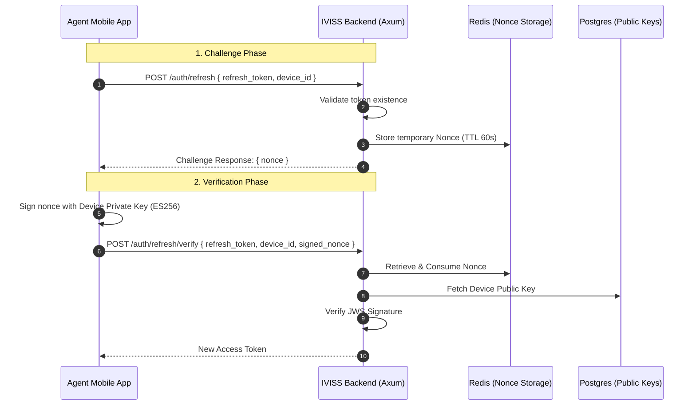

# Auto-Refresh Signature Mechanism

The IVISS system implements a secure, device-bound token refresh flow using a cryptographic challenge-response mechanism. This prevents session hijacking by ensuring that refresh tokens can only be used by the physical device they were originally issued to.

## 1. Overview

The mechanism replaces the standard "send refresh token, get new access token" flow with a multi-step verification:

1. **Challenge**: Request a nonce (Number used ONCE) from the server.
2. **Proof**: Sign the nonce using the device's private key (ES256).
3. **Verification**: Server verifies the signature using the stored public key before issuing a new token.

## 2. Implementation Status

| Component                | Status      | Details                                                                       |
| :----------------------- | :---------- | :---------------------------------------------------------------------------- |
| **Design Spec**          | ✅ Complete | Documented in `docs/User_registration.md` §5.                                 |
| **Frontend Interceptor** | ✅ Complete | Implemented in `src/services/authInterceptor.ts`.                             |
| **Signature Service**    | ✅ Complete | Implemented in `src/services/signatureService.ts` using `jose`.               |
| **Backend Handlers**     | ✅ Complete | `/auth/refresh` and `/auth/refresh/verify` implemented in `handlers/auth.rs`. |

## 3. Detailed Flow & Sequence Diagram

The auto-refresh mechanism involves exactly **2 backend calls** per refresh cycle.

### Sequence Diagram

