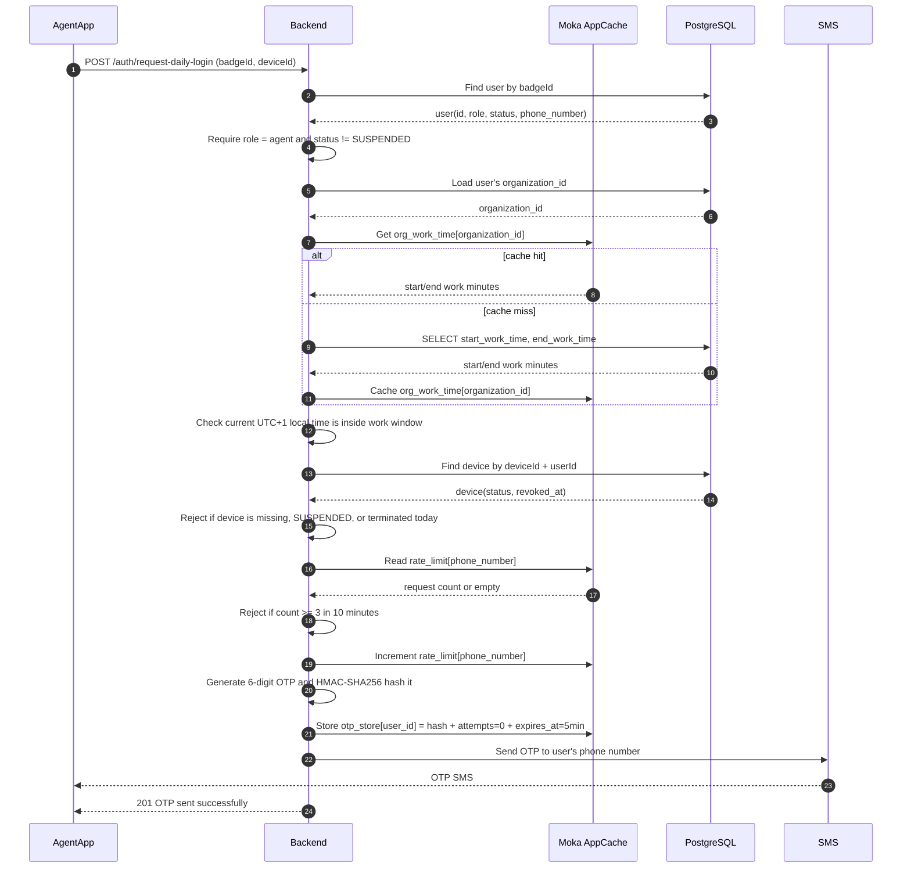
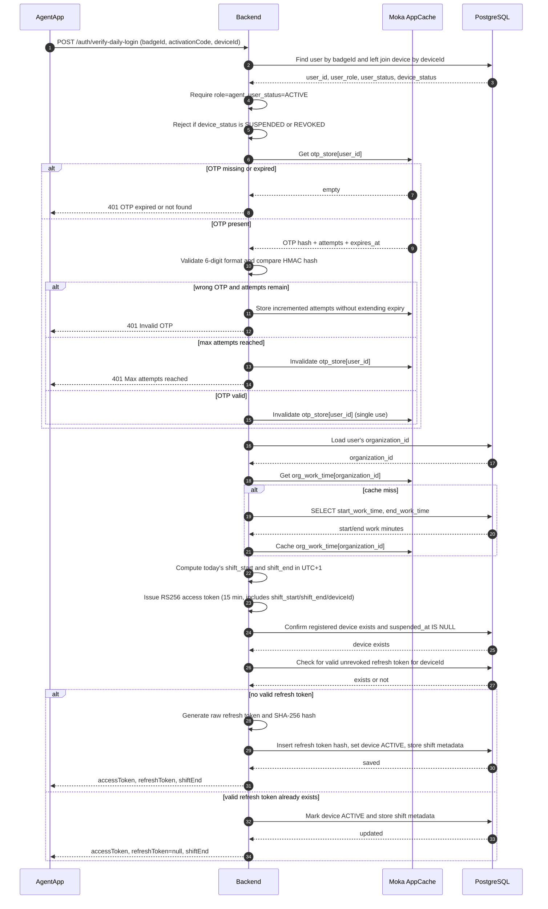
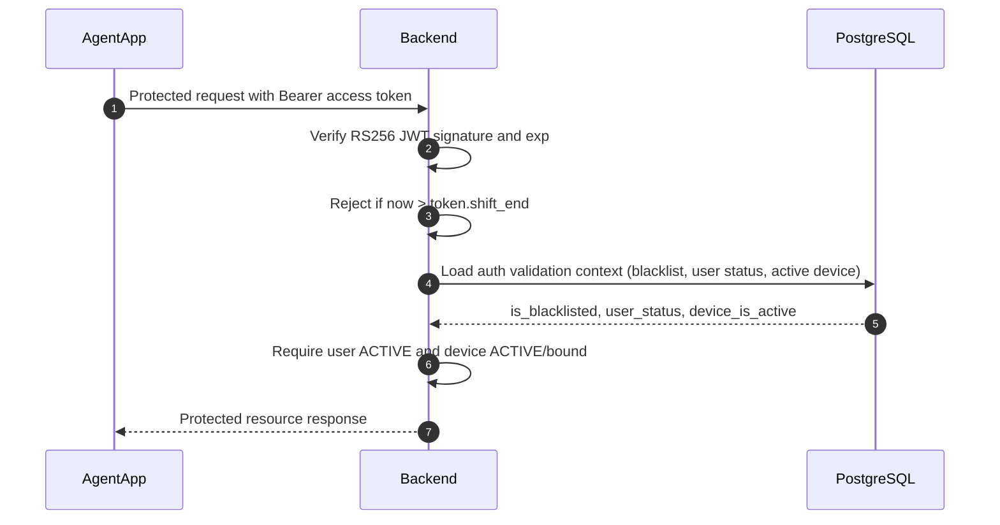
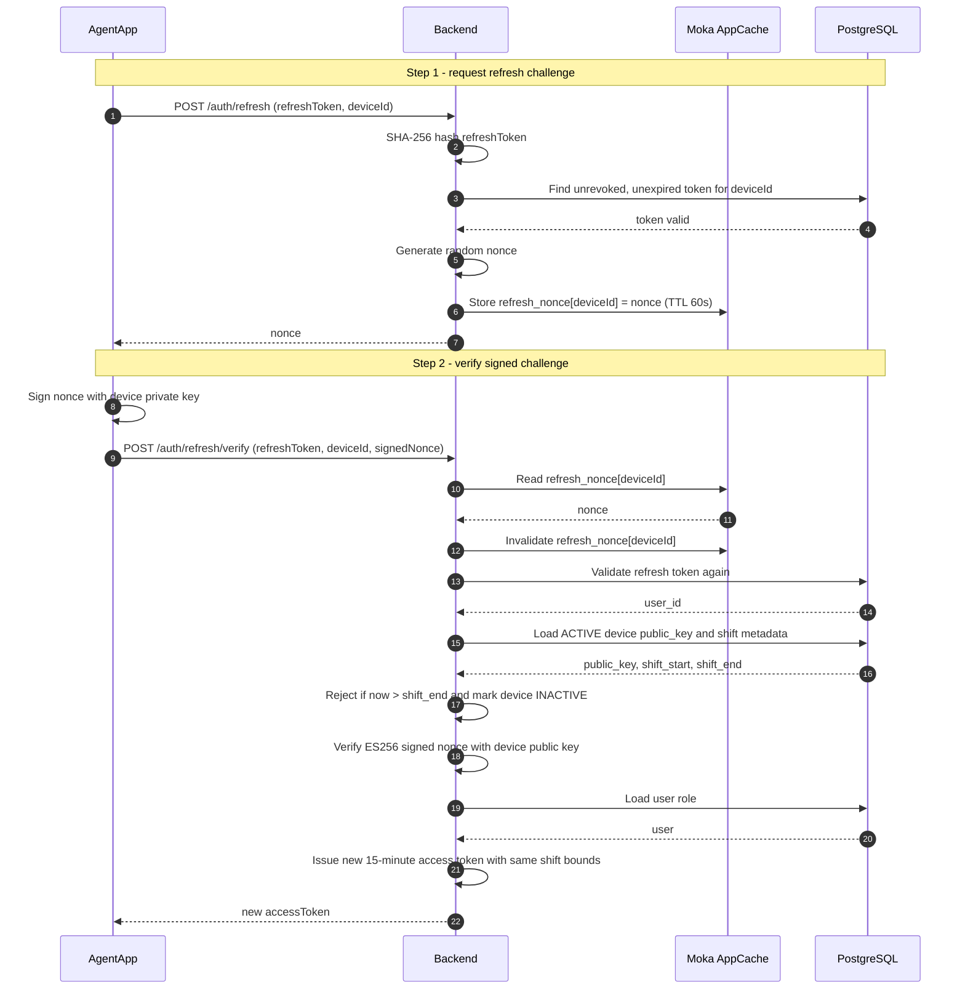
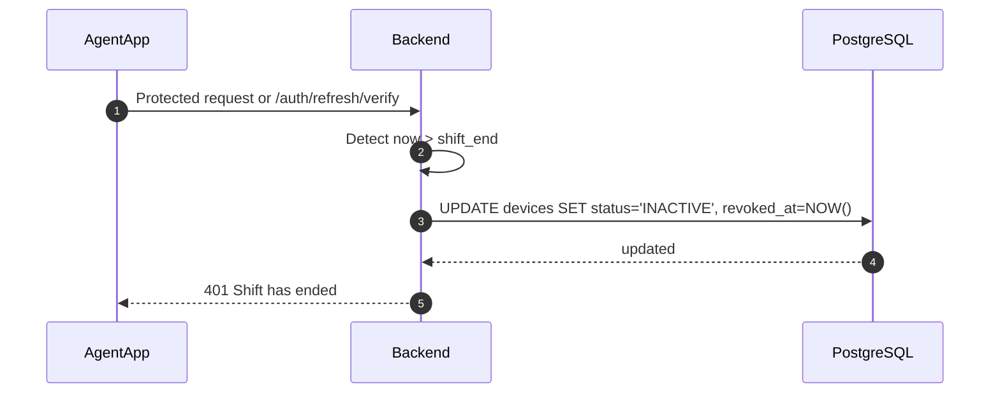
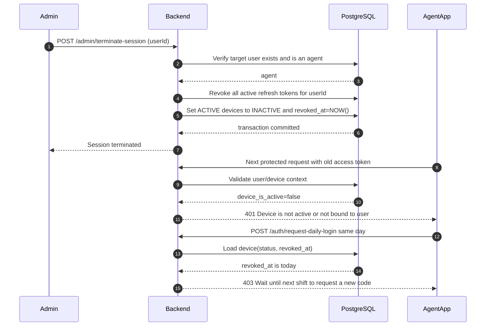

# BE-08 - Daily Login Flow (Agent)

**Ticket:** BE-08
**Last updated:** 2026-05-03

---

## What is this?

Every day, before going on patrol, an agent confirms their identity with their
badge ID, registered device, and a 6-digit OTP sent by SMS. A successful login
opens the shift and gives the agent access until the configured organization
work window ends.

The backend no longer uses Redis for this flow. Temporary data is stored in an
in-process Moka cache (`AppCache`) and persistent session/auth data remains in
PostgreSQL.

---

## Actors

| Actor          | Role |
| -------------- | ---- |
| **AgentApp**   | Android app on the agent's registered phone |
| **Backend**    | IVISS server and auth handlers |
| **Moka Cache** | In-memory `AppCache`: OTPs, OTP rate limits, refresh nonces, cached org work times, short-lived JTI blacklist cache |
| **PostgreSQL** | Main database: users, organizations, devices, refresh tokens, access token blacklist |
| **SMS**        | Configured SMS provider that sends the OTP |
| **Admin**      | Back-office user who can terminate sessions and manage accounts/devices |

---

## Cache Data

| Cache | Key | Value | TTL / behavior |
| ----- | --- | ----- | -------------- |
| `otp_store` | `user_id` | OTP hash, attempt count, absolute expiry | 5 minutes; deleted after successful validation |
| `rate_limit` | phone number | OTP request count | 10 minutes; max 3 requests |
| `refresh_nonce` | `device_id` | nonce to be signed by the device | 60 seconds; consumed on verification |
| `jti_blacklist` | access-token JTI | empty marker | 3 minutes; also backed by PostgreSQL for persistence |
| `org_work_time` | `organization_id` | `(start_work_time, end_work_time)` in minutes since midnight | no TTL; loaded at startup and filled on cache miss |

---

## Device Status

The database enum currently supports these device states:

| Status | Meaning in the daily login flow |
| ------ | ------------------------------- |
| `INACTIVE` | Registered device is allowed to request and verify daily login. |
| `ACTIVE` | Device is working in the current shift and can refresh access tokens. |
| `SUSPENDED` | Device is blocked. OTP request and verification are rejected. |
| `REVOKED` | Legacy/blocked status. Verification rejects it. |
| `PENDING` | Legacy registration status; not used as the normal daily-login standby state. |

Only successful OTP verification sets the registered device to `ACTIVE` and
stores today's `shift_start` and `shift_end` in `devices.metadata`.

---

## Flow 1 - Request Daily OTP

The agent enters their badge ID from a registered device. The backend verifies
that the user is an agent, checks the organization's configured work window
using the Moka organization cache, validates the device, then stores the OTP in
Moka and sends it by SMS.

---

## Flow 2 - Verify Daily Login

The agent submits the OTP. The backend consumes the cached OTP, computes today's
shift bounds from the organization work window, issues an access token, activates
the device, and creates a refresh token only if the device does not already have
a valid one.

---

## Flow 3 - During the Shift: Protected Requests

Every protected mobile request validates the JWT and then checks PostgreSQL for
the user's current status, device binding/status, and token blacklist state.

---

## Flow 4 - Access Token Renewal

Agent refresh is a two-step challenge-response flow. The nonce is stored in Moka
for 60 seconds and consumed when verified, so replaying the same signed nonce
does not work.

---

## Flow 5 - End of Shift

When the JWT `shift_end` is in the past, the backend marks the device as
`INACTIVE` and sets `revoked_at = NOW()`. Subsequent requests and refreshes fail
until the agent completes the daily login flow again.

---

## Flow 6 - Admin Terminates an Agent Session

The current admin endpoint is `/api/v1/admin/terminate-session`. It revokes all
active refresh tokens for the agent and marks active devices as `INACTIVE`.
Because protected mobile requests require the device to be `ACTIVE`, the next
request from the agent is rejected.

---

## Session Rules

| Rule | Current behavior |
| ---- | ---------------- |
| Daily login request payload | `badgeId` and `deviceId` |
| OTP cache | Moka `otp_store`, keyed by `user_id` |
| OTP validity window | 5 minutes, absolute TTL |
| OTP attempts | 5 attempts max; entry is invalidated after max attempts or success |
| OTP request rate limit | 3 requests per phone number per 10 minutes in Moka `rate_limit` |
| Work window | Organization `start_work_time` and `end_work_time`, minutes since midnight, checked in UTC+1 local time |
| Work time cache | Moka `org_work_time`, loaded at startup and on cache miss |
| Access token duration | 15 minutes |
| Shift bounds | Stored in the access token and in `devices.metadata` |
| Refresh token duration | 30 days |
| Refresh flow | Challenge-response: nonce in Moka, device signs nonce, backend verifies with stored public key |
| Device activation | Successful OTP verification sets device to `ACTIVE` |
| End of shift | Backend marks device `INACTIVE` and sets `revoked_at` |
| Admin session termination | Revokes refresh tokens and marks active devices `INACTIVE`; same-day OTP request is blocked by `revoked_at` |

---

## Implementation References

| Area | File |
| ---- | ---- |
| App cache definitions | `iviss-backend/src/app_cache.rs` |
| OTP generation, hashing, rate limit, validation | `iviss-backend/src/services/otp_service.rs` |
| Daily login handlers | `iviss-backend/src/handlers/auth.rs` |
| Refresh challenge-response handlers | `iviss-backend/src/handlers/auth.rs` |
| Mobile auth middleware | `iviss-backend/src/middleware/auth.rs` |
| Auth/session queries | `iviss-backend/src/queries/auth_queries.rs`, `iviss-backend/src/queries/session_queries.rs` |
