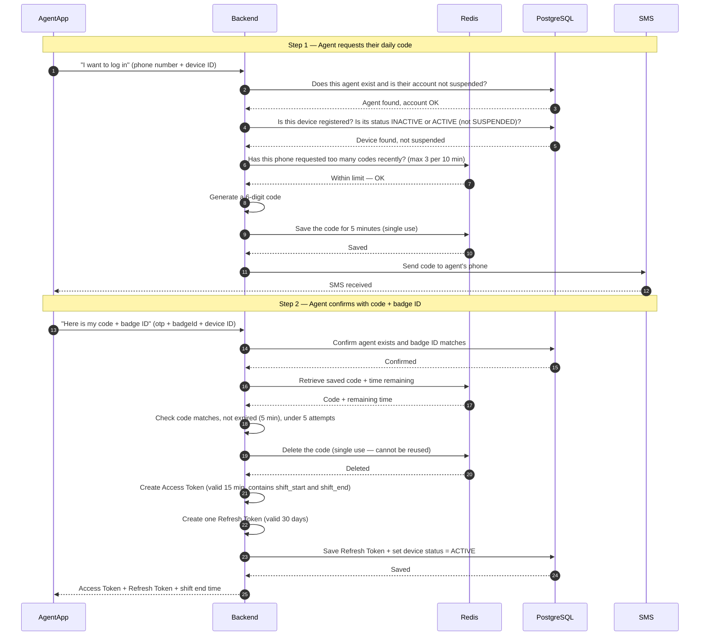
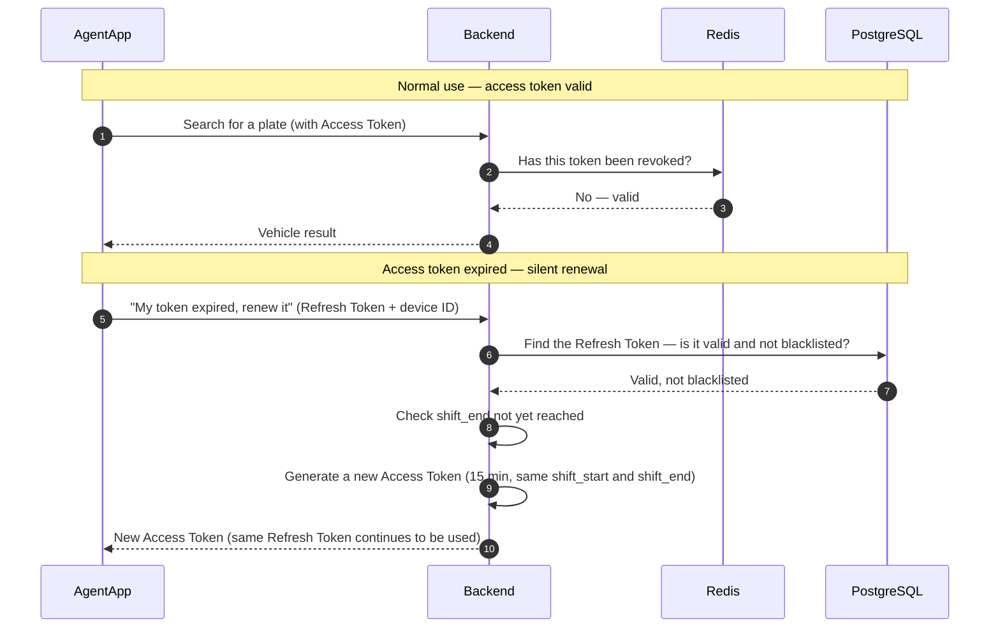
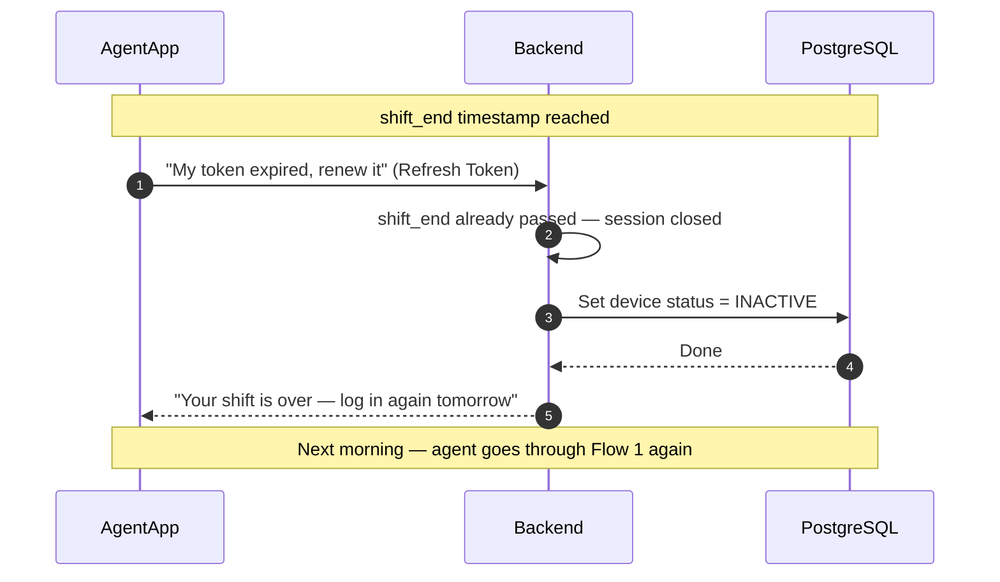
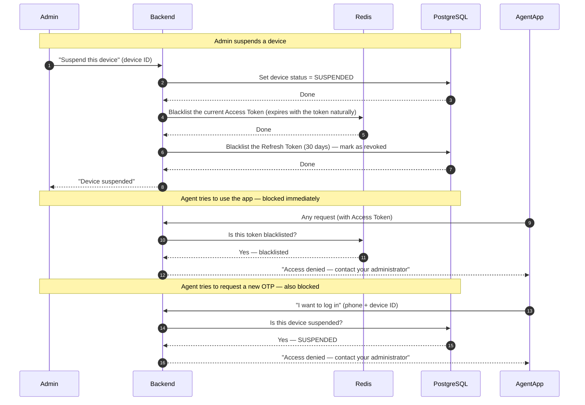
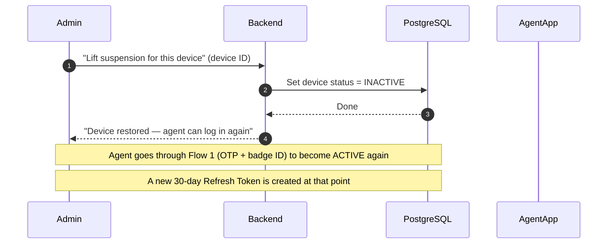

# BE-08 — Daily Login Flow (Agent)

**Ticket:** BE-08
**Last updated:** 2026-03-06

---

## What is this?

Every morning, before going on patrol, an agent confirms their identity with a **6-digit code sent by SMS** combined with their  **badge ID** . This opens their shift and gives them access to the app until the shift ends.

At the end of the shift, access closes automatically and the device returns to standby — ready for the next morning.

An admin can suspend an agent's device at any time, which immediately blocks all access, even mid-session.

---

## Actors

| Actor                | Role                                                                |
| -------------------- | ------------------------------------------------------------------- |
| **AgentApp**   | The Android app on the agent's phone                                |
| **Backend**    | The IVISS server                                                    |
| **Redis**      | Temporary storage — OTP codes, rate limits, blacklisted tokens     |
| **PostgreSQL** | Main database — users, devices, tokens                             |
| **SMS**        | Gateway (Twilio) that sends the OTP to the agent                    |
| **Admin**      | Back-office user who manages agents and can suspend/restore devices |

---

## Device Status

A device has exactly three possible states:

| Status        | Meaning                                                 | Can request OTP?                          |
| ------------- | ------------------------------------------------------- | ----------------------------------------- |
| `INACTIVE`  | Normal standby — shift not started or shift just ended | ✅ Yes                                    |
| `ACTIVE`    | Shift in progress — agent is working                   | ✅ Yes (but new OTP not needed mid-shift) |
| `SUSPENDED` | Blocked by admin                                        | ❌ No                                     |

> **Only a successful OTP + badge ID verification can set a device to `ACTIVE`.**
> The device goes back to `INACTIVE` automatically when the shift ends, or when an admin lifts a suspension.

---

## Flow 1 — Morning Login (OTP)

The agent requests their daily code, then confirms it with their badge ID.

---

## Flow 2 — During the Shift (Token Renewal)

The access token lasts 15 minutes. When it expires, the app silently gets a new one using the refresh token — the agent sees nothing. The **same refresh token (30 days) is reused** throughout all renewals during the agent's sessions.

---

## Flow 3 — End of Shift (Automatic)

When `shift_end` is reached, the system automatically closes the session. The device returns to `INACTIVE` — the agent can request a new OTP the next morning.

---

## Flow 4 — Admin Suspends a Device

An admin can immediately cut access to a device at any time — even during an active session. The refresh token (30 days) is blacklisted so no new access token can be generated.

---

## Flow 5 — Admin Lifts the Suspension

When an admin lifts the suspension, the device goes back to `INACTIVE`. The agent must go through a normal OTP login (Flow 1) to become `ACTIVE` again.

---

## Session Rules

| Rule                         | Detail                                                              |
| ---------------------------- | ------------------------------------------------------------------- |
| Shift is valid while         | `shift_start ≤ current time < shift_end`                         |
| Access token duration        | 15 minutes — renewed automatically using the Refresh Token         |
| Refresh token duration       | 30 days — one token per activation, reused throughout all renewals |
| A device becomes ACTIVE      | Only after successful OTP + badge ID verification                   |
| A device returns to INACTIVE | Automatically at `shift_end`, or when admin lifts a suspension    |
| A device is SUSPENDED        | Admin action — blocks OTP requests, blacklists the Refresh Token   |
| Max OTP attempts             | 5 — code destroyed after the 5th wrong attempt                     |
| OTP validity window          | 5 minutes — cannot be extended                                     |
| Max OTP requests per phone   | 3 per 10 minutes                                                    |

---

## Dependencies

| Ticket | What is needed                                            |
| ------ | --------------------------------------------------------- |
| BE-02  | OTP generation and SMS sending                            |
| BE-03  | Token creation, device registration and status management |
| BE-05  | Token validation on every protected request               |
