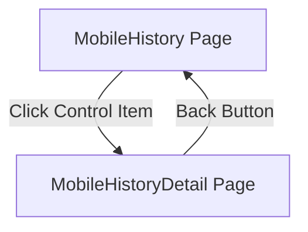

# Design: History Detail View

## Description
This feature allows users to view the full details of a past vehicle control from the History page. Since the data is already available in the history list, the detail view will use that data directly instead of performing a new search.

## User Review Required
> [!IMPORTANT]
> The history data (`ListControlResponse`) contains only the statuses (valid/warning/critical) for each category (registration, insurance, etc.) and does not include the full vehicle technical details (brand, model, owner info) that a "Live Search" provides. The History Detail view will focus on the recorded control event.

## Mermaid Flow

## Routing
| Path | Component | Auth | Description |
|------|-----------|------|-------------|
| `/mobile/history/:id` | `MobileHistoryDetail` | Yes | Shows details of a specific past control |

## UI/UX Plan
- **History Item**: Add navigation to `/mobile/history/:id` using `navigate` with `state` containing the control object.
- **Detail Page**: 
  - Retrieve control data from `location.state`.
  - Display plate number, overall status, timestamp, and location.
  - Display a grid or list of the individual category statuses (Registration, Insurance, etc.).
  - Display any recorded actions or notes.
  - No "Search" call will be performed.
