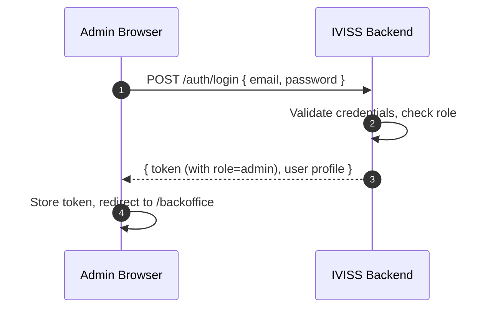

# Admin-Only RBAC

---

## Overview

IVISS enforces **role-based access control (RBAC)** so that only users with `role = "admin"` can access back-office administration features. Non-admin users (agents, supervisors) are restricted to their respective mobile workflows.

---

## Roles

| Role | Access | Login method |
|------|--------|--------------|
| `admin` | Back-office dashboard, user management, organizations, audit logs, settings | Email + password via `/admin-login` |
| `agent` | Mobile app (scan, search, history) | Device activation + daily OTP |
| `supervisor` | Mobile app + limited back-office (dashboard, controls) | Device activation + daily OTP |

---

## Admin Login Flow



1. Admin navigates to `/admin-login`.
2. Enters email and password.
3. Frontend calls `POST /auth/login` with `{ email, password }`.
4. Backend returns an access token containing `role: "admin"` and the user profile.
5. Frontend stores the session and redirects to `/backoffice`.

---

## Frontend Enforcement

### Route Guards

All protected routes declare an `allowedRoles` array. The `RequireAuth` component checks `user.role` against this list:

- **Match** → render the page.
- **No match** → redirect admin users to `/backoffice`, non-admin users to `/mobile`.
- **Not authenticated** → redirect to `/activate` or `/daily-login`.

```
/backoffice              → ['admin', 'supervisor']
/backoffice/controls     → ['admin', 'supervisor']
/backoffice/users        → ['admin']
/backoffice/organizations→ ['admin']
/backoffice/audit        → ['admin']
/backoffice/settings     → ['admin']
/mobile/*                → ['agent', 'supervisor']
```

### Navigation Visibility

The back-office sidebar conditionally renders admin-only nav items:

```tsx
const isAdmin = user?.role === 'admin';

{isAdmin && (
  <div>
    {/* Users, Organizations, Audit Logs, Settings */}
  </div>
)}
```

Non-admin users who access `/backoffice` (e.g. supervisors) see only the dashboard and control history — not the administration section.

---

## Backend Enforcement

Admin endpoints are grouped under `/admin/*` in `routes.rs`. The `require_auth` middleware validates the JWT on every request. Admin-specific middleware further checks `role == "admin"`:

| Scenario | HTTP Status |
|----------|-------------|
| No token | `401 Unauthorized` |
| Valid token, non-admin role | `403 Forbidden` |
| Valid token, admin role | Request proceeds |

---

## Bootstrap: Creating the First Admin

The first admin account is created via an **environment-seeded bootstrap**:

- Set `ADMIN_EMAIL`, `ADMIN_PASSWORD` in `iviss-backend/.env`.
- On startup, the backend checks if an admin exists; if not, it creates one.
- This is **idempotent** — running it again does not create duplicates.

---

## Key Files

| File | Purpose |
|------|---------|
| `frontend/src/pages/auth/AdminLogin.tsx` | Admin sign-in page |
| `frontend/src/contexts/AuthContext.tsx` | Auth state + real `loginUser` API call |
| `frontend/src/router/routes.ts` | Route definitions with `allowedRoles` |
| `frontend/src/router/RequireAuth.tsx` | Role-based route guard |
| `frontend/src/components/layout/BackOfficeSidebar.tsx` | Admin nav visibility gating |
| `iviss-backend/src/routes.rs` | Backend route assembly (public, admin, protected) |
| `iviss-backend/src/middleware/auth.rs` | JWT validation + role checking |
