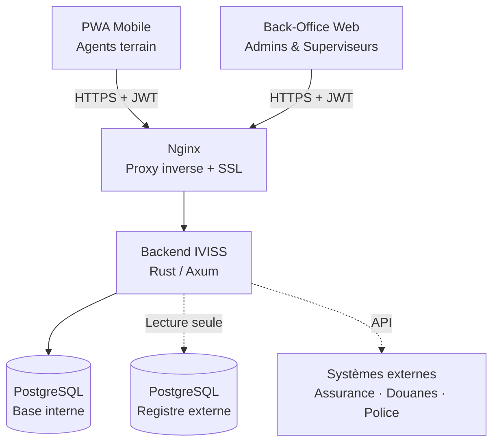

# IVISS — Document de Déploiement et de Gestion des Versions

**Titre du document :** Runbook de Déploiement et de Versions IVISS
**Version :** 1.0
**Date :** Mai 2026
**Classification :** Interne / Client
**Auteurs :** Équipe de développement IVISS

---

## Table des matières

> Les sections ci-dessous sont colorées en **bleu** pour la navigation.

1. [Résumé exécutif](#1-résumé-exécutif)
2. [Architecture du système](#2-architecture-du-système)
3. [Hébergement et infrastructure](#3-hébergement-et-infrastructure)
4. [Environnements](#4-environnements)
5. [Pipeline CI/CD et processus de release](#5-pipeline-cicd-et-processus-de-release)
6. [Stratégie de versionnement et de release](#6-stratégie-de-versionnement-et-de-release)
7. [Processus de déploiement](#7-processus-de-déploiement)
8. [Configuration et gestion des secrets](#8-configuration-et-gestion-des-secrets)
9. [Sécurité et conformité](#9-sécurité-et-conformité)
10. [Monitoring, journalisation et observabilité](#10-monitoring-journalisation-et-observabilité)
11. [Sauvegarde et reprise après sinistre](#11-sauvegarde-et-reprise-après-sinistre)
12. [Rollback et gestion des incidents](#12-rollback-et-gestion-des-incidents)
13. [Maintenance et procédures opérationnelles](#13-maintenance-et-procédures-opérationnelles)
14. [Résolution des problèmes](#14-résolution-des-problèmes)
15. [Annexes](#15-annexes)

---

## 1. Résumé exécutif

**IVISS** (Système Intégré d'Inspection et de Surveillance des Véhicules) est une plateforme multi-tenant conçue pour les forces de l'ordre et les agences de régulation afin d'effectuer des contrôles routiers, vérifier la conformité des véhicules, gérer les actions coercitives et maintenir un registre centralisé des véhicules.

Le système est composé d'une Progressive Web App mobile pour les agents de terrain, d'un back-office web pour les administrateurs et superviseurs, et d'un backend API développé en Rust. Il est déployé sur AWS Lightsail via un pipeline CI/CD entièrement automatisé basé sur GitHub Actions, avec une infrastructure gérée en tant que code via Terraform et Ansible.

**Technologies clés :**

| Couche | Technologie |
|---|---|
| Backend | Rust, Axum, SQLx |
| Frontend | React, TypeScript, Vite |
| Base de données | PostgreSQL 15 |
| Conteneurisation | Docker, Docker Compose |
| Infrastructure as Code | Terraform |
| Gestion de configuration | Ansible |
| CI/CD | GitHub Actions |
| Registre de conteneurs | GitHub Container Registry (GHCR) |
| Fournisseur cloud | AWS Lightsail |

---

## 2. Architecture du système

### 2.1 Vue d'ensemble

Le diagramme ci-dessous montre comment les différents composants d'IVISS interagissent. Les applications clientes communiquent avec le backend via un proxy inverse Nginx sécurisé. Le backend gère toute la logique métier et interroge à la fois une base de données interne et un registre national externe.



### 2.2 Détail des composants

Le tableau ci-dessous décrit le rôle de chaque composant dans le système.

| Composant | Description |
|---|---|
| **Nginx** | Proxy inverse, terminaison SSL, service des fichiers statiques du frontend |
| **Backend IVISS** | API principale — authentification, recherche de véhicules, contrôles, OTP, RBAC |
| **PostgreSQL (Interne)** | Données IVISS : utilisateurs, organisations, véhicules, contrôles, journaux d'audit |
| **PostgreSQL (Externe)** | Registre national des véhicules — accès en lecture seule |
| **GHCR** | Registre privé d'images Docker hébergé sur GitHub |

---

## 3. Hébergement et infrastructure

Cette section décrit le fournisseur cloud, les spécifications du serveur et les outils utilisés pour provisionner et gérer l'infrastructure automatiquement.

### 3.1 Fournisseur cloud et serveur

| Ressource | Valeur |
|---|---|
| Fournisseur | AWS Lightsail |
| Région | eu-west-1 (Europe — Irlande) |
| Offre | `small_3_0` — 2 vCPUs, 2 Go RAM, 60 Go SSD |
| Système d'exploitation | Ubuntu 22.04 LTS |
| IP statique | Oui — attachée via la ressource IP statique Lightsail |
| Ports ouverts | 22 (SSH), 80 (HTTP), 443 (HTTPS) |

### 3.2 Infrastructure as Code

Toute l'infrastructure est définie et gérée via **Terraform**, garantissant que l'environnement est reproductible et versionné. L'état Terraform est stocké à distance dans AWS S3 avec verrouillage DynamoDB pour éviter les modifications concurrentes.

| Composant IaC | Outil | Emplacement |
|---|---|---|
| Provisionnement du serveur | Terraform | `infra/terraform/` |
| Configuration du serveur | Ansible | `infra/ansible/` |
| Script de déploiement | Bash | `infra/scripts/deploy.sh` |
| Stockage de l'état distant | AWS S3 | `iviss-terraform-state-<account-id>` |
| Verrouillage de l'état | AWS DynamoDB | `iviss-terraform-lock` (eu-central-1) |

### 3.3 Réseau

- Tout le trafic entre par **Nginx** sur les ports 80/443
- HTTP est automatiquement redirigé vers HTTPS
- L'API backend n'est pas exposée directement — toutes les requêtes passent par Nginx
- Les certificats SSL sont émis et renouvelés automatiquement via **Let's Encrypt / Certbot**

---

## 4. Environnements

IVISS fonctionne actuellement dans deux environnements. Il n'existe pas d'environnement de staging dédié — la configuration de développement local remplit ce rôle.

| Environnement | Branche | Objectif | URL |
|---|---|---|---|
| Développement local | Toute branche feature | Tests développeur avec rechargement à chaud | `http://localhost:8080` |
| Production | `dev` | Système en production — tout merge déclenche un déploiement | `https://<domaine>` |

> **Note :** La branche `dev` est la branche de production active. Il n'existe pas d'environnement de staging séparé — l'environnement de développement local remplit ce rôle.

---

## 5. Pipeline CI/CD et processus de release

### 5.1 Outils utilisés

| Outil | Rôle |
|---|---|
| GitHub Actions | Orchestration du pipeline |
| Docker Buildx | Construction d'images multi-plateformes |
| GHCR | Stockage des images Docker |
| Terraform | Provisionnement de l'infrastructure |
| Ansible | Configuration du serveur et déploiement de l'application |
| Semantic Release | Versionnement automatique et notes de version |

### 5.2 Étapes du pipeline

Chaque Pull Request mergée dans `dev` déclenche la séquence automatisée suivante :

```
1. Vérifications CI
   ├── Backend : build, tests, couverture, lint, format, audit sécurité
   └── Frontend : build, lint, vérification des types, tests unitaires, SonarQube

2. Release
   └── Semantic Release analyse les commits → attribue une version → publie la GitHub Release

3. Build et push Docker  (déclenché par le nouveau tag de release)
   ├── Build image backend → push vers ghcr.io/skyengpro/iviss/backend:<version>
   └── Build image frontend → push vers ghcr.io/skyengpro/iviss/frontend:<version>

4. Déploiement sur AWS  (déclenché après le succès du build Docker)
   ├── Terraform : provisionnement / mise à jour de l'infrastructure
   └── Ansible : configuration du serveur, pull des nouvelles images, redémarrage des conteneurs
```

### 5.3 Stratégie de branches

| Type de branche | Convention de nommage | Objectif |
|---|---|---|
| Fonctionnalité | `feat/123-description` | Nouvelles fonctionnalités |
| Correction | `fix/123-description` | Corrections de bugs |
| Amélioration | `enhancement/123-description` | Améliorations |
| Infrastructure | `dep/description` | Changements de déploiement/infra |

Toutes les branches sont mergées dans `dev` via des Pull Requests. Les pushs directs sur `dev` nécessitent au moins une approbation de revue.

### 5.4 Critères de qualité

Un déploiement ne se poursuit que si tous les éléments suivants sont validés :

- Tests unitaires backend (couverture minimale de 50% des lignes)
- Tests unitaires frontend
- Vérification des types TypeScript (zéro erreur)
- ESLint (maximum 10 avertissements)
- Rust Clippy (zéro avertissement)
- Audit de sécurité via `cargo-audit`

---

## 6. Stratégie de versionnement et de release

### 6.1 Schéma de versionnement

IVISS utilise le **Semantic Versioning (SemVer)** : `MAJEUR.MINEUR.CORRECTIF`

| Partie de la version | Déclencheur | Exemple |
|---|---|---|
| CORRECTIF | Commits `fix:` | `v0.1.0` → `v0.1.1` |
| MINEUR | Commits `feat:` | `v0.1.0` → `v0.2.0` |
| MAJEUR | `feat!:` ou `BREAKING CHANGE:` | `v0.1.0` → `v1.0.0` |
| Pas de release | `chore:`, `docs:`, `style:`, `refactor:` | — |

### 6.2 Comment les versions sont décidées

Les numéros de version sont attribués **automatiquement** par Semantic Release sur la base des Conventional Commits. Aucune décision manuelle n'est requise. Lors du merge d'une PR, tous ses commits sont analysés et le type de commit le plus impactant détermine le bump de version. Une seule release est créée par merge, quel que soit le nombre de commits.

### 6.3 Artefacts de release

Chaque release produit :

- Un **tag Git** (ex. `v0.2.0`) sur la branche `dev`
- Une **GitHub Release** avec des notes de version générées automatiquement
- Des **images Docker** taguées avec le numéro de version et poussées vers GHCR

---

## 7. Processus de déploiement

### 7.1 Méthode de déploiement

IVISS utilise une stratégie de déploiement **recreate** — les conteneurs existants sont arrêtés et remplacés par de nouveaux tirant la dernière image de release. Il n'y a pas de load balancer ni de configuration blue-green à ce stade.

**Durée estimée du déploiement :** 3 à 8 minutes

### 7.2 Étapes du déploiement automatisé

Le script `infra/scripts/deploy.sh` exécute les étapes suivantes :

1. **Terraform init** — initialise le backend distant (S3 + DynamoDB)
2. **Terraform apply** — provisionne ou met à jour l'instance Lightsail et l'IP statique
3. **Extraction de la clé SSH** — sauvegarde la clé générée pour Ansible
4. **Génération de l'inventaire Ansible** — écrit l'IP du serveur dans le fichier d'inventaire
5. **Vérification de disponibilité SSH** — attend que le port 22 soit accessible
6. **Playbook Ansible** — configure le serveur, se connecte à GHCR, tire les nouvelles images, redémarre Docker Compose

### 7.3 Vérification post-déploiement

```bash
# Vérifier que tous les conteneurs sont en cours d'exécution
docker compose ps

# Vérifier le point de terminaison de santé du backend
curl https://<domaine>/api/v1/health
# Réponse attendue : 200 OK

# Vérifier que le frontend est accessible
curl -I https://<domaine>
# Attendu : HTTP/2 200
```

### 7.4 Déclenchement manuel du déploiement

1. Aller sur GitHub → **Actions** → **Docker**
2. Cliquer sur **Run workflow** → taper `yes` → confirmer

---

## 8. Configuration et gestion des secrets

Toute la configuration sensible est stockée sous forme de **GitHub Actions Secrets** — chiffrés au repos et injectés dans le pipeline au moment de l'exécution. Aucun secret n'est stocké dans le code source.

### 8.1 Catégories de secrets

| Catégorie | Secrets |
|---|---|
| Identifiants AWS | `AWS_ACCESS_KEY_ID`, `AWS_SECRET_ACCESS_KEY` |
| Domaine et SSL | `DOMAIN_NAME`, `CERTBOT_EMAIL` |
| Authentification JWT | `JWT_SECRET`, `JWT_PRIVATE_KEY_PEM`, `JWT_PUBLIC_KEY_PEM` |
| Sécurité OTP | `ACTIVATION_CODE_PEPPER` |
| Base de données | `POSTGRES_USER`, `POSTGRES_PASSWORD`, `POSTGRES_DB` |
| Compte admin initial | `ADMIN_BOOTSTRAP_EMAIL`, `ADMIN_BOOTSTRAP_PASSWORD`, `ADMIN_BOOTSTRAP_PHONE`, `ADMIN_BOOTSTRAP_USERNAME` |
| Registre de conteneurs | `REGISTRY_USERNAME`, `REGISTRY_TOKEN` |
| Fournisseur SMS | `SMS_PROVIDER` + clés spécifiques au fournisseur |
| Fournisseur e-mail | `EMAIL_PROVIDER` + clés spécifiques au fournisseur |

### 8.2 Configuration des fournisseurs

**Fournisseurs SMS** (configuré via `SMS_PROVIDER`) :

| Valeur | Fournisseur | Notes |
|---|---|---|
| `mock` | Aucun — journalise dans la console | Développement/tests uniquement |
| `orange` | Orange Cameroun | Numéros `+237` uniquement |
| `twilio` | Twilio | Couverture internationale |
| `vonage` | Vonage (Nexmo) | Couverture internationale |

**Fournisseurs e-mail** (configuré via `EMAIL_PROVIDER`) :

| Valeur | Fournisseur |
|---|---|
| `mock` | Journalise dans la console — tests uniquement |
| `smtp` | Gmail, Outlook ou serveur SMTP personnalisé |
| `resend` | API Resend.com |

---

## 9. Sécurité et conformité

### 9.1 Authentification et autorisation

- Tous les points de terminaison API nécessitent un **token JWT (RS256)** valide
- Les tokens sont de courte durée (15 minutes pour les agents, 24 heures pour les sessions web)
- La connexion des agents utilise un **OTP temporel** envoyé par SMS — valide 5 minutes, usage unique
- Le RBAC est appliqué au niveau du middleware sur chaque requête
- Les sessions des agents sont liées à un appareil spécifique et à une fenêtre de quart de travail

### 9.2 Chiffrement

- Tout le trafic est chiffré en transit via **TLS 1.2/1.3** (certificat Let's Encrypt)
- Les mots de passe de base de données et les clés JWT sont stockés sous forme de GitHub Secrets chiffrés
- Les codes OTP sont stockés sous forme de **hachages HMAC-SHA256** avec un pepper secret — jamais en clair

### 9.3 Sécurité réseau

- Seuls les ports 22, 80 et 443 sont ouverts sur le pare-feu du serveur
- La base de données n'est pas exposée à l'extérieur — accessible uniquement au sein du réseau Docker
- L'API backend n'est pas directement accessible — toutes les requêtes passent par Nginx

### 9.4 Sécurité des dépendances

- Les dépendances Rust sont auditées à chaque exécution CI via `cargo-audit`
- Les vulnérabilités connues sans correctif disponible sont explicitement ignorées avec justification documentée

### 9.5 Journalisation des audits

Toutes les actions administratives (création d'utilisateur, résiliation de session, approbation/rejet de soumission) sont enregistrées dans le journal d'audit avec horodatage, acteur et détails de l'action.

---

## 10. Monitoring, journalisation et observabilité

IVISS utilise une stack Prometheus + Grafana pour collecter et visualiser les métriques du frontend et du backend. Cette section décrit les outils, ce qui est surveillé et comment accéder aux tableaux de bord.

### 10.1 Stack de monitoring

Les outils suivants constituent la stack d'observabilité. Ils fonctionnent comme des conteneurs Docker aux côtés de l'application.

| Outil | Rôle | Port |
|---|---|---|
| **Prometheus** | Collecte et stockage des métriques | 9090 |
| **Grafana** | Tableaux de bord et visualisation | 3001 |
| **Serveur de métriques** | Pont Node.js entre le frontend et Prometheus | 9091 |

### 10.2 Journalisation backend

Le backend utilise la journalisation structurée via le crate `tracing`. Le niveau de log est configurable via le secret `LOG_LEVEL` (`info` en production, `debug` pour le débogage).

```bash
# Voir les logs backend en direct
cd /opt/iviss
docker compose logs -f backend
```

### 10.3 Accès aux tableaux de bord

Une fois la stack démarrée, les tableaux de bord sont accessibles aux URLs suivantes.

| Tableau de bord | URL |
|---|---|
| Grafana | `https://<domaine>:3001` |
| Prometheus | `https://<domaine>:9090` |

---

## 11. Sauvegarde et reprise après sinistre

### 11.1 Sauvegarde de la base de données

> ⚠️ Les sauvegardes automatiques de la base de données ne sont pas encore configurées. Cela doit être traité avant une utilisation complète en production.

**Sauvegarde manuelle :**

```bash
docker compose exec db pg_dump -U iviss_user iviss_prod > sauvegarde_$(date +%Y%m%d).sql
```

**Approche recommandée (à implémenter) :** `pg_dump` quotidien exporté vers S3 avec une rétention de 30 jours.

### 11.2 Reprise de l'infrastructure

Comme toute l'infrastructure est définie en tant que code, l'environnement serveur complet peut être reproduit depuis zéro :

```bash
./infra/scripts/deploy.sh <domaine> <email>
```

**Objectif de temps de reprise (RTO) :** ~10 minutes pour l'infrastructure
**Objectif de point de reprise (RPO) :** Dépend de la fréquence des sauvegardes (manuelle actuellement)

---

## 12. Rollback et gestion des incidents

### 12.1 Retour à une version précédente

```bash
cd /opt/iviss
# Modifier docker-compose.yml pour utiliser le tag de version précédent (ex. :v0.1.0)
docker compose pull
docker compose up -d
```

### 12.2 Détection d'une mauvaise release

- Le point de terminaison de santé retourne un code non-200 : `curl https://<domaine>/api/v1/health`
- Conteneurs en état `Restarting` : `docker compose ps`
- Pic d'erreurs dans le tableau de bord Grafana
- Échecs de connexion des agents signalés par les équipes terrain

### 12.3 Niveaux de sévérité des incidents

| Niveau | Description | Temps de réponse |
|---|---|---|
| P1 — Critique | Système complètement hors service | Immédiat |
| P2 — Élevé | Fonctionnalité principale défaillante (connexion, recherche) | < 1 heure |
| P3 — Moyen | Fonctionnalité non critique dégradée | < 4 heures |
| P4 — Faible | Problème d'interface mineur, bug cosmétique | Prochaine release |

---

## 13. Maintenance et procédures opérationnelles

### 13.1 Opérations courantes

| Tâche | Commande |
|---|---|
| Voir l'état de tous les conteneurs | `docker compose ps` |
| Voir les logs en direct | `docker compose logs -f` |
| Redémarrer un service spécifique | `docker compose restart backend` |
| Tirer les dernières images et redémarrer | `docker compose pull && docker compose up -d` |
| Se connecter à la base de données | `docker compose exec db psql -U iviss_user -d iviss_prod` |

### 13.2 Renouvellement des certificats SSL

Les certificats SSL se renouvellent automatiquement tous les 90 jours. Pour déclencher manuellement le renouvellement :

```bash
certbot renew
```

### 13.3 Configuration des quarts de travail

Les heures de connexion des agents sont contrôlées par les secrets `SHIFT_START_HOUR` et `SHIFT_END_HOUR` (UTC+1, fuseau horaire Africa/Douala). Les modifications nécessitent un redéploiement.

---

## 14. Résolution des problèmes

### Les agents ne peuvent pas se connecter / OTP non reçu

1. Vérifier que `SMS_PROVIDER` est correctement configuré
2. Consulter les logs backend : `docker compose logs backend | grep sms`
3. Si Orange Cameroun est utilisé, vérifier que le numéro commence par `+237`
4. Vérifier que la demande est dans la fenêtre horaire du quart configuré

### Erreurs 401 Non autorisé sur le frontend

1. Vérifier que `JWT_PRIVATE_KEY_PEM` et `JWT_PUBLIC_KEY_PEM` sont correctement formatés (une seule ligne, séparateurs `\n`)
2. Redéployer pour s'assurer que le backend a chargé les bonnes clés

### Échec du déploiement — Incompatibilité de checksum de l'état Terraform

1. Aller sur AWS DynamoDB → table `iviss-terraform-lock` (eu-central-1)
2. Supprimer l'élément avec le `LockID` correspondant
3. Relancer le déploiement

### Échec du pull des images Docker

1. Vérifier que `REGISTRY_TOKEN` n'a pas expiré
2. Générer un nouveau PAT GitHub avec la permission `read:packages` et mettre à jour le secret

### Erreurs de connexion à la base de données

```bash
docker compose ps        # Vérifier que le conteneur db est en cours d'exécution
docker compose logs db   # Vérifier les erreurs au démarrage
```

### Le frontend affiche une page blanche après le déploiement

```bash
docker compose restart frontend
```

---

## 15. Annexes

### 15.1 Glossaire

| Terme | Définition |
|---|---|
| **CI/CD** | Intégration Continue / Déploiement Continu — pipeline automatisé pour tester et déployer le code |
| **Docker** | Plateforme de conteneurisation — empaquète l'application et ses dépendances dans des unités isolées |
| **Terraform** | Outil Infrastructure as Code — définit et provisionne les ressources cloud depuis des fichiers de configuration |
| **Ansible** | Outil de gestion de configuration — automatise la configuration du serveur et le déploiement de l'application |
| **JWT** | JSON Web Token — token signé utilisé pour authentifier les requêtes API |
| **OTP** | Mot de passe à usage unique — code à 6 chiffres temporaire envoyé par SMS pour la connexion des agents |
| **RBAC** | Contrôle d'accès basé sur les rôles — restreint l'accès au système selon les rôles des utilisateurs |
| **SemVer** | Semantic Versioning — standard de versionnement utilisant le format MAJEUR.MINEUR.CORRECTIF |
| **GHCR** | GitHub Container Registry — stockage privé d'images Docker |
| **PWA** | Progressive Web App — application web installable sur appareils mobiles |
| **RTO** | Recovery Time Objective — temps cible de restauration du service après un incident |
| **RPO** | Recovery Point Objective — perte de données maximale acceptable en cas de défaillance |

### 15.2 Liens utiles

| Ressource | URL |
|---|---|
| Dépôt GitHub | `https://github.com/skyengpro/iviss` |
| Releases GitHub | `https://github.com/skyengpro/iviss/releases` |
| GitHub Actions | `https://github.com/skyengpro/iviss/actions` |
| Registre de conteneurs | `https://github.com/orgs/skyengpro/packages` |
| Console AWS Lightsail | `https://lightsail.aws.amazon.com` |

### 15.3 Emplacements des fichiers clés sur le serveur

| Chemin | Contenu |
|---|---|
| `/opt/iviss/` | Racine de l'application — docker-compose.yml et .env |
| `/opt/iviss/.env` | Configuration d'environnement d'exécution |
| `/var/log/nginx/` | Logs d'accès et d'erreurs Nginx |

### 15.4 Accès SSH d'urgence

```bash
ssh -i iviss-key.pem ubuntu@<ip-serveur>
```

La clé privée est disponible via `terraform output private_key` et sauvegardée à `infra/ansible/iviss-key.pem` lors du déploiement.

---

## Version du document

**Version :** 1.0
**Dernière mise à jour :** 30 avril 2026
**Auteur :** Équipe de développement IVISS

Pour la dernière version de ce guide, consultez la section Aide du back-office IVISS ou contactez votre administrateur système.

---

**Bienvenue sur IVISS. Nous sommes là pour rendre votre travail plus sûr, plus rapide et plus efficace.**
