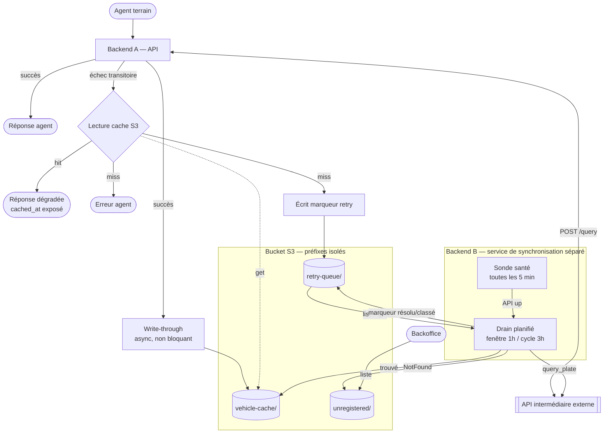

# Plan d'implémentation — Service de synchronisation du cache S3

> **Statut** : plan validé sur les décisions d'architecture. Étape 0 close, étapes 1 à 5 à faire.
> **Branche** : `refactor/backend-domain-layout`
> **Dernière révision** : 2026-08-11 — réaligné sur le découpage backend par domaine
> **Raisonnement et décisions** : [`s3_sync_service_session.md`](s3_sync_service_session.md)

## Contexte

Aujourd'hui, une recherche de plaque par un agent ([`handlers/vehicles/search.rs`](../iviss-backend/src/handlers/vehicles/search.rs)) interroge l'API intermédiaire externe et **ne conserve rien**. Le cache S3 n'est alimenté que par un binaire séparé ([`bin/s3-cache-sync.rs`](../iviss-backend/src/bin/s3-cache-sync.rs)) qui balaie l'API par préfixe de plaque toutes les 5 min via `GET /batch`. Deux conséquences : les recherches réellement effectuées sur le terrain n'enrichissent jamais le cache, et une recherche qui échoue pendant une panne de l'API externe est définitivement perdue.

L'objectif est qu'**aucune recherche agent n'échappe au stockage S3**, afin d'assurer la continuité de service quand l'API intermédiaire est indisponible. On remplace le balayage par préfixe par une architecture pilotée par la demande réelle : write-through sur succès, file d'attente `retry-queue/` sur échec, et un service de synchronisation qui draine cette file pendant des fenêtres planifiées.

## Architecture cible



## Décisions actées

| Sujet | Décision |
|---|---|
| Sonde de santé | `POST /query` avec plaque sentinelle constante. `Ok` **ou** `NotFound` = up ; `Unavailable` (transport, TLS, 5xx, timeout) = down |
| Plaque sentinelle | Constante `CE128BC` — `CD128AB` ne passe pas `plate_format::is_valid` |
| `search_vehicle` sur `NotFound` | **Inchangé** : 404 sec, cache non consulté → flux carte grise |
| Write-through | `tokio::spawn` détaché, échec loggé uniquement, jamais bloquant pour l'agent |
| `unregistered/` au backoffice | Fusionné dans `GET /api/v1/admin/submissions` existant |
| `fetch_batch` / `GET /batch` | Supprimé |

Justification de la sonde en [§3.1 du compte-rendu](s3_sync_service_session.md).

---

## Ce que le refactor `refactor/backend-domain-layout` a déjà apporté

Le backend a été redécoupé par domaine. Trois éléments du plan initial sont **désormais acquis** et ne sont plus à faire :

1. **`services/vehicles/data_cache.rs` compile.** L'ancien `services/vehicle_data_cache.rs` était commité dans un état non compilable (imports manquants, variable `client` jamais liée, signature à 2 arguments appelée avec 1). Il a été réécrit en délégation propre vers `s3_cache_layer::build_s3_client`, avec un `from_config(&S3CacheConfig)` à un seul argument et sans trace de `dedup_cache`. **`cargo check --no-default-features --bin s3-cache-sync` passe.** C'était l'étape 0 bloquante.

2. **Un port `ExternalDataSource` existe** ([`external_services/mod.rs`](../iviss-backend/src/external_services/mod.rs)), implémenté par `VehicleApiService` ([`client.rs:186`](../iviss-backend/src/external_services/vehicle_client/client.rs)) :

   ```rust
   pub trait ExternalDataSource: Send + Sync {
       fn service_id(&self) -> &'static str;
       async fn fetch(&self, plate: &str) -> Result<PartnerPayload, ExternalServiceError>;
       async fn health_probe(&self) -> HealthStatus;
   }
   ```

   `ExternalServiceError` expose exactement les trois cas dont le drain a besoin : `NotFound`, `Unavailable`, `Protocol`.

3. **`HEALTH_PROBE_PLATE = "CE128BC"` est déjà en place** ([`client.rs:13`](../iviss-backend/src/external_services/vehicle_client/client.rs)) et `health_probe()` implémente déjà la sémantique décidée : `Ok(_) | Err(NotFound)` → `Healthy`, tout le reste → `Unhealthy`. **Le service de sync doit consommer ce port, pas réimplémenter la sonde.**

4. **Les fichiers orphelins ont été supprimés** : `feature_flags.rs` et `services/vehicle_client_service.rs` n'existent plus.

### Correspondance des chemins ancienne → nouvelle structure

| Avant | Après |
|---|---|
| `src/vehicle_client/` | `src/external_services/vehicle_client/` |
| `src/services/vehicle_data_cache.rs` | `src/services/vehicles/data_cache.rs` |
| `src/services/vehicle_service.rs` | `src/services/vehicles/status.rs` |
| `src/handlers/search_vehicle.rs` | `src/handlers/vehicles/search.rs` (+ `router.rs`) |
| `src/handlers/pending_submission.rs` | `src/handlers/submissions/submissions.rs` (+ `router.rs`) |
| `src/queries/submission_queries.rs` | `src/queries/submissions.rs` |
| `src/services/jwt_service.rs`, `otp_service.rs` | `src/services/auth/{jwt,otp}.rs` |
| `src/services/{email,sms}_*.rs` | `src/services/notifications/` |

`src/s3_cache_layer/`, `src/dto/`, `src/utils/` et `src/tests/` sont inchangés. Chaque domaine de `handlers/` porte désormais son propre `router.rs`, assemblé dans [`routes.rs`](../iviss-backend/src/routes.rs).

Rappel de compilation : `external_services` et `s3_cache_layer` sont dans la section **toujours compilée** de [`lib.rs`](../iviss-backend/src/lib.rs) ; `services/` est derrière la feature `api`. Le binaire sync, bâti en `--no-default-features`, peut donc utiliser `ExternalDataSource` et `s3_cache_layer` mais **pas** le trait `VehicleDataCache`.

---

## Étape 1 — Étendre `s3_cache_layer` aux nouveaux préfixes

Fichier : [`s3_cache_layer/types.rs`](../iviss-backend/src/s3_cache_layer/types.rs)

```rust
pub const S3_CACHE_PREFIX: &str = "vehicle-cache/";   // existant, inchangé
pub const RETRY_QUEUE_PREFIX: &str = "retry-queue/";
pub const UNREGISTERED_PREFIX: &str = "unregistered/";
```

Disposition des clés : `vehicle-cache/` **conserve** son partitionnement régional existant (`vehicle-cache/{PARTITION}/{PLATE}.json`, déjà testé). `retry-queue/` et `unregistered/` sont **plats** — `retry-queue/{PLATE}.json` — parce qu'ils sont énumérés en entier à chaque drain : un `ListObjectsV2` paginé sur un préfixe plat suffit, alors qu'un partitionnement imposerait 20 listes.

Ajouter, sur le modèle de `object_key` (qui rejette déjà tout caractère non `ascii_alphanumeric` — protection contre l'injection de clé, à conserver et réutiliser telle quelle) :

- `retry_queue_key(plate) -> Result<String>` et `unregistered_key(plate) -> Result<String>`, factorisées avec `object_key` via un helper commun de validation.
- `plate_from_key(key, prefix) -> Option<String>` pour le chemin retour du listing.
- Struct `QueueMarker { plate_number: String, queued_at: String }` (RFC3339), sérialisée en JSON.

Nouveau fichier : `src/s3_cache_layer/s3_queue.rs`, déclaré dans [`s3_cache_layer/mod.rs`](../iviss-backend/src/s3_cache_layer/mod.rs) aux côtés de `s3_reader` / `s3_writer` :

```rust
pub async fn enqueue_plate(client, bucket, plate) -> Result<()>
pub async fn list_queued_plates(client, bucket, prefix, max: usize) -> Result<Vec<String>>  // ListObjectsV2 paginé
pub async fn remove_marker(client, bucket, prefix, plate) -> Result<()>
pub async fn mark_unregistered(client, bucket, plate) -> Result<()>
```

Fonctions libres, comme `read_vehicle_data` / `write_vehicle_data` : c'est ce qui permet au binaire sync (sans la feature `api`) de les appeler directement.

Les marqueurs sont écrits **en clair** (JSON, pas de chiffrement AES) : le corps ne contient que la plaque et un horodatage, et la plaque figure déjà en clair dans le nom de la clé — comme c'est déjà le cas pour `vehicle-cache/{PARTITION}/{PLATE}.json`. Chiffrer le corps n'ajouterait aucune protection réelle tout en imposant un déchiffrement par objet au listing du backoffice. Seul `vehicle-cache/` reste chiffré, car lui porte des données personnelles (nom, adresse, pièce d'identité du propriétaire).

**Attention IAM** : `remove_marker` introduit un besoin de `s3:DeleteObject`, que [`IVISS_Sync_Architecture.md`](IVISS_Sync_Architecture.md) exclut explicitement de la politique de moindre privilège. À restreindre par condition sur `retry-queue/*` uniquement, jamais sur `vehicle-cache/*`.

---

## Étape 2 — Backend A : write-through et mise en file

**Trait** — [`services/vehicles/data_cache.rs`](../iviss-backend/src/services/vehicles/data_cache.rs) ne déclare aujourd'hui que `get_vehicle_data`. L'étendre :

```rust
#[async_trait]
pub trait VehicleDataCache: Send + Sync {
    async fn get_vehicle_data(&self, plate: &str) -> Result<Option<CachedVehicleData>>;
    async fn store_vehicle_data(&self, plate: &str, vehicle: &VehicleInfo) -> Result<()>;
    async fn enqueue_retry(&self, plate: &str) -> Result<()>;
    async fn list_unregistered(&self) -> Result<Vec<UnregisteredPlate>>;
}
```

Les trois nouvelles méthodes de `S3VehicleDataCache` délèguent aux fonctions libres de l'étape 1, exactement comme `get_vehicle_data` délègue déjà à `s3_reader::read_vehicle_data`. Aucun changement de câblage : [`app_state.rs`](../iviss-backend/src/app_state.rs) porte déjà `s3_data_cache: Option<Arc<dyn VehicleDataCache>>` et [`main.rs:53`](../iviss-backend/src/main.rs) le construit déjà.

**Handler** — [`handlers/vehicles/search.rs`](../iviss-backend/src/handlers/vehicles/search.rs)

*Branche `Ok(api_response)`* (ligne 56) — après `build_search_result`, avant de répondre :

```rust
if let Some(cache) = &state.s3_data_cache {
    let (cache, plate, vehicle) = (cache.clone(), plate.clone(), response.vehicle.clone());
    tokio::spawn(async move {
        if let Err(e) = cache.store_vehicle_data(&plate, &vehicle).await {
            tracing::warn!(error = %e, "write-through S3 échoué");
        }
    });
}
```

Détaché : la réponse agent part immédiatement et n'est jamais dégradée par S3. Ne pas logger la plaque avec les données propriétaire.

*Branche `Err(error)`* (ligne 70) — la lecture cache existante avec `S3_CACHE_READ_TIMEOUT` (3 s, ligne 22) est conservée telle quelle. Sur cache **miss**, erreur de lecture ou timeout, avant le `Err(AppError::external_api_failure)` final : `tokio::spawn` d'un `cache.enqueue_retry(&plate)`.

*Branche `Err(VehicleApiError::NotFound)`* (ligne 63) : inchangée.

Sur un hit cache, la réponse expose aujourd'hui `confidence: Some(1.0)` et `IdentificationMode::Manual` sans aucun indicateur de fraîcheur — l'agent ne peut pas distinguer une donnée live d'une donnée de cache. Le diagramme prévoit `cached_at exposé`. Ajouter à `VehicleSearchResult` ([`dto/search_vehicle.rs`](../iviss-backend/src/dto/search_vehicle.rs)) : `source: Option<VehicleDataSource>` (`Live` | `Cache`) et `cached_at: Option<String>`, tous deux `Option` pour rester rétrocompatibles.

> **Changement de contrat OpenAPI** — impose la régénération du client frontend (`npm run codegen`, voir étape 4).

---

## Étape 3 — Backend B : réécriture du service de synchronisation

Fichier : [`bin/s3-cache-sync.rs`](../iviss-backend/src/bin/s3-cache-sync.rs) — remplacer entièrement la boucle par préfixe.

**Écrire le drain contre le port `ExternalDataSource`**, pas contre `VehicleApiService` concret : la sonde et le mapping d'erreurs existent déjà et sont partagés avec l'API server.

```rust
use iviss_backend::external_services::{
    ExternalDataSource, ExternalServiceError, HealthStatus, PartnerPayload,
};
```

Constantes nommées, chacune surchargeable par variable d'environnement (indispensable : personne ne peut tester un cycle de 3 h à la main) :

```rust
const DRAIN_WINDOW: Duration         = Duration::from_secs(60 * 60);      // SYNC_WINDOW_SECS
const IDLE_BETWEEN_WINDOWS: Duration = Duration::from_secs(2 * 60 * 60);  // SYNC_IDLE_SECS
const PING_INTERVAL: Duration        = Duration::from_secs(5 * 60);       // SYNC_PING_INTERVAL_SECS
const MAX_CONSECUTIVE_FAILURES: u32  = 5;                                 // SYNC_MAX_CONSECUTIVE_FAILURES
```

`HEALTH_PROBE_PLATE` n'est **pas** à redéfinir ici : il vit dans `external_services/vehicle_client/client.rs` et n'est consommé qu'à travers `health_probe()`.

Boucle principale — cycle de 3 h :

1. **Fenêtre de drain**, `DRAIN_WINDOW` (1 h) : toutes les `PING_INTERVAL` (5 min),
   - `list_queued_plates(retry-queue/, max=1)` → si **vide**, ne rien faire, attendre le ping suivant. Aucune sonde n'est émise quand il n'y a rien à drainer.
   - Sinon, `source.health_probe().await` :
     - `HealthStatus::Unhealthy(reason)` → on log `reason` et on attend le ping suivant.
     - `HealthStatus::Healthy` → on draine.
2. **Drain** : `list_queued_plates` paginé, puis pour chaque plaque, `source.fetch(&plate).await` :
   - `Ok(PartnerPayload::Vehicle { vehicle, .. })` → `write_vehicle_data` dans `vehicle-cache/`, puis `remove_marker`.
   - `Err(ExternalServiceError::NotFound)` → `mark_unregistered` dans `unregistered/`, puis `remove_marker`.
   - `Err(Unavailable(_) | Protocol(_))` → **marqueur laissé en place**, incrémente le compteur d'échecs consécutifs ; à `MAX_CONSECUTIVE_FAILURES` on avorte le drain du cycle et on repasse en mode ping. Garde-fou contre le cas « serveur joignable mais `/query` cassé », que la sonde seule ne détecte pas.
   - Le compteur est remis à zéro sur tout succès.
   - Le marqueur n'est supprimé **qu'après** confirmation de l'écriture destination : un crash entre les deux rejoue la plaque au cycle suivant (at-least-once, idempotent puisque la clé est déterministe).
3. **Repos** : `IDLE_BETWEEN_WINDOWS` (2 h).

Suppressions associées :

- `fetch_batch` ([`external_services/vehicle_client/client.rs:102`](../iviss-backend/src/external_services/vehicle_client/client.rs)) et le type `ExternalVehicle` ([`types.rs:47`](../iviss-backend/src/external_services/vehicle_client/types.rs)), plus son ré-export dans [`vehicle_client/mod.rs:17`](../iviss-backend/src/external_services/vehicle_client/mod.rs).
- Route `GET /batch` du mock : `iviss-mock-ext-api/src/routes/batch.rs`, sa déclaration dans `routes/mod.rs` et `main.rs`, ainsi que `db::find_by_prefix`.
- `PLATE_PREFIX_CODES` cesse d'être une liste d'énumération et redevient uniquement l'allowlist de partitionnement de `cache_partition_for_plate`. Cela résout au passage le double usage bogué : les entrées 3 caractères `CMD` et `CPC` ne pouvaient jamais matcher `plate.get(..2)`.

Le binaire reste construit avec `--no-default-features` : le drain n'a besoin que de `s3_cache_layer` et `external_services`.

**Test unitaire** : `assert!(plate_format::is_valid(HEALTH_PROBE_PLATE))` — à placer dans `external_services/vehicle_client/client.rs`, où vit la constante. Verrouille la valeur contre une future dérive de format.

---

## Étape 4 — Backoffice : fusion des plaques `unregistered/`

**Backend** — [`handlers/submissions/submissions.rs`](../iviss-backend/src/handlers/submissions/submissions.rs), `list_pending_submissions` : après `queries::submissions::get_pending_submissions`, si `state.s3_data_cache` est présent, appeler `list_unregistered()` et concaténer les entrées converties en `PendingSubmissionListItem`, triées par date décroissante sur l'ensemble. La route reste déclarée dans [`handlers/submissions/router.rs`](../iviss-backend/src/handlers/submissions/router.rs) — pas de changement d'assemblage.

Adapter [`dto/pending_submission.rs`](../iviss-backend/src/dto/pending_submission.rs) :

```rust
pub struct PendingSubmissionListItem {
    pub id: Option<Uuid>,         // None pour une entrée S3 — pas de ligne en base
    pub plate_number: String,
    pub agent_name: Option<String>,
    pub status: SubmissionStatus,
    pub submitted_at: String,
    pub source: SubmissionSource, // Submission | S3Unregistered
}
```

`source` permet au frontend de savoir qu'il n'y a ni images ni détail à charger. Un échec de lecture S3 est loggé et n'invalide pas la réponse : la liste des soumissions en base reste servie (dégradation gracieuse).

> **Changement de contrat OpenAPI** — `id` devient nullable et `source` est ajouté.

**Frontend** — [`PendingVehicles.tsx`](../frontend/src/pages/backoffice/PendingVehicles.tsx) : masquer les vignettes carte grise et désactiver l'ouverture du détail quand `source === 's3_unregistered'`. Ajouter les clés i18n correspondantes dans `frontend/src/i18n/locales/{en,fr}.json`.

Cette page est le seul consommateur d'API du frontend qui **n'utilise pas** le client généré : elle passe par [`services/api/submissionService.ts`](../frontend/src/services/api/submissionService.ts) avec des interfaces TS maintenues à la main (tous les autres hooks importent depuis `src/openapi-rq/queries/queries`). Il faut donc mettre à jour ces types manuellement **en plus** de régénérer le client. Aligner cette page sur le client généré serait cohérent avec le reste du code, mais c'est un refactor à part — hors périmètre ici.

---

## Étape 5 — Configuration et déploiement

- [`config.rs`](../iviss-backend/src/config.rs) : `get_s3_cache_config` lit `S3_CACHE_KMS_KEY_ID`, mais `docker-compose.yml` (ligne 54) exporte `S3_CACHE_SSE_KMS_KEY_ID` pour le backend — **le backend ne reçoit jamais de clé KMS**. Le service `s3-cache-sync` fait le mapping correctement (ligne 186). Corriger l'ancre partagée.
- Le binaire sync duplique le chargement d'env (`load_vehicle_api_credentials`, `load_s3_cache_config`) et lit `EXTERNAL_API_HEADER_*` là où tout le reste du projet utilise `EXTERNAL_API_*`. Compose masque le bug en définissant les deux orthographes à `""` pour le mock. **Pointé sur le registre réel, le service enverrait des en-têtes d'authentification vides.** Aligner sur les noms `EXTERNAL_API_*` et retirer les doublons de compose.
- `S3_CACHE_BUCKET` a **quatre valeurs par défaut différentes** selon l'endroit (`vehicle-data-cache`, `iviss-vehicle-cache`…). Unifier sur une seule valeur dans `.env.example` et `docker-compose.yml` (services `minio-init`, `s3-cache-sync`, `backend`).
- Remplacer `SYNC_INTERVAL_SECS` par les nouvelles variables de fenêtre dans le bloc `s3-cache-sync` de `docker-compose.yml`.

---

## Vérification

1. `cargo check` (défaut) puis `cargo check --no-default-features --bin s3-cache-sync` — les deux profils de compilation doivent passer. **Les deux passent aujourd'hui** : toute régression est donc imputable au travail en cours.
2. `cargo fmt` et `cargo clippy` sur les deux profils.
3. `cargo test s3_cache_layer` et `cargo test vehicle_data_cache` — les tests MinIO via testcontainers existants ([`tests/vehicle_data_cache_tests.rs`](../iviss-backend/src/tests/vehicle_data_cache_tests.rs)) doivent rester verts ; y ajouter la couverture `enqueue_retry` → `list_queued_plates` → `remove_marker` et le round-trip `mark_unregistered` → `list_unregistered`.
4. Bout en bout en local :
   - `cargo run` dans `iviss-mock-ext-api/`, `docker compose --profile dev up minio minio-init s3-cache-sync backend`.
   - **Write-through** : rechercher une plaque de `seeds/vehicles.sql` → `mc ls local/<bucket>/vehicle-cache/` doit montrer l'objet.
   - **Panne + hit cache** : arrêter le mock, rechercher la même plaque → réponse 200 avec `source: "cache"` et `cached_at`.
   - **Panne + miss** : arrêter le mock, rechercher une plaque jamais vue → erreur agent, et `mc ls local/<bucket>/retry-queue/` montre le marqueur.
   - **Drain** : redémarrer le mock, `SYNC_WINDOW_SECS=120 SYNC_PING_INTERVAL_SECS=10 SYNC_IDLE_SECS=30` → le marqueur disparaît, l'objet apparaît dans `vehicle-cache/` (plaque connue) ou `unregistered/` (plaque inconnue).
   - **Sonde down** : arrêter Postgres sous le mock → `/query` renvoie 500 → `health_probe()` doit renvoyer `Unhealthy`, le sync rester en ping et **ne pas** vider la file.
   - **Backoffice** : la page Pending Validation liste l'entrée `unregistered/` sans image ni détail cliquable.
5. `npm run codegen` dans `frontend/` après démarrage du backend, puis `npm run test` (vitest).

## Points signalés, hors périmètre

- **Isolation tenant** : `get_pending_submissions` ([`queries/submissions.rs:53`](../iviss-backend/src/queries/submissions.rs)) ne filtre **par aucune organisation** — les deux variantes SQL sélectionnent toutes les lignes de `pending_submissions`. Tout utilisateur autorisé sur cet endpoint voit les soumissions de tous les tenants. Le refactor par domaine a déplacé ce code sans le corriger. Antérieur à ce ticket et non corrigé ici, mais l'étape 4 ajoute des données à cette même réponse : à traiter en priorité dans un ticket dédié. À noter que les entrées `unregistered/` sont par nature globales (le bucket n'est pas partitionné par organisation) — décider si elles doivent l'être.
- **Secrets dans `.env`** : le fichier contient des identifiants de production réels (mot de passe de l'API externe, URL du registre, certificat TLS, clé de chiffrement du cache). Confirmer que `.env` est bien ignoré par git et qu'aucune de ces valeurs n'a jamais été commitée.
- **Divergence doc/code** : [`IVISS_Sync_Architecture.md`](IVISS_Sync_Architecture.md) décrit le service de sync comme un proxy HTTP à la demande (`GET /fetch?plate=…`) avec un préfixe plat `vehicles/`, alors que le code implémente un service sans surface HTTP et un préfixe partitionné `vehicle-cache/{REGION}/`. Le présent plan s'aligne sur le code ; le document devra être mis à jour.
- **Ports partenaires non branchés** : `insurance_client` et `technical_inspection_client` ([`external_services/`](../iviss-backend/src/external_services/)) ne sont que des placeholders renvoyant `Status::Pending`, et n'implémentent pas encore `ExternalDataSource`. Sans incidence sur ce plan, mais le drain écrit dans `vehicle-cache/` un `VehicleInfo` dont les volets assurance et contrôle technique resteront `Pending` tant que ces transports ne sont pas décidés.
