# License Plate Scanning - Complete Architecture

## System Overview

This document provides a comprehensive architectural view of the License Plate Scanning feature for IVISS (Intelligent Vehicle Identification & Security System). The feature enables law enforcement agents to scan vehicle license plates in real-time using their mobile device cameras.

### Why Backend OCR?

We've chosen a **hybrid architecture** where the frontend handles camera access and user experience, while the backend (Rust + Tesseract) performs the heavy OCR processing. This decision is based on:

- **Accuracy**: Backend Tesseract achieves 85-95% accuracy vs 60-70% for browser-based solutions
- **Consistency**: All users get the same quality results regardless of device capabilities
- **Performance**: Offloading heavy processing prevents mobile devices from freezing
- **Scalability**: Centralized processing is easier to optimize and monitor
- **Reusability**: The same API can be used by future mobile apps

### Key Design Principles

1. **Frame Sampling**: Capture only 2 frames per second (not 30 FPS) to minimize network load
2. **Image Optimization**: Compress images to ~50KB before upload
3. **Stability Detection**: Require 3 consecutive identical reads to prevent false positives
4. **Privacy First**: Images are processed in-memory only and never stored
5. **Graceful Degradation**: Continue scanning on errors, offer manual entry as fallback

---

## High-Level Architecture

This diagram shows the complete system flow from the agent's device to the database and back. The architecture is divided into four main layers:

1. **Mobile Device**: Where the agent interacts with the camera
2. **Frontend Processing**: Client-side optimizations to reduce network load
3. **Backend Server**: Where the heavy OCR processing happens
4. **Data Layer**: PostgreSQL database with vehicle records

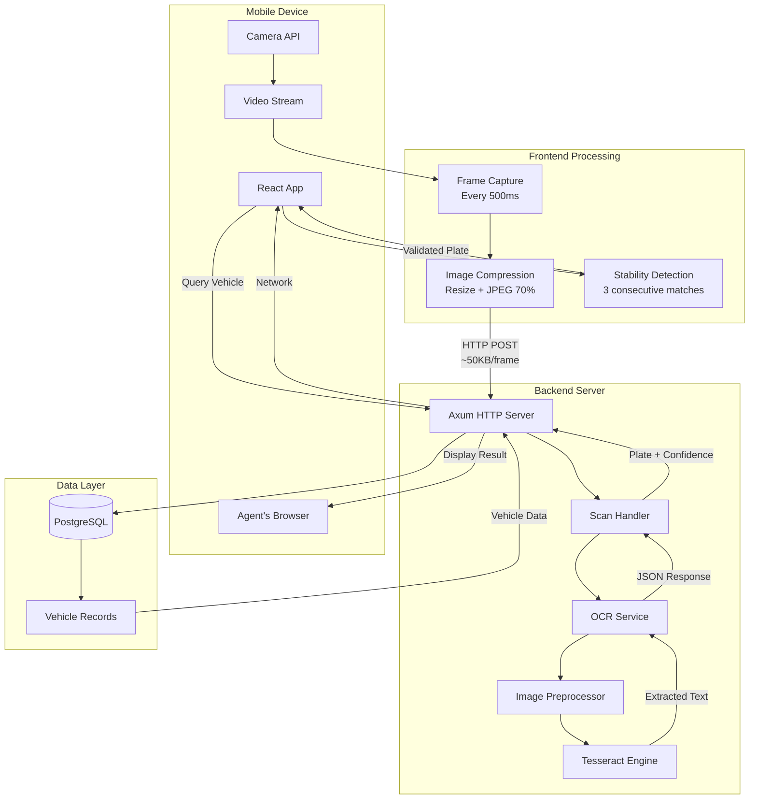

---

## Detailed Sequence Diagram

### Understanding the Complete Scan Flow

This sequence diagram shows **every step** that happens when an agent scans a license plate, from opening the scanner page to displaying the vehicle information. The process involves multiple systems working together:

**Key Actors:**
- **Agent**: The law enforcement officer using the app
- **React Frontend**: The browser application
- **Device Camera**: The physical camera hardware
- **HTML5 Canvas**: Browser API for image manipulation
- **Axum Backend**: The Rust web server
- **OCR Service**: The text recognition engine
- **Tesseract**: The actual OCR library
- **PostgreSQL**: The vehicle database

**Important Notes:**
- The loop runs every 500ms (2 times per second), not continuously
- Each scan attempt is independent - if it fails, we just try again
- The frontend doesn't wait for a response before capturing the next frame
- Stability detection happens on the frontend to avoid unnecessary database queries

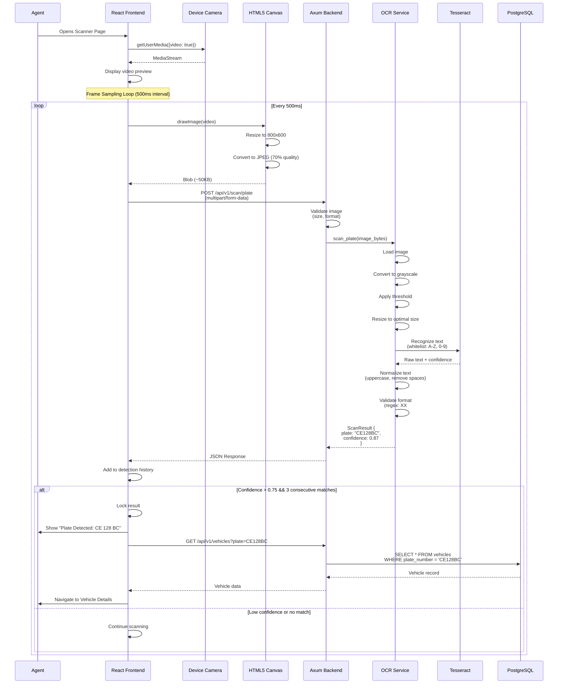

---

## Component Architecture

### How the Code is Organized

This section shows how the codebase is structured. Understanding the component hierarchy helps developers know where to find code and where to add new features.

**Design Philosophy:**
- **Separation of Concerns**: UI components don't contain business logic
- **Reusability**: Hooks can be used by multiple components
- **Testability**: Each layer can be tested independently
- **Maintainability**: Clear boundaries make debugging easier

### Frontend Component Hierarchy

**Component Breakdown:**

1. **MobileScan Page**: The route entry point (`/mobile/scan`)
2. **LiveScanner Component**: The main scanning interface
   - **Video Element**: Displays the camera feed
   - **ScannerOverlay**: Visual guide showing where to point the camera
   - **StatusDisplay**: Shows scanning status and confidence

**Custom Hooks** (the "smart" layer):
- **useCamera**: Manages camera permissions and video stream
- **useScanPlate**: Handles API calls to the backend
- **useStabilityDetection**: Tracks scan history and determines when to lock result

**Why This Structure?**
- Components are "dumb" - they just display data
- Hooks are "smart" - they contain all the logic
- This makes testing easier and components reusable

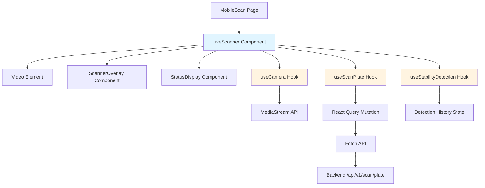

### Backend Module Architecture

**Backend File Structure:**

1. **main.rs**: Application entry point, starts the server
2. **routes.rs**: Defines all API endpoints
3. **handlers/scan.rs**: HTTP request/response logic for scanning
4. **services/ocr.rs**: Core OCR business logic (the "brain")
5. **models/scan.rs**: Data structures for requests and responses

**External Dependencies:**
- **leptess**: Rust bindings for Tesseract OCR engine
- **image**: Image loading and manipulation

**Validation Layer** (security):
- **File Size Check**: Reject images > 5MB
- **Format Check**: Only accept JPEG/PNG
- **Rate Limiting**: Max 10 requests per minute per user

**Why Rust for OCR?**
- **Performance**: Rust is as fast as C/C++
- **Safety**: No memory leaks or crashes
- **Concurrency**: Handle multiple scans simultaneously
- **Tesseract Integration**: Mature bindings available

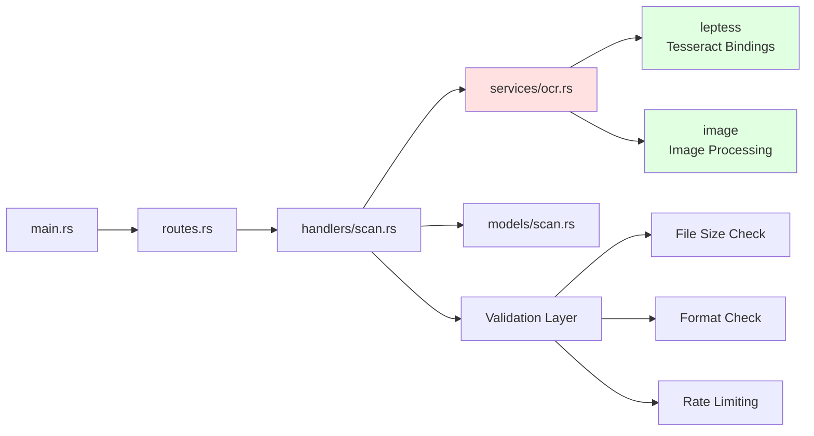

---

## Data Flow Architecture

### Following the Data Through the System

These diagrams show how data transforms as it moves through the system. Understanding data flow is crucial for debugging and optimization.

### Request Flow (Scanning)

**The Journey of a Single Frame:**

1. **Capture**: Video frame grabbed from camera (1920x1080, ~2MB)
2. **Resize**: Reduced to 800x600 to save bandwidth
3. **Compress**: JPEG compression at 70% quality → ~50KB
4. **Upload**: Sent to backend via HTTP POST
5. **Validate**: Backend checks size, format, authentication
6. **Preprocess**: Convert to grayscale, apply threshold
7. **OCR**: Tesseract extracts text
8. **Normalize**: Uppercase, remove spaces ("CE 128 BC" → "CE128BC")
9. **Validate Format**: Check against regex pattern
10. **Return**: JSON response with plate and confidence
11. **Stability Check**: Frontend checks if last 3 scans match
12. **Lock or Continue**: Either lock result or scan next frame

**Why 50KB?**
- Original frame: ~2MB
- After resize + compression: ~50KB (97.5% reduction)
- On 4G network: uploads in ~40ms
- Small enough for 3G networks too (~200ms)

```mermaid
flowchart LR
    A[Camera Frame] --> B{Frame Capture<br/>Timer}
    B -->|Every 500ms| C[Canvas API]
    C --> D[Resize Image<br/>800x600]
    D --> E[JPEG Compression<br/>70% quality]
    E --> F[Create Blob<br/>~50KB]
    F --> G[FormData]
    G --> H[HTTP POST]
    H --> I[Axum Router]
    I --> J[Multipart Parser]
    J --> K[Image Validator]
    K -->|Valid| L[OCR Service]
    K -->|Invalid| M[400 Error]
    L --> N[Preprocessing]
    N --> O[Tesseract OCR]
    O --> P[Text Normalization]
    P --> Q[Format Validation]
    Q --> R[JSON Response]
    R --> S[React State Update]
    S --> T{Stability Check}
    T -->|3 Matches| U[Lock Result]
    T -->|No Match| A
    U --> V[Query Vehicle]
    V --> W[Display Result]
```

### Response Flow (Vehicle Lookup)

**What Happens After a Successful Scan:**

Once we have a stable plate number (e.g., "CE128BC"), the frontend queries the database:

1. **Query**: `GET /api/v1/vehicles?plate=CE128BC`
2. **Database Lookup**: Search vehicles table
3. **Found**: Return owner info, insurance status, registration details
4. **Not Found**: Return 404, offer manual entry option

**Why Separate Queries?**
- Don't query database on every OCR attempt (wasteful)
- Only query once we're confident in the result
- Reduces database load significantly

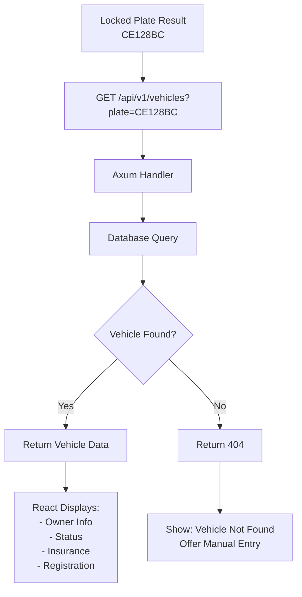

---

## State Management

### How the Application Tracks Progress

State machines help us understand all possible states the application can be in and how it transitions between them. This is crucial for handling edge cases and errors gracefully.

### Frontend State Machine

**All Possible States:**

1. **Initializing**: App is loading
2. **RequestingCamera**: Asking for camera permission
3. **CameraActive**: Camera is ready
4. **Scanning**: Actively capturing frames
5. **Processing**: Waiting for OCR response
6. **Detected**: First high-confidence result
7. **Confirmed**: 3 consecutive matches (stable)
8. **QueryingVehicle**: Fetching from database
9. **ShowingResult**: Displaying vehicle info
10. **NotFound**: Plate not in database
11. **CameraError**: Permission denied
12. **Stopped**: User cancelled

**Critical Transitions:**
- **Permission Denied** → Show error, can't proceed
- **3 Consecutive Matches** → Lock result, stop scanning
- **Vehicle Not Found** → Offer manual entry

**Why State Machines?**
- Prevents impossible states (e.g., scanning without camera)
- Makes error handling explicit
- Easier to debug (know exactly what state we're in)

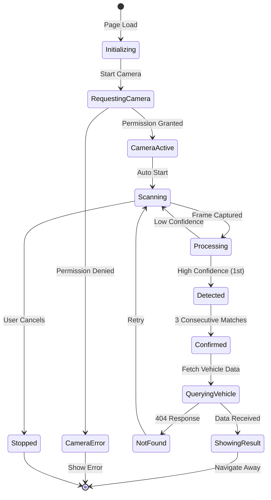

### Backend Processing States

**Backend Request Lifecycle:**

1. **ReceiveRequest**: HTTP POST arrives
2. **ValidateRequest**: Check auth, size, format
3. **ProcessImage**: Valid request, proceed
4. **LoadImage**: Decode JPEG bytes
5. **Preprocess**: Grayscale, threshold, resize
6. **RunOCR**: Tesseract recognition
7. **ExtractText**: Get raw text + confidence
8. **Normalize**: Clean up text
9. **ValidateFormat**: Check regex pattern
10. **ReturnSuccess** or **ReturnLowConfidence**

**Error States:**
- **ReturnError**: Invalid request (400, 413, 415)
- **ReturnLowConfidence**: OCR succeeded but low quality

**Processing Time:**
- Validation: ~10ms
- Image Loading: ~20ms
- Preprocessing: ~60ms
- OCR: ~100ms
- Total: ~200ms

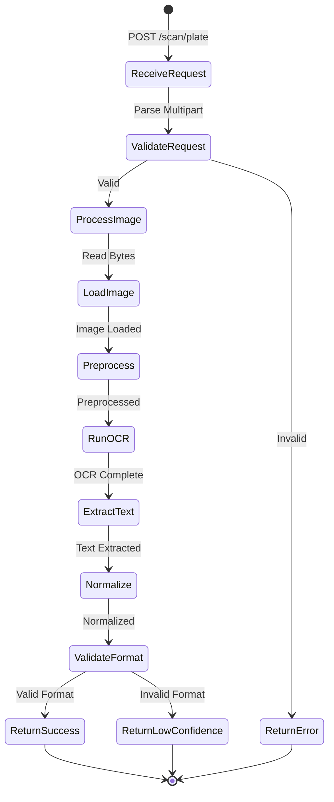

---

## Network Communication

### API Contracts and Network Optimization

This section defines the exact format of requests and responses, plus how we optimize network usage.

### API Contract

#### Scan Endpoint

**Request:**
```http
POST /api/v1/scan/plate HTTP/1.1
Content-Type: multipart/form-data; boundary=----WebKitFormBoundary

------WebKitFormBoundary
Content-Disposition: form-data; name="image"; filename="frame.jpg"
Content-Type: image/jpeg

[Binary JPEG data ~50KB]
------WebKitFormBoundary--
```

**Success Response (200 OK):**
```json
{
  "success": true,
  "data": {
    "plate": "CE128BC",
    "raw_text": "CE 128 BC",
    "confidence": 0.87,
    "format_valid": true
  }
}
```

**Low Confidence Response (200 OK):**
```json
{
  "success": true,
  "data": {
    "plate": "",
    "raw_text": "C£ 12B 8C",
    "confidence": 0.34,
    "format_valid": false
  }
}
```

**Error Response (400 Bad Request):**
```json
{
  "success": false,
  "error": {
    "code": "INVALID_IMAGE",
    "message": "Image size exceeds 5MB limit"
  }
}
```

### Network Optimization

**Image Compression Strategy:**

We aggressively compress images before upload to minimize network usage:

- **Original**: 1920x1080 camera frame = ~2MB
- **Resize**: 800x600 = 75% smaller
- **JPEG 70%**: Further compression
- **Final**: ~50KB (97.5% reduction)

**Network Performance:**

| Network | Upload Speed | Upload Time | Backend | Total |
|---------|--------------|-------------|---------|-------|
| **4G** | 10 Mbps | 40ms | 200ms | **240ms** ✅ |
| **3G** | 2 Mbps | 200ms | 200ms | **400ms** ⚠️ |
| **2G** | 0.5 Mbps | 800ms | 200ms | **1000ms** ❌ |

**Why This Matters:**
- 4G: Excellent experience (~240ms feels instant)
- 3G: Acceptable (~400ms is noticeable but usable)
- 2G: Poor experience (would need offline mode)

**Bandwidth Usage:**
- 2 frames/second × 50KB = **100KB/s**
- Average scan (5 seconds) = **500KB total**
- Compare to: Loading a webpage (2-3MB)

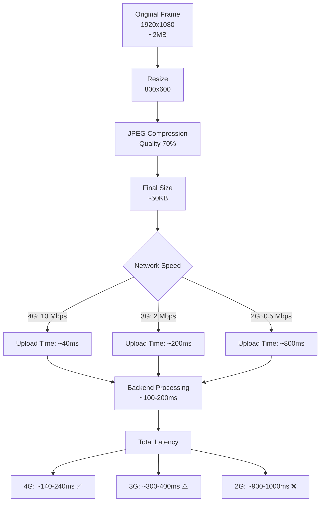

---

## Image Processing Pipeline

### How We Prepare Images for OCR

Image preprocessing is critical for OCR accuracy. Raw camera images are not optimal for text recognition - we need to enhance them first.

### Preprocessing Steps

**Why Preprocess?**

Raw images have problems for OCR:
- **Color**: Tesseract works better with grayscale
- **Size**: Too large images slow down processing
- **Noise**: Shadows, reflections confuse OCR
- **Contrast**: Low contrast makes text hard to read

**Our Pipeline:**

1. **Load Image**: Decode JPEG bytes into pixel array
2. **Grayscale**: Convert RGB (3 channels) to single channel
   - Reduces data by 66%
   - Tesseract is optimized for grayscale
3. **Resize**: Standardize to 800px width
   - Consistent results across devices
   - Optimal size for Tesseract
4. **Threshold**: Convert to pure black & white
   - Removes shadows and gradients
   - Maximizes contrast
   - Critical for accuracy
5. **Denoise** (optional): Remove small artifacts
6. **Feed to Tesseract**: Now optimized for recognition

**Character Whitelist:**
- Only allow: A-Z and 0-9
- Prevents misreading symbols as letters
- Cameroon plates use: 2 letters + 3 digits + 2 letters

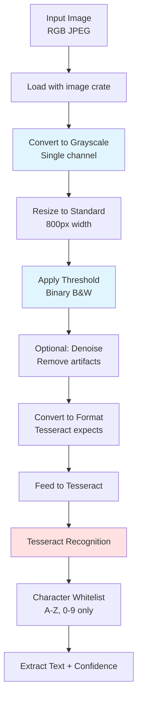

### Text Normalization

**Cleaning Up OCR Output:**

Tesseract might return: `"ce 128 bc"` or `"CE  128BC"` or `"Ce128Bc"`

We normalize to: `"CE128BC"`

**Normalization Steps:**

1. **Uppercase**: `"ce 128 bc"` → `"CE 128 BC"`
2. **Remove Spaces**: `"CE 128 BC"` → `"CE128BC"`
3. **Remove Special Chars**: `"CE-128-BC"` → `"CE128BC"`
4. **Validate Format**: Check regex `^[A-Z]{2}[0-9]{3}[A-Z]{2}$`

**Regex Explanation:**
- `^` = Start of string
- `[A-Z]{2}` = Exactly 2 uppercase letters
- `[0-9]{3}` = Exactly 3 digits
- `[A-Z]{2}` = Exactly 2 uppercase letters
- `$` = End of string

**Why Normalize?**
- Database stores plates without spaces
- Consistent format for lookups
- Easier to validate

```mermaid
flowchart LR
    A[Raw OCR Output<br/>'ce 128 bc'] --> B[Uppercase<br/>'CE 128 BC']
    B --> C[Remove Spaces<br/>'CE128BC']
    C --> D[Remove Special Chars<br/>'CE128BC']
    D --> E{Regex Match<br/>^[A-Z]{2}[0-9]{3}[A-Z]{2}$}
    E -->|Match| F[Valid Plate<br/>format_valid: true]
    E -->|No Match| G[Invalid Format<br/>format_valid: false]
    
    F --> H[Store Normalized<br/>'CE128BC']
    G --> I[Return Low Confidence]
```

---

## Performance Characteristics

### Understanding System Performance

Performance is critical for user experience. Agents need fast, reliable results in the field.

### Timing Breakdown

**Where Does Time Go?**

This Gantt chart shows exactly how long each step takes in a single scan request. Understanding this helps us identify bottlenecks.

**Frontend (90ms):**
- Frame Capture: 10ms (grab from video)
- Image Resize: 20ms (Canvas API)
- JPEG Compression: 20ms (Canvas toBlob)
- Network Upload: 40ms (on 4G)

**Backend (210ms):**
- Request Parsing: 10ms (multipart decode)
- Image Loading: 20ms (JPEG decode)
- Preprocessing: 60ms (grayscale, threshold)
- **Tesseract OCR: 100ms** ← Slowest step
- Normalization: 10ms (text cleanup)
- Response Serialization: 10ms (JSON encode)

**Frontend Return (40ms):**
- Network Download: 20ms (JSON response)
- State Update: 10ms (React)
- UI Render: 10ms (React DOM)

**Total: ~340ms**

**Optimization Opportunities:**
- Tesseract is the bottleneck (100ms)
- Could use GPU acceleration
- Could cache Tesseract initialization
- Network time varies by connection

```mermaid
gantt
    title Single Scan Request Timeline
    dateFormat X
    axisFormat %L ms
    
    section Frontend
    Frame Capture           :0, 10
    Image Resize            :10, 30
    JPEG Compression        :30, 50
    Network Upload (4G)     :50, 90
    
    section Backend
    Request Parsing         :90, 100
    Image Loading           :100, 120
    Preprocessing           :120, 180
    Tesseract OCR           :180, 280
    Normalization           :280, 290
    Response Serialization  :290, 300
    
    section Frontend
    Network Download        :300, 320
    State Update            :320, 330
    UI Render               :330, 340
```

**Total Time: ~340ms per scan**

### Throughput Analysis

**System Capacity:**

These metrics help us understand system load and plan for scaling.

| Metric | Value | Notes |
|--------|-------|-------|
| **Frame Rate** | 2 FPS | 1 frame every 500ms |
| **Image Size** | ~50KB | After compression |
| **Bandwidth Usage** | 100KB/s | During active scanning |
| **Backend Load** | ~2 req/s | Per active user |
| **Scan Duration** | 3-5 seconds | Until stable result |
| **Total Data Transfer** | ~500KB | Per successful scan |

---

## Stability Detection Algorithm

### Preventing False Positives

**The Problem:**
OCR isn't perfect. A single scan might return:
- `"CE128BC"` (correct)
- `"CE12BBC"` (wrong - motion blur)
- `"CE128BC"` (correct again)

If we accept the first result, we might get wrong data.

**The Solution: Stability Detection**

We only accept a result after seeing it **3 times in a row** with **high confidence (>75%)**.

**Why 3 Times?**
- 1 time: Too risky (could be lucky guess)
- 2 times: Better, but still possible coincidence
- 3 times: Very unlikely to be wrong
- More than 3: Unnecessary delay

**Why 75% Confidence?**
- Tesseract returns confidence 0.0 to 1.0
- < 0.5: Basically guessing
- 0.5-0.75: Uncertain
- > 0.75: High confidence
- > 0.9: Very high confidence

**Time Impact:**
- Each scan: ~340ms
- 3 scans: ~1 second
- Plus frame interval (500ms × 2): ~1 second
- **Total: ~2-3 seconds** to lock result

**This is acceptable** because:
- Accuracy is more important than speed
- 2-3 seconds feels responsive
- Prevents costly mistakes (wrong citations)

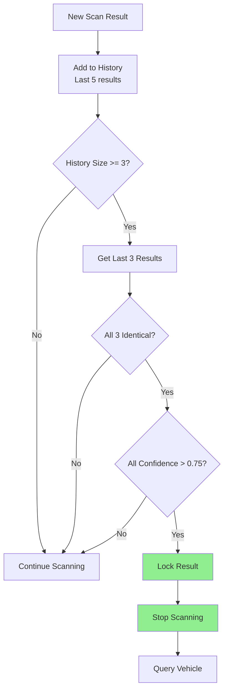

**Pseudocode:**
```typescript
const detectionHistory: ScanResult[] = [];

function handleScanResult(result: ScanResult) {
  detectionHistory.push(result);
  
  if (detectionHistory.length >= 3) {
    const last3 = detectionHistory.slice(-3);
    
    const allMatch = last3.every(r => r.plate === last3[0].plate);
    const allHighConfidence = last3.every(r => r.confidence > 0.75);
    
    if (allMatch && allHighConfidence) {
      lockResult(last3[0].plate);
      stopScanning();
      queryVehicle(last3[0].plate);
    }
  }
}
```

---

## Error Handling Architecture

### Graceful Degradation

**Philosophy: Never Block the User**

Errors will happen (network issues, camera problems, etc.). Our goal is to handle them gracefully and keep the user productive.

**Error Categories:**

1. **Camera Permission Denied**
   - **Impact**: Can't scan at all
   - **Action**: Show clear instructions to enable camera
   - **Fallback**: Redirect to manual entry

2. **Network Error**
   - **Impact**: Can't reach backend
   - **Action**: Retry with exponential backoff (100ms, 200ms, 400ms)
   - **Fallback**: After 3 retries, offer manual entry

3. **Invalid Image**
   - **Impact**: Backend rejects image
   - **Action**: Show guidance ("Adjust camera angle")
   - **Fallback**: Continue scanning

4. **Low Confidence**
   - **Impact**: OCR uncertain
   - **Action**: Continue scanning (silent)
   - **Fallback**: After 30 seconds, offer manual entry

5. **Backend Error**
   - **Impact**: Server issue
   - **Action**: Log error, show toast, retry
   - **Fallback**: Manual entry

6. **Timeout**
   - **Impact**: No result after 30 seconds
   - **Action**: Offer manual entry
   - **Fallback**: User types plate manually

**Key Principle: Always Provide a Path Forward**

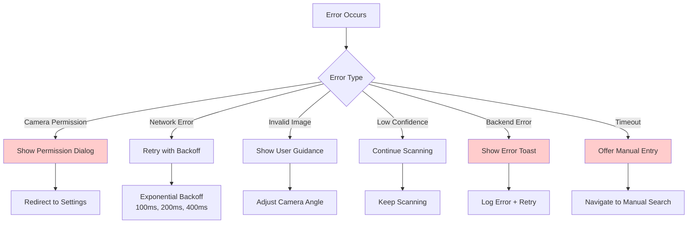

---

## Security Considerations

### Protecting the System and User Data

Security is critical for law enforcement applications. We implement multiple layers of protection.

### Request Validation Flow

**Defense in Depth:**

Every request goes through multiple validation layers:

1. **Authentication** (401 Unauthorized)
   - Verify JWT token
   - Ensure user is logged in
   - Check token hasn't expired

2. **Rate Limiting** (429 Too Many Requests)
   - Max 10 requests per minute per user
   - Prevents abuse and DoS attacks
   - Protects backend resources

3. **File Size** (413 Payload Too Large)
   - Max 5MB per image
   - Prevents memory exhaustion
   - Catches malicious large files

4. **Content-Type** (415 Unsupported Media Type)
   - Only accept image/jpeg or image/png
   - Prevents code injection
   - Ensures we can decode the file

5. **Image Validation** (400 Bad Request)
   - Actually try to decode the image
   - Catches corrupted files
   - Prevents crashes

**Only After All Checks Pass**: Process the request

**Why So Many Checks?**
- Each layer catches different attack vectors
- Fail fast (don't waste resources on invalid requests)
- Clear error messages help debugging

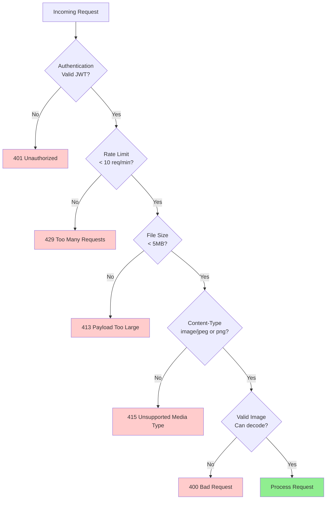

### Data Privacy

**Critical Privacy Requirement: No Image Storage**

**The Rule:**
- ✅ Process images in memory
- ✅ Extract text
- ✅ Return result
- ✅ Immediately discard image
- ❌ **NEVER** write images to disk
- ❌ **NEVER** log image data
- ❌ **NEVER** cache images

**Why?**
- **Privacy**: License plates are personal data
- **Compliance**: GDPR, data protection laws
- **Security**: Stored images are attack targets
- **Storage**: Images consume massive space

**Implementation:**
- Images live only in request memory
- Rust's ownership system ensures cleanup
- No image data in logs or error messages
- Memory released immediately after processing

**Audit Trail:**
- We log: plate number, timestamp, user, confidence
- We don't log: images, raw OCR output, metadata

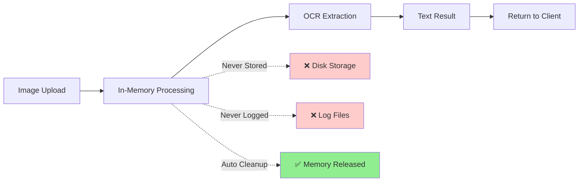

---

## Deployment Architecture

### How to Deploy This System

Deployment architecture shows how the application runs in production.

### Docker Container Structure

**Three-Container Architecture:**

1. **Backend Container** (Rust + Tesseract)
   - Rust binary (compiled application)
   - Tesseract 5.x (OCR engine)
   - Leptonica (image processing library)
   - Language data (eng.traineddata)
   - **Base Image**: `rust:1.75` or `debian:bookworm`
   - **Size**: ~500MB

2. **Database Container** (PostgreSQL)
   - PostgreSQL 15
   - Vehicle records
   - **Base Image**: `postgres:15-alpine`
   - **Size**: ~200MB

3. **Frontend Container** (Nginx + React)
   - Nginx web server
   - React build (static files)
   - **Base Image**: `nginx:alpine`
   - **Size**: ~50MB

**Container Communication:**
- Frontend → Backend: HTTP (port 8080)
- Backend → Database: PostgreSQL protocol (port 5432)
- Internet → Frontend: HTTPS (port 443)

**Why Containers?**
- **Consistency**: Same environment everywhere
- **Isolation**: Issues in one container don't affect others
- **Scalability**: Easy to run multiple backend instances
- **Portability**: Deploy anywhere (cloud, on-premise)

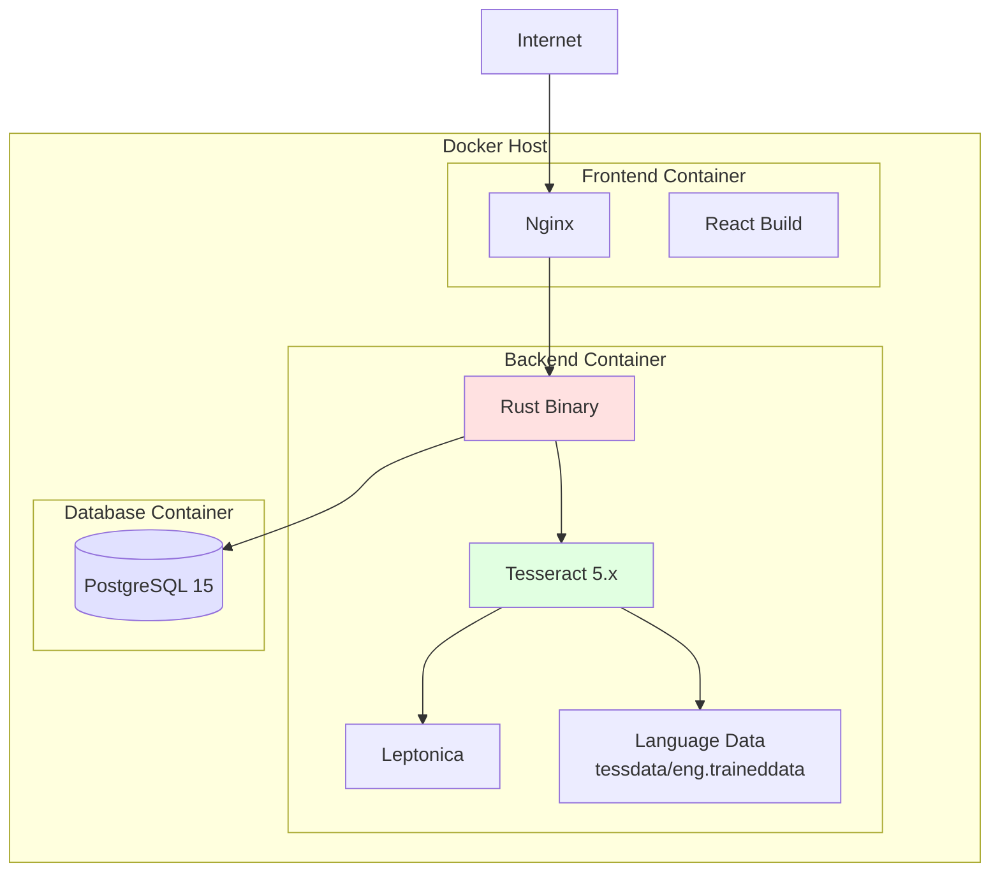

### Environment Configuration

**Configuration via Environment Variables:**

All deployment-specific settings are configured through environment variables (`.env` file):

**Required Variables:**

1. **DATABASE_URL**
   - PostgreSQL connection string
   - Example: `postgresql://user:pass@db:5432/iviss`

2. **TESSERACT_DATA_PATH**
   - Path to Tesseract language data
   - Example: `/usr/share/tesseract-ocr/4.00/tessdata`

3. **OCR_MAX_FILE_SIZE**
   - Maximum image size in bytes
   - Default: `5242880` (5MB)

4. **OCR_RATE_LIMIT**
   - Requests per minute per user
   - Default: `10`

5. **JWT_SECRET**
   - Secret key for JWT validation
   - Must be strong random string

**Why Environment Variables?**
- Different values for dev/staging/production
- Secrets not in code repository
- Easy to change without rebuilding
- Standard practice for 12-factor apps

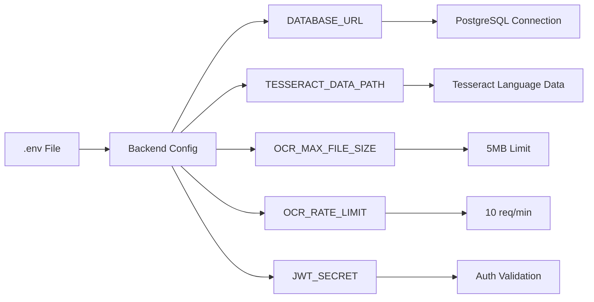

---

## Scalability Considerations

### Planning for Growth

As more agents use the system, we need to scale. This section shows how.

### Horizontal Scaling

**Scaling Strategy: Add More Backend Instances**

**Architecture:**
- Load balancer distributes requests across multiple backend instances
- Each instance runs the same code
- All instances share the same database
- Database has read replicas for scaling reads

**Why Horizontal Scaling?**
- **Easier**: Just add more servers
- **Cheaper**: Use commodity hardware
- **Resilient**: If one instance fails, others continue
- **Flexible**: Scale up/down based on demand

**Bottlenecks:**
- **OCR Processing**: CPU-intensive, benefits from more instances
- **Database**: Can become bottleneck, use read replicas
- **Network**: Usually not an issue with 50KB images

**Auto-Scaling:**
- Monitor CPU usage
- If CPU > 70% for 5 minutes → add instance
- If CPU < 30% for 10 minutes → remove instance

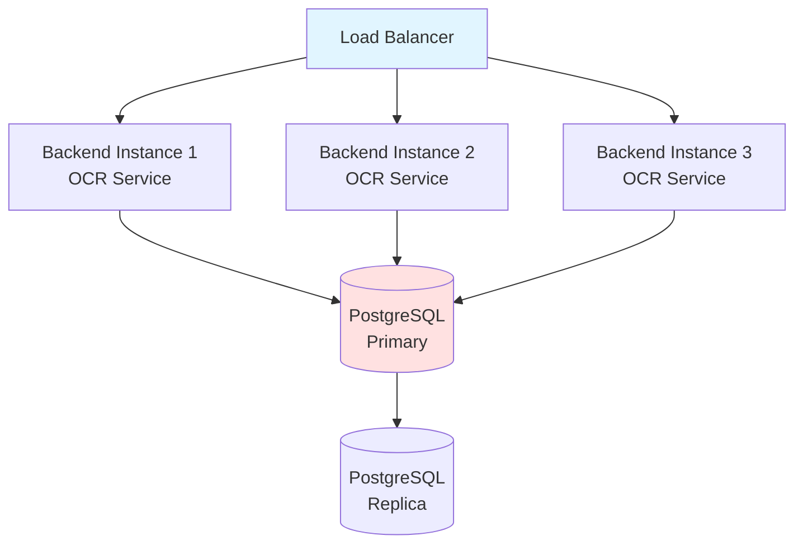

### Performance Metrics

**Capacity Planning:**

These numbers help estimate infrastructure needs:

**Assumptions:**
- Each user scans at 2 req/s while actively scanning
- Average scan duration: 5 seconds
- Users don't scan continuously (10% duty cycle)

**Scaling Guidelines:**
- **10 concurrent users**: 1 instance handles easily
- **50 concurrent users**: 2 instances recommended
- **100 concurrent users**: 4 instances for headroom
- **500 concurrent users**: 10 instances + load balancer

**Cost Estimation** (AWS example):
- 1 instance: t3.medium (~$30/month)
- 10 instances: ~$300/month
- Database: RDS t3.medium (~$50/month)
- Load balancer: ~$20/month
- **Total for 500 users**: ~$370/month

| Concurrent Users | Requests/Second | Backend Instances | CPU Usage | Memory Usage |
|------------------|-----------------|-------------------|-----------|--------------|
| 10 | 20 | 1 | ~40% | ~500MB |
| 50 | 100 | 2 | ~60% | ~1GB |
| 100 | 200 | 4 | ~70% | ~2GB |
| 500 | 1000 | 10 | ~80% | ~5GB |

---

## Future Enhancements

### Roadmap for Improvement

These features are not in the initial implementation but could be added later.

### Phase 2: Plate Detection (Pre-OCR)

**Problem:**
Currently, we send the entire camera frame to the backend. Most of the image is not the license plate (background, car body, etc.).

**Solution:**
Use a lightweight ML model to detect the plate region first, then crop and send only that region.

**Benefits:**
- **Smaller uploads**: Send only plate region (~10KB vs 50KB)
- **Better OCR**: Tesseract works better on cropped plates
- **Faster processing**: Less data to process

**Implementation:**
- Use YOLO or SSD model (lightweight)
- Run on frontend (TensorFlow.js) or backend
- Detect bounding box coordinates
- Crop image before upload

**Trade-offs:**
- More complex frontend
- Requires training data (plate images)
- ML model adds ~2MB to bundle

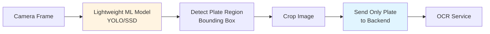

### Phase 3: WebAssembly Option

**Problem:**
Backend OCR requires network connectivity. What if agents work in areas with no signal?

**Solution:**
Compile the Rust OCR code to WebAssembly (WASM) and run it in the browser.

**Benefits:**
- **Offline capability**: Works without internet
- **No backend load**: Processing happens on device
- **Privacy**: Images never leave device
- **Instant results**: No network latency

**Trade-offs:**
- **Large bundle**: WASM + Tesseract data = ~5MB
- **Slower**: Browser is slower than server
- **Battery drain**: Heavy processing on mobile
- **Inconsistent**: Results vary by device

**Hybrid Approach:**
- Use WASM when offline
- Use backend when online
- Backend verifies WASM results

**When to Implement:**
- Only if offline is a hard requirement
- After measuring actual network reliability
- Consider progressive web app (PWA) instead

```mermaid
graph TD
    A[Rust OCR Code] --> B[Compile to WASM]
    B --> C[Load in Browser]
    C --> D[Offline OCR]
    
    D --> E{Network Available?}
    E -->|Yes| F[Verify with Backend]
    E -->|No| G[Use Local Result]
    
    style B fill:#ffe1e1
    style D fill:#e1ffe1
```

---

## Summary

### Architecture Highlights

**What We've Designed:**

A robust, scalable license plate scanning system that balances accuracy, performance, and user experience.

This architecture provides:

✅ **High Accuracy**: Backend Tesseract (85-95%)  
✅ **Good Performance**: ~340ms per scan  
✅ **Low Bandwidth**: ~50KB per frame  
✅ **Reliable Results**: Stability detection  
✅ **Scalable**: Horizontal scaling ready  
✅ **Secure**: Validation + rate limiting  
✅ **Privacy**: No image storage  

**Next Step**: Review this architecture and confirm before implementation begins.
