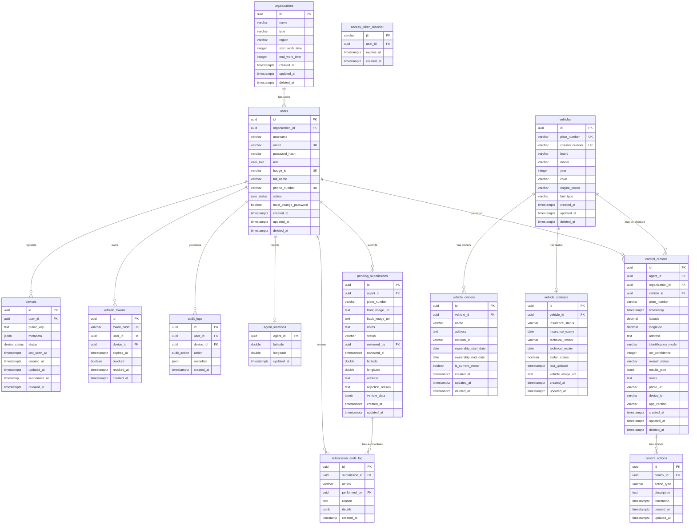

# Database Schema Design

This document describes the current PostgreSQL schema for the IVISS backend.

Source of truth used for this update: migrations in
`iviss-backend/migrations` through
`20260422051000_add_organization_work_time.sql`.

## 1. Entity-Relationship Diagram

## 2. Extensions, Enums, and Functions

### Extensions

- `uuid-ossp`: used for `uuid_generate_v4()`.

### Enums

| Enum | Values |
| ---- | ------ |
| `user_role` | `admin`, `manager`, `agent`, `org_admin` |
| `user_status` | `PENDING_ACTIVATION`, `ACTIVE`, `SUSPENDED` |
| `device_status` | `PENDING`, `ACTIVE`, `REVOKED`, `INACTIVE`, `SUSPENDED` |
| `audit_action` | `LOGIN_SUCCESS`, `LOGIN_FAILED`, `LOGOUT`, `TOKEN_REFRESHED`, `OTP_REQUESTED`, `OTP_VERIFIED`, `OTP_FAILED`, `DEVICE_REGISTERED`, `DEVICE_REVOKED`, `USER_CREATED`, `USER_UPDATED`, `USER_SUSPENDED`, `USER_ACTIVATED`, `VEHICLE_SEARCHED`, `VEHICLE_NOT_FOUND`, `PENDING_SUBMISSION_CREATED`, `PENDING_SUBMISSION_REVIEWED`, `DEVICE_SUSPENDED` |

### Functions and Triggers

`update_updated_at_column()` sets `NEW.updated_at = NOW()` before updates.

Tables with an `updated_at` trigger:

- `organizations`
- `users`
- `vehicles`
- `vehicle_owners`
- `vehicle_statuses`
- `control_records`
- `control_actions`
- `pending_submissions`
- `devices`

## 3. Tables

### 3.1 `organizations`

Stores government agencies or departments using the system.

| Column | Type | Constraints / Default |
| ------ | ---- | --------------------- |
| `id` | `UUID` | Primary key, default `uuid_generate_v4()` |
| `name` | `VARCHAR(255)` | Not null |
| `type` | `VARCHAR(50)` | Not null, check: `police`, `customs`, `border_control`, `other` |
| `region` | `VARCHAR(100)` | Nullable |
| `start_work_time` | `INTEGER` | Not null |
| `end_work_time` | `INTEGER` | Not null |
| `created_at` | `TIMESTAMPTZ` | Default `NOW()` |
| `updated_at` | `TIMESTAMPTZ` | Default `NOW()` |
| `deleted_at` | `TIMESTAMPTZ` | Nullable |

### 3.2 `users`

Stores admins, organization admins, managers, and field agents.

| Column | Type | Constraints / Default |
| ------ | ---- | --------------------- |
| `id` | `UUID` | Primary key, default `uuid_generate_v4()` |
| `organization_id` | `UUID` | Nullable FK to `organizations(id)` |
| `username` | `VARCHAR(50)` | Not null |
| `email` | `VARCHAR(255)` | Unique, nullable |
| `password_hash` | `VARCHAR` | Nullable |
| `role` | `user_role` | Not null |
| `badge_id` | `VARCHAR(50)` | Unique, nullable |
| `full_name` | `VARCHAR(100)` | Not null |
| `phone_number` | `VARCHAR(20)` | Unique, not null |
| `status` | `user_status` | Not null, default `PENDING_ACTIVATION` |
| `must_change_password` | `BOOLEAN` | Not null, default `FALSE` |
| `created_at` | `TIMESTAMPTZ` | Default `NOW()` |
| `updated_at` | `TIMESTAMPTZ` | Default `NOW()` |
| `deleted_at` | `TIMESTAMPTZ` | Nullable |

User constraints:

- `admin` users may have no organization.
- `agent`, `manager`, and `org_admin` users must have an organization.
- `agent` users do not require an email and must have `password_hash IS NULL`.
- `admin`, `manager`, and `org_admin` users must have an email.
- `agent` users must have a `badge_id`.

### 3.3 `vehicles`

Central vehicle registry.

| Column | Type | Constraints / Default |
| ------ | ---- | --------------------- |
| `id` | `UUID` | Primary key, default `uuid_generate_v4()` |
| `plate_number` | `VARCHAR(20)` | Unique, not null |
| `chassis_number` | `VARCHAR(50)` | Unique, nullable |
| `brand` | `VARCHAR(50)` | Nullable |
| `model` | `VARCHAR(50)` | Nullable |
| `year` | `INTEGER` | Nullable |
| `color` | `VARCHAR(30)` | Nullable |
| `engine_power` | `VARCHAR(20)` | Nullable |
| `fuel_type` | `VARCHAR(20)` | Nullable |
| `created_at` | `TIMESTAMPTZ` | Default `NOW()` |
| `updated_at` | `TIMESTAMPTZ` | Default `NOW()` |
| `deleted_at` | `TIMESTAMPTZ` | Nullable |

### 3.4 `vehicle_owners`

Stores vehicle ownership records and ownership history.

| Column | Type | Constraints / Default |
| ------ | ---- | --------------------- |
| `id` | `UUID` | Primary key, default `uuid_generate_v4()` |
| `vehicle_id` | `UUID` | Not null FK to `vehicles(id)` |
| `name` | `VARCHAR(255)` | Not null |
| `address` | `TEXT` | Nullable |
| `national_id` | `VARCHAR(50)` | Nullable |
| `ownership_start_date` | `DATE` | Not null, default `CURRENT_DATE` |
| `ownership_end_date` | `DATE` | Nullable |
| `is_current_owner` | `BOOLEAN` | Default `TRUE` |
| `created_at` | `TIMESTAMPTZ` | Default `NOW()` |
| `updated_at` | `TIMESTAMPTZ` | Default `NOW()` |
| `deleted_at` | `TIMESTAMPTZ` | Nullable |

### 3.5 `vehicle_statuses`

Caches vehicle compliance and status data.

| Column | Type | Constraints / Default |
| ------ | ---- | --------------------- |
| `id` | `UUID` | Primary key, default `uuid_generate_v4()` |
| `vehicle_id` | `UUID` | Unique, not null FK to `vehicles(id)` |
| `insurance_status` | `VARCHAR(20)` | Nullable, check: `valid`, `expired`, `none`, `unknown` |
| `insurance_expiry` | `DATE` | Nullable |
| `technical_status` | `VARCHAR(20)` | Nullable, check: `valid`, `expired`, `failed`, `unknown` |
| `technical_expiry` | `DATE` | Nullable |
| `stolen_status` | `BOOLEAN` | Default `FALSE` |
| `last_updated` | `TIMESTAMPTZ` | Nullable |
| `vehicle_image_url` | `TEXT` | Nullable |
| `created_at` | `TIMESTAMPTZ` | Default `NOW()` |
| `updated_at` | `TIMESTAMPTZ` | Default `NOW()` |

### 3.6 `control_records`

Audit trail of vehicle checks performed by agents.

| Column | Type | Constraints / Default |
| ------ | ---- | --------------------- |
| `id` | `UUID` | Primary key, default `uuid_generate_v4()` |
| `agent_id` | `UUID` | Not null FK to `users(id)` |
| `organization_id` | `UUID` | Not null FK to `organizations(id)` |
| `plate_number` | `VARCHAR(20)` | Not null |
| `timestamp` | `TIMESTAMPTZ` | Not null |
| `latitude` | `DECIMAL(10, 8)` | Nullable |
| `longitude` | `DECIMAL(11, 8)` | Nullable |
| `address` | `TEXT` | Nullable |
| `identification_mode` | `VARCHAR(20)` | Nullable, check: `manual`, `photo`, `live` |
| `ocr_confidence` | `INTEGER` | Nullable, check: `0 <= value <= 100` |
| `overall_status` | `VARCHAR(20)` | Nullable, check: `valid`, `warning`, `critical` |
| `results_json` | `JSONB` | Nullable |
| `notes` | `TEXT` | Nullable |
| `vehicle_id` | `UUID` | Nullable FK to `vehicles(id)` |
| `photo_url` | `VARCHAR(255)` | Nullable |
| `device_id` | `VARCHAR(100)` | Nullable |
| `app_version` | `VARCHAR(20)` | Nullable |
| `created_at` | `TIMESTAMPTZ` | Default `NOW()` |
| `updated_at` | `TIMESTAMPTZ` | Default `NOW()` |
| `deleted_at` | `TIMESTAMPTZ` | Nullable |

### 3.7 `control_actions`

Actions taken during or after a control record.

| Column | Type | Constraints / Default |
| ------ | ---- | --------------------- |
| `id` | `UUID` | Primary key, default `uuid_generate_v4()` |
| `control_id` | `UUID` | Not null FK to `control_records(id)` |
| `action_type` | `VARCHAR(50)` | Not null, check: `citation`, `impound`, `flag`, `warning` |
| `description` | `TEXT` | Nullable |
| `timestamp` | `TIMESTAMPTZ` | Default `NOW()` |
| `created_at` | `TIMESTAMPTZ` | Default `NOW()` |
| `updated_at` | `TIMESTAMPTZ` | Default `NOW()` |

### 3.8 `pending_submissions`

Queue for gray card submissions that need back-office review.

| Column | Type | Constraints / Default |
| ------ | ---- | --------------------- |
| `id` | `UUID` | Primary key, default `uuid_generate_v4()` |
| `agent_id` | `UUID` | Not null FK to `users(id)` |
| `plate_number` | `VARCHAR(20)` | Not null |
| `front_image_url` | `TEXT` | Nullable |
| `back_image_url` | `TEXT` | Nullable |
| `notes` | `TEXT` | Nullable |
| `status` | `VARCHAR(20)` | Default `pending`, check: `pending`, `approved`, `rejected` |
| `reviewed_by` | `UUID` | Nullable FK to `users(id)` |
| `created_at` | `TIMESTAMPTZ` | Default `NOW()` |
| `updated_at` | `TIMESTAMPTZ` | Default `NOW()` |
| `latitude` | `DOUBLE PRECISION` | Nullable |
| `longitude` | `DOUBLE PRECISION` | Nullable |
| `address` | `TEXT` | Nullable |
| `rejection_reason` | `TEXT` | Nullable |
| `vehicle_data` | `JSONB` | Nullable |
| `reviewed_at` | `TIMESTAMPTZ` | Nullable |

### 3.9 `devices`

Mobile devices registered for agent authentication.

| Column | Type | Constraints / Default |
| ------ | ---- | --------------------- |
| `id` | `UUID` | Primary key, default `uuid_generate_v4()` |
| `user_id` | `UUID` | Not null FK to `users(id)` with `ON DELETE CASCADE` |
| `public_key` | `TEXT` | Not null, unique index |
| `metadata` | `JSONB` | Not null, default `{}` |
| `status` | `device_status` | Not null, default `PENDING` |
| `last_seen_at` | `TIMESTAMPTZ` | Nullable |
| `created_at` | `TIMESTAMPTZ` | Not null, default `NOW()` |
| `updated_at` | `TIMESTAMPTZ` | Not null, default `NOW()` |
| `suspended_at` | `TIMESTAMP` | Nullable |
| `revoked_at` | `TIMESTAMPTZ` | Nullable |

### 3.10 `refresh_tokens`

Refresh token storage for authenticated sessions.

| Column | Type | Constraints / Default |
| ------ | ---- | --------------------- |
| `id` | `UUID` | Primary key, default `uuid_generate_v4()` |
| `token_hash` | `VARCHAR(64)` | Unique, not null |
| `user_id` | `UUID` | Not null FK to `users(id)` with `ON DELETE CASCADE` |
| `device_id` | `UUID` | Nullable FK to `devices(id)` with `ON DELETE CASCADE`, deferrable initially deferred |
| `expires_at` | `TIMESTAMPTZ` | Not null |
| `revoked` | `BOOLEAN` | Not null, default `FALSE` |
| `revoked_at` | `TIMESTAMPTZ` | Nullable |
| `created_at` | `TIMESTAMPTZ` | Not null, default `NOW()` |

### 3.11 `access_token_blacklist`

Stores revoked access-token JTIs until they expire.

| Column | Type | Constraints / Default |
| ------ | ---- | --------------------- |
| `jti` | `VARCHAR(36)` | Primary key |
| `user_id` | `UUID` | Not null FK to `users(id)` with `ON DELETE CASCADE` |
| `expires_at` | `TIMESTAMPTZ` | Not null |
| `created_at` | `TIMESTAMPTZ` | Not null, default `NOW()` |

### 3.12 `audit_logs`

Application audit log for auth, device, user, vehicle, and submission events.

| Column | Type | Constraints / Default |
| ------ | ---- | --------------------- |
| `id` | `UUID` | Primary key, default `uuid_generate_v4()` |
| `user_id` | `UUID` | Nullable FK to `users(id)` with `ON DELETE SET NULL` |
| `device_id` | `UUID` | Nullable FK to `devices(id)` with `ON DELETE SET NULL` |
| `action` | `audit_action` | Not null |
| `metadata` | `JSONB` | Not null, default `{}` |
| `created_at` | `TIMESTAMPTZ` | Not null, default `NOW()` |

### 3.13 `agent_locations`

Latest known live location for each agent.

| Column | Type | Constraints / Default |
| ------ | ---- | --------------------- |
| `agent_id` | `UUID` | Primary key, FK to `users(id)` with `ON DELETE CASCADE` |
| `latitude` | `DOUBLE PRECISION` | Not null |
| `longitude` | `DOUBLE PRECISION` | Not null |
| `updated_at` | `TIMESTAMPTZ` | Not null, default `CURRENT_TIMESTAMP` |

### 3.14 `submission_audit_log`

Audit log for gray card approval and rejection workflow.

| Column | Type | Constraints / Default |
| ------ | ---- | --------------------- |
| `id` | `UUID` | Primary key, default `uuid_generate_v4()` |
| `submission_id` | `UUID` | Not null FK to `pending_submissions(id)` |
| `action` | `VARCHAR(20)` | Not null, check: `approved`, `rejected` |
| `performed_by` | `UUID` | Not null FK to `users(id)` |
| `reason` | `TEXT` | Nullable |
| `details` | `JSONB` | Nullable |
| `created_at` | `TIMESTAMP` | Default `NOW()` |

## 4. Indexes

### Users

- `idx_users_phone` on `users(phone_number)` where `deleted_at IS NULL`
- `idx_users_email` on `users(email)` where `deleted_at IS NULL AND email IS NOT NULL`
- `idx_users_org_role` on `users(organization_id, role)` where `deleted_at IS NULL`
- `idx_users_status` on `users(status)` where `deleted_at IS NULL`

### Vehicles

- `idx_vehicles_chassis` on `vehicles(chassis_number)` where `chassis_number IS NOT NULL`
- `idx_vehicles_plate_number` on `vehicles(plate_number)`

### Vehicle Statuses

- `idx_vehicle_statuses_expired_insurance` on `vehicle_statuses(insurance_expiry)` where `insurance_status = 'expired'`

### Control Records

- `idx_control_records_timestamp` on `control_records(timestamp DESC)`
- `idx_control_records_org_timestamp` on `control_records(organization_id, timestamp DESC)`
- `idx_control_records_status` on `control_records(overall_status)`
- `idx_control_records_vehicle` on `control_records(vehicle_id)` where `vehicle_id IS NOT NULL`
- `idx_control_records_plate` on `control_records(plate_number)`
- `idx_control_records_results_json` on `control_records` using GIN on `results_json`

### Pending Submissions

- `idx_pending_submissions_status` on `pending_submissions(status, created_at DESC)` where `status = 'pending'`

### Devices

- `idx_devices_user_id` on `devices(user_id)` where `status != 'SUSPENDED'`
- `idx_devices_public_key` unique index on `devices(public_key)`
- `idx_devices_suspended` on `devices(revoked_at)` where `revoked_at IS NOT NULL`

### Refresh Tokens

- `idx_refresh_tokens_token_hash` on `refresh_tokens(token_hash)` where `revoked = FALSE`
- `idx_refresh_tokens_user_id` on `refresh_tokens(user_id, expires_at)` where `revoked = FALSE`
- `idx_refresh_tokens_expires_at` on `refresh_tokens(expires_at)` where `revoked = FALSE`

### Access Token Blacklist

- `idx_blacklist_expires_at` on `access_token_blacklist(expires_at)`

### Audit Logs

- `idx_audit_logs_user_id` on `audit_logs(user_id, created_at DESC)` where `user_id IS NOT NULL`
- `idx_audit_logs_device_id` on `audit_logs(device_id, created_at DESC)` where `device_id IS NOT NULL`
- `idx_audit_logs_action` on `audit_logs(action, created_at DESC)`
- `idx_audit_logs_created_at` on `audit_logs(created_at DESC)`
- `idx_audit_logs_metadata` on `audit_logs` using GIN on `metadata`

### Agent Locations

- `idx_agent_locations_updated_at` on `agent_locations(updated_at)`

### Submission Audit Log

- `idx_audit_log_submission` on `submission_audit_log(submission_id)`
- `idx_audit_log_performed_by` on `submission_audit_log(performed_by)`
- `idx_audit_log_created_at` on `submission_audit_log(created_at DESC)`

## 5. Notes

- Most business tables use soft delete through `deleted_at`; `vehicle_statuses`,
  `control_actions`, `pending_submissions`, auth tables, and audit tables do not
  currently have `deleted_at`.
- `devices.suspended_at` remains `TIMESTAMP` while most auth timestamps are now
  `TIMESTAMPTZ`; this follows the current migration history.
- `submission_audit_log.created_at` remains `TIMESTAMP`; it was not converted by
  the timestamp type migration.
- `control_records.device_id` is a string field and is not a foreign key to
  `devices(id)`.
