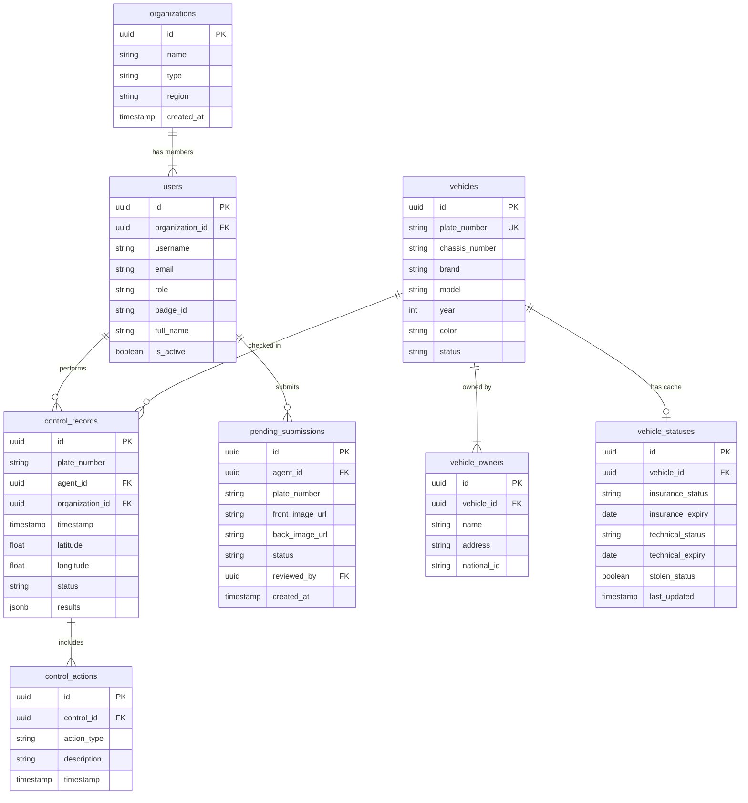

# Database Schema Design

This document details the database schema for the IVISS backend, designed for PostgreSQL.

## 1. Entity-Relationship Diagram



## 2. Tables

### 2.1 Organizations

**Purpose**: Manages different government agencies and departments that use the IVISS system.

**Business Need**: The system serves multiple organizations (police brigades, customs offices, border control, etc.) that need to be isolated from each other for security and data privacy. Each organization has its own set of users and can only access their own control records and submissions.

**Key Relationships**:

- One organization has many users (agents and administrators)
- Organization context is captured in every control record for audit and reporting

| Column       | Type           | Constraints     | Description                                              |
| ------------ | -------------- | --------------- | -------------------------------------------------------- |
| `id`         | `UUID`         | `PRIMARY KEY`   | Unique identifier                                        |
| `name`       | `VARCHAR(255)` | `NOT NULL`      | Organization name (e.g., "Brigade Mobile de Douala")     |
| `type`       | `VARCHAR(50)`  | `NOT NULL`      | Organization type: 'police', 'customs', 'border_control' |
| `region`     | `VARCHAR(100)` |                 | Geographic region or jurisdiction                        |
| `created_at` | `TIMESTAMP`    | `DEFAULT NOW()` | Record creation time                                     |

### 2.2 Users

**Purpose**: Stores all user accounts for the system, including field agents and back-office administrators.

**Business Need**: The system requires role-based access control to distinguish between:

- **Agents**: Field officers who perform vehicle checks using mobile devices
- **Managers**: Supervisors who review statistics and agent performance
- **Admins**: Back-office staff who review pending submissions and manage the vehicle registry

Each user belongs to an organization and can only access data within their organizational scope.

**Key Relationships**:

- Each user belongs to one organization
- Users create control records when checking vehicles
- Users submit pending gray card requests
- Admins review pending submissions

| Column            | Type           | Constraints        | Description                                              |
| ----------------- | -------------- | ------------------ | -------------------------------------------------------- |
| `id`              | `UUID`         | `PRIMARY KEY`      | Unique identifier                                        |
| `organization_id` | `UUID`         | `FOREIGN KEY`      | Reference to organization (determines data access scope) |
| `username`        | `VARCHAR(50)`  | `UNIQUE, NOT NULL` | Login username                                           |
| `email`           | `VARCHAR(255)` | `UNIQUE, NOT NULL` | Contact email for notifications                          |
| `password_hash`   | `VARCHAR`      | `NOT NULL`         | Hashed password (bcrypt/argon2)                          |
| `role`            | `VARCHAR(20)`  | `NOT NULL`         | User role: 'admin', 'agent', 'manager'                   |
| `badge_id`        | `VARCHAR(50)`  |                    | Official badge/ID number for accountability              |
| `full_name`       | `VARCHAR(100)` | `NOT NULL`         | Full name for display and reports                        |
| `is_active`       | `BOOLEAN`      | `DEFAULT TRUE`     | Account status (for disabling without deletion)          |

### 2.3 Vehicles (Registry)

**Purpose**: The central vehicle registry containing all officially registered vehicles in the system.

**Business Need**: This is the master database of vehicles that agents query when performing roadside checks. It contains the physical characteristics and identification details of each vehicle. When an agent scans a license plate, the system looks up this table to retrieve vehicle information and display it alongside compliance status.

**Key Relationships**:

- One vehicle can have multiple owners (through vehicle_owners table)
- One vehicle has one status cache record (vehicle_statuses)
- Vehicles are referenced in control records when checks are performed

**Data Flow**: Vehicle data is typically imported from government motor vehicle departments or entered by back-office admins when processing gray card submissions.

| Column           | Type          | Constraints        | Description                                         |
| ---------------- | ------------- | ------------------ | --------------------------------------------------- |
| `id`             | `UUID`        | `PRIMARY KEY`      | Unique identifier                                   |
| `plate_number`   | `VARCHAR(20)` | `UNIQUE, NOT NULL` | Normalized plate number (primary search key)        |
| `chassis_number` | `VARCHAR(50)` | `UNIQUE`           | Vehicle Identification Number (VIN)                 |
| `brand`          | `VARCHAR(50)` |                    | Manufacturer (e.g., "Toyota", "Renault")            |
| `model`          | `VARCHAR(50)` |                    | Model name (e.g., "Corolla", "Clio")                |
| `year`           | `INTEGER`     |                    | Manufacturing year                                  |
| `color`          | `VARCHAR(30)` |                    | Visual color for identification                     |
| `engine_power`   | `VARCHAR(20)` |                    | Horsepower/KW rating                                |
| `fuel_type`      | `VARCHAR(20)` |                    | Fuel type: 'petrol', 'diesel', 'electric', 'hybrid' |

### 2.4 Vehicle Owners

**Purpose**: Links vehicles to their legal owners, supporting multiple owners per vehicle and ownership history.

**Business Need**: When agents check a vehicle, they need to know who the registered owner is to:

- Verify the driver's authorization to operate the vehicle
- Contact the owner if the vehicle is flagged or impounded
- Track ownership changes over time for fraud detection

**Key Relationships**:

- Multiple owners can be associated with one vehicle (joint ownership, company fleets)
- One person can own multiple vehicles

**Note**: This is a many-to-many relationship table between vehicles and owner entities.

| Column        | Type           | Constraints   | Description                         |
| ------------- | -------------- | ------------- | ----------------------------------- |
| `id`          | `UUID`         | `PRIMARY KEY` | Unique identifier                   |
| `vehicle_id`  | `UUID`         | `FOREIGN KEY` | Reference to vehicle                |
| `name`        | `VARCHAR(255)` | `NOT NULL`    | Full legal name of owner            |
| `address`     | `TEXT`         |               | Residential or business address     |
| `national_id` | `VARCHAR(50)`  |               | National ID Card or Passport number |

### 2.5 Vehicle Statuses (External Data Cache)

**Purpose**: Caches real-time compliance and status information from external government systems.

**Business Need**: When an agent checks a vehicle, the system needs to quickly display whether the vehicle is:

- **Insured**: Has valid insurance coverage
- **Technically compliant**: Has passed required safety/emissions inspections
- **Stolen/Wanted**: Flagged by police as stolen or involved in criminal activity
- **Customs cleared**: Has paid all import duties (for foreign vehicles)

Querying external systems in real-time for every check would be too slow and unreliable. This table caches the most recent status information and refreshes it periodically or on-demand.

**Key Relationships**:

- One vehicle has one status cache record (1:1 relationship)
- Status data is fetched from external APIs and stored here

**Data Freshness**: The `last_updated` timestamp indicates when the cache was last refreshed. The system may trigger a refresh if the data is stale.

| Column             | Type          | Constraints           | Description                                               |
| ------------------ | ------------- | --------------------- | --------------------------------------------------------- |
| `id`               | `UUID`        | `PRIMARY KEY`         | Unique identifier                                         |
| `vehicle_id`       | `UUID`        | `FOREIGN KEY, UNIQUE` | Reference to vehicle (one-to-one)                         |
| `insurance_status` | `VARCHAR(20)` |                       | Insurance status: 'valid', 'expired', 'none'              |
| `insurance_expiry` | `DATE`        |                       | Insurance expiration date                                 |
| `technical_status` | `VARCHAR(20)` |                       | Technical inspection status: 'valid', 'expired', 'failed' |
| `technical_expiry` | `DATE`        |                       | Technical inspection expiration date                      |
| `stolen_status`    | `BOOLEAN`     | `DEFAULT FALSE`       | Whether vehicle is reported stolen                        |
| `last_updated`     | `TIMESTAMP`   |                       | When this cache was last refreshed from external systems  |

### 2.6 Control Records

**Purpose**: Complete audit trail of every vehicle check performed by agents in the field.

**Business Need**: This is the core transactional table of the system. Every time an agent:

1. Scans a license plate with their mobile device
2. Manually enters a plate number
3. Performs a live OCR check

...a control record is created. This provides:

- **Accountability**: Who checked which vehicle, when, and where
- **Analytics**: Traffic patterns, agent productivity, violation hotspots
- **Legal evidence**: Timestamped, GPS-tagged records for enforcement actions
- **Historical tracking**: Complete vehicle check history

**Key Relationships**:

- Each record is created by one agent (user)
- Each record belongs to one organization (for data isolation)
- Each record may reference a vehicle (if found in registry)
- Each record can have multiple control actions (citations, impounds)

**Data Flow**: Created by mobile app → Synced to backend → Available for dashboard analytics and reporting

| Column                | Type             | Constraints   | Description                                                          |
| --------------------- | ---------------- | ------------- | -------------------------------------------------------------------- |
| `id`                  | `UUID`           | `PRIMARY KEY` | Unique identifier                                                    |
| `agent_id`            | `UUID`           | `FOREIGN KEY` | Agent who performed the check                                        |
| `organization_id`     | `UUID`           | `FOREIGN KEY` | Organization context (for data isolation)                            |
| `plate_number`        | `VARCHAR(20)`    | `NOT NULL`    | Plate checked (stored even if not in registry)                       |
| `timestamp`           | `TIMESTAMP`      | `NOT NULL`    | Exact time of check (from mobile device)                             |
| `latitude`            | `DECIMAL(10, 8)` |               | GPS latitude of check location                                       |
| `longitude`           | `DECIMAL(11, 8)` |               | GPS longitude of check location                                      |
| `address`             | `TEXT`           |               | Human-readable location (reverse geocoded)                           |
| `identification_mode` | `VARCHAR(20)`    |               | How plate was identified: 'manual', 'photo', 'live'                  |
| `ocr_confidence`      | `INTEGER`        |               | OCR confidence score (0-100) if photo/live mode                      |
| `overall_status`      | `VARCHAR(20)`    |               | Aggregated result: 'valid', 'warning', 'critical'                    |
| `results_json`        | `JSONB`          |               | Detailed breakdown of all status checks (insurance, technical, etc.) |
| `notes`               | `TEXT`           |               | Free-text notes entered by agent                                     |

### 2.7 Control Actions

**Purpose**: Detailed audit log of specific enforcement actions taken during vehicle controls.

**Business Need**: When an agent checks a vehicle and finds violations, they may take various actions:

- **Citation**: Issue a traffic ticket or fine
- **Impound**: Seize the vehicle for serious violations
- **Flag**: Mark the vehicle for follow-up investigation
- **Warning**: Verbal warning with no formal penalty

This table records each action separately, allowing:

- Multiple actions per control (e.g., citation + flag)
- Detailed audit trail for legal proceedings
- Statistical analysis of enforcement patterns
- Performance metrics for agents and organizations

**Key Relationships**:

- Each action belongs to one control record
- One control record can have multiple actions

**Use Case Example**: An agent checks a vehicle and finds expired insurance and a broken taillight. They issue two citations (one for each violation) and flag the vehicle for re-inspection. This creates one control record with three control actions.

| Column        | Type          | Constraints     | Description                                           |
| ------------- | ------------- | --------------- | ----------------------------------------------------- |
| `id`          | `UUID`        | `PRIMARY KEY`   | Unique identifier                                     |
| `control_id`  | `UUID`        | `FOREIGN KEY`   | Reference to parent control record                    |
| `action_type` | `VARCHAR(50)` | `NOT NULL`      | Action type: 'citation', 'impound', 'flag', 'warning' |
| `description` | `TEXT`        |                 | Detailed description of the action and reason         |
| `timestamp`   | `TIMESTAMP`   | `DEFAULT NOW()` | When the action was taken                             |

### 2.8 Pending Submissions

**Purpose**: Queue for gray card (carte grise) documents submitted by field agents for back-office review.

**Business Need**: When an agent encounters a vehicle that is NOT in the central registry, they need a way to:

1. Capture photos of the vehicle's gray card (registration document)
2. Submit it to back-office administrators for data entry
3. Track the submission status (pending, approved, rejected)

This creates a workflow:

- **Agent**: Takes photos of gray card → Submits to system
- **Admin**: Reviews submission → Enters vehicle data into registry → Marks as approved
- **System**: Vehicle is now searchable for future checks

**Key Relationships**:

- Each submission is created by one agent
- Each submission is reviewed by one admin (when processed)
- Approved submissions result in new vehicle records being created

**Use Case**: An agent stops a vehicle with foreign plates. The vehicle is not in the database. The agent photographs the front and back of the gray card and submits it. A back-office admin later reviews the images, manually enters the vehicle details into the registry, and marks the submission as approved.

| Column            | Type           | Constraints         | Description                                        |
| ----------------- | -------------- | ------------------- | -------------------------------------------------- |
| `id`              | `UUID`         | `PRIMARY KEY`       | Unique identifier                                  |
| `agent_id`        | `UUID`         | `FOREIGN KEY`       | Agent who submitted the gray card                  |
| `plate_number`    | `VARCHAR(20)`  | `NOT NULL`          | Plate number from the gray card                    |
| `front_image_url` | `VARCHAR(255)` |                     | Cloud storage URL for front image of gray card     |
| `back_image_url`  | `VARCHAR(255)` |                     | Cloud storage URL for back image of gray card      |
| `notes`           | `TEXT`         |                     | Agent's notes about the submission                 |
| `status`          | `VARCHAR(20)`  | `DEFAULT 'pending'` | Workflow status: 'pending', 'approved', 'rejected' |
| `reviewed_by`     | `UUID`         | `FOREIGN KEY`       | Admin who reviewed and processed the submission    |
| `created_at`      | `TIMESTAMP`    | `DEFAULT NOW()`     | When the submission was created                    |

## 3. Indexes and Performance

- **Vehicles**: Index on `plate_number` (Hash) for O(1) lookups.
- **Control Records**:
  - Compound index on `(agent_id, timestamp)` for history queries.
  - Index on `plate_number` for vehicle history.
  - Geospatial index (PostGIS) on `(latitude, longitude)` for map clustering (optional).

## 4. Recommended Schema Enhancements

This section documents suggested improvements to the schema for better data integrity, audit trails, and functionality.

### 4.1 Audit Trail Improvements

**Add to ALL tables**:

- `created_at TIMESTAMP DEFAULT NOW()` - When the record was created
- `updated_at TIMESTAMP DEFAULT NOW()` - When the record was last modified (use trigger to auto-update)

**Rationale**: Complete audit trail for all data changes. Essential for compliance and debugging.

**Tables needing `created_at`**:

- `vehicles`
- `vehicle_owners`
- `vehicle_statuses`
- `control_actions`
- `users`

**Tables needing `updated_at`**:

- All tables (use PostgreSQL trigger to auto-update on modification)

### 4.2 Soft Delete Support

**Add to critical tables**:

- `deleted_at TIMESTAMP NULL` - When the record was soft-deleted (NULL = active)

**Rationale**: Preserve historical data integrity. Hard deletes can break foreign key references and lose audit trails.

**Tables needing soft delete**:

- `vehicles` - Keep deleted vehicles for historical control records
- `users` - Preserve agent history even after account deletion
- `organizations` - Maintain organizational context for old records
- `vehicle_owners` - Track ownership history

**Implementation**:

- Add `WHERE deleted_at IS NULL` to all queries
- Use database views for "active" records
- Periodic archival process for old deleted records

### 4.3 Enhanced Vehicle Ownership Tracking

**Add to `vehicle_owners` table**:

```sql
ownership_start_date DATE NOT NULL DEFAULT CURRENT_DATE
ownership_end_date DATE NULL
is_current_owner BOOLEAN DEFAULT TRUE
```

**Rationale**: Track ownership changes over time. Useful for:

- Fraud detection (frequent ownership changes)
- Historical queries ("Who owned this vehicle on date X?")
- Legal disputes

**Migration Strategy**: Set `ownership_start_date` to `created_at` for existing records.

### 4.4 Additional Fields for Control Records

**Add to `control_records` table**:

```sql
vehicle_id UUID NULL FOREIGN KEY REFERENCES vehicles(id)
photo_url VARCHAR(255) NULL
device_id VARCHAR(100) NULL
app_version VARCHAR(20) NULL
```

**Rationale**:

- `vehicle_id`: Direct link to vehicle if found (faster joins, better referential integrity)
- `photo_url`: Store the actual license plate photo for evidence
- `device_id`: Track which mobile device performed the check (for device management)
- `app_version`: Debug issues related to specific app versions

### 4.5 Data Validation Constraints

**Add CHECK constraints**:

```sql
-- Organizations
ALTER TABLE organizations ADD CONSTRAINT chk_org_type
  CHECK (type IN ('police', 'customs', 'border_control', 'other'));

-- Users
ALTER TABLE users ADD CONSTRAINT chk_user_role
  CHECK (role IN ('admin', 'agent', 'manager'));

-- Vehicle Statuses
ALTER TABLE vehicle_statuses ADD CONSTRAINT chk_insurance_status
  CHECK (insurance_status IN ('valid', 'expired', 'none', 'unknown'));
ALTER TABLE vehicle_statuses ADD CONSTRAINT chk_technical_status
  CHECK (technical_status IN ('valid', 'expired', 'failed', 'unknown'));

-- Control Records
ALTER TABLE control_records ADD CONSTRAINT chk_identification_mode
  CHECK (identification_mode IN ('manual', 'photo', 'live'));
ALTER TABLE control_records ADD CONSTRAINT chk_overall_status
  CHECK (overall_status IN ('valid', 'warning', 'critical'));
ALTER TABLE control_records ADD CONSTRAINT chk_ocr_confidence
  CHECK (ocr_confidence >= 0 AND ocr_confidence <= 100);

-- Control Actions
ALTER TABLE control_actions ADD CONSTRAINT chk_action_type
  CHECK (action_type IN ('citation', 'impound', 'flag', 'warning'));

-- Pending Submissions
ALTER TABLE pending_submissions ADD CONSTRAINT chk_submission_status
  CHECK (status IN ('pending', 'approved', 'rejected'));
```

**Rationale**: Prevent invalid data at the database level. Catch bugs early.

### 4.6 Additional Performance Indexes

**Recommended indexes**:

```sql
-- Users
CREATE INDEX idx_users_organization_role ON users(organization_id, role) WHERE is_active = TRUE;
CREATE INDEX idx_users_email ON users(email) WHERE is_active = TRUE;

-- Vehicles
CREATE INDEX idx_vehicles_chassis ON vehicles(chassis_number) WHERE chassis_number IS NOT NULL;

-- Vehicle Statuses
CREATE INDEX idx_vehicle_statuses_expired_insurance
  ON vehicle_statuses(insurance_expiry)
  WHERE insurance_status = 'expired';

-- Control Records
CREATE INDEX idx_control_records_timestamp ON control_records(timestamp DESC);
CREATE INDEX idx_control_records_org_timestamp
  ON control_records(organization_id, timestamp DESC);
CREATE INDEX idx_control_records_status ON control_records(overall_status);
CREATE INDEX idx_control_records_vehicle ON control_records(vehicle_id)
  WHERE vehicle_id IS NOT NULL;

-- Pending Submissions
CREATE INDEX idx_pending_submissions_status
  ON pending_submissions(status, created_at DESC)
  WHERE status = 'pending';
```

**Rationale**: Optimize common query patterns:

- Dashboard queries (filtered by organization + time range)
- Pending submission queue (status = 'pending', ordered by date)
- Vehicle history lookups
- Expired insurance/technical inspection reports

### 4.7 Missing Relationships

**Add to ERD**:

- `control_records.vehicle_id` → `vehicles.id` (optional FK, NULL if vehicle not in registry)

**Rationale**: Currently, control records only store `plate_number` as a string. Adding a direct FK to vehicles (when found) enables:

- Faster joins for vehicle history
- Referential integrity
- Cascade updates if plate numbers are corrected

### 4.8 Data Retention Policy

**Recommended policies**:

| Table                 | Retention Period                 | Action                                           |
| --------------------- | -------------------------------- | ------------------------------------------------ |
| `control_records`     | 7 years                          | Archive to cold storage, keep metadata           |
| `control_actions`     | 7 years                          | Archive with parent control record               |
| `pending_submissions` | 2 years after approval/rejection | Archive images, keep metadata                    |
| `vehicle_statuses`    | Keep latest only                 | Archive old status snapshots if needed for audit |

**Implementation**:

- Partition `control_records` by year for efficient archival
- Use PostgreSQL table partitioning or separate archive database
