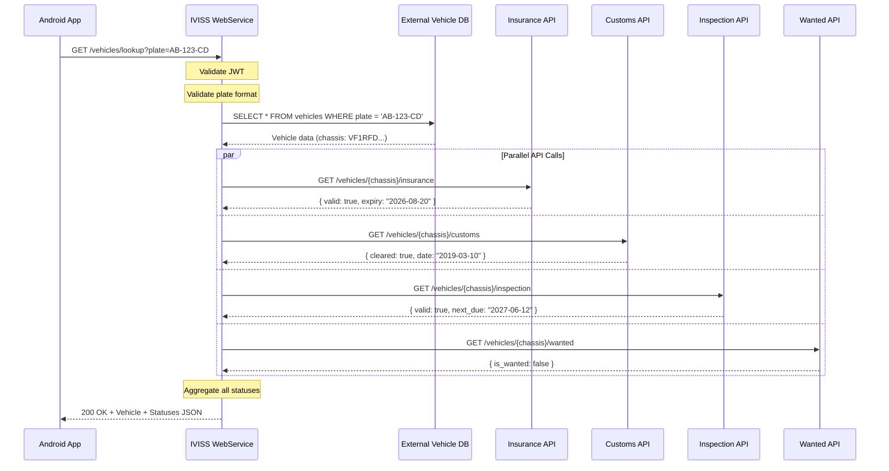
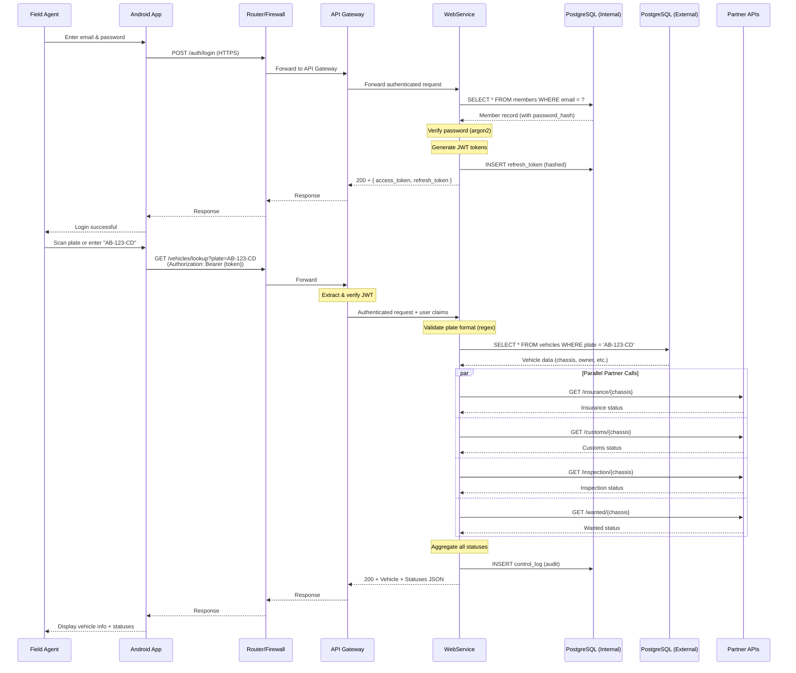
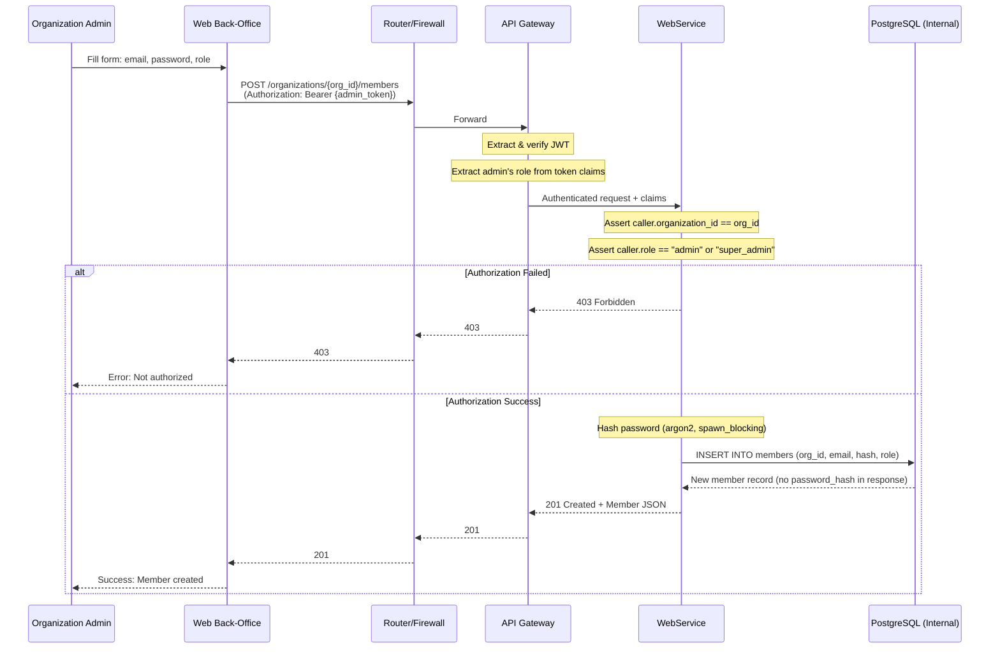
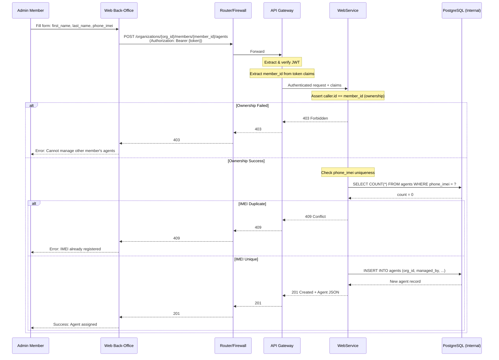
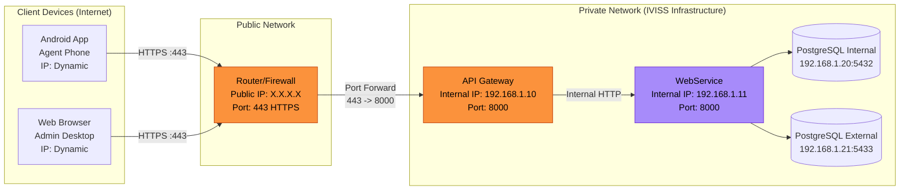

# IVISS — Sequence diagrams & communication flows Documentation

**Version:** 1.0
**Date:** February 2026
**Author:** IVISS Development Team

---

## Table of Contents

1. [Partner API Integration Flow](#5-Partner API Integration Flow)

2. [Sequence Diagrams](#6-sequence-diagrams)

3. [Client-Server Communication](#7-client-server-communication)

### 1. Partner API Integration Flow

**Error Handling:**

- **Timeout (3s):** If any partner API exceeds 3 seconds, IVISS returns a partial response with `"status": "unknown"` for that partner.
- **Service Unavailable:** If a partner API returns 503, IVISS logs the error and marks that status as `"unavailable"`.
- **Rate Limiting:** Partner APIs may enforce rate limits. IVISS caches responses for 5 minutes to reduce duplicate calls.

## 2. Sequence Diagrams

### 2.1 Agent Login & Vehicle Lookup (Full Flow)

---

### 2.2 Admin Creates Member (Hierarchy Enforcement)

---

### 2.3 Member Assigns Agent (Ownership Check)

## 3. Client-Server Communication

### 3.1 Network Topology

