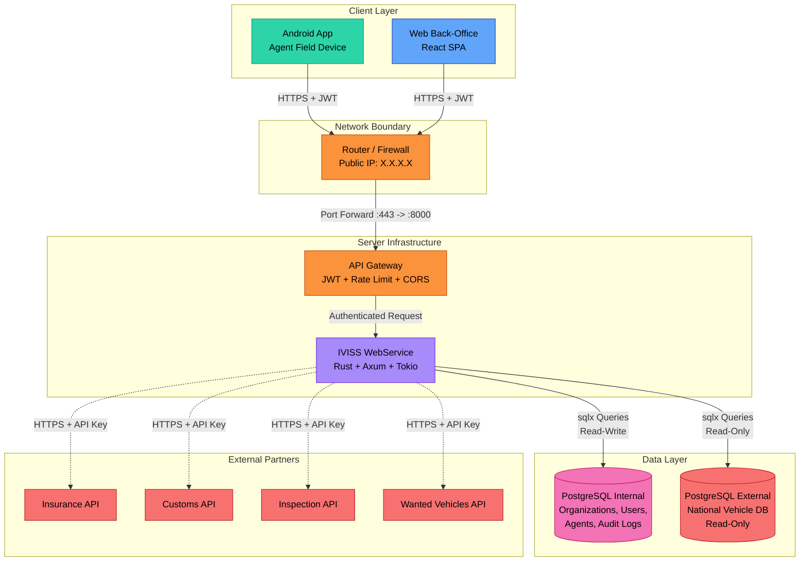

```mermaid
graph TB
    subgraph "Client Layer"
        A[Android App<br/>Agent Field Device]
        B[Web Back-Office<br/>React SPA]
    end
  
    subgraph "Network Boundary"
        R[Router / Firewall<br/>Public IP: X.X.X.X]
    end
  
    subgraph "Server Infrastructure"
        G[API Gateway<br/>JWT + Rate Limit + CORS]
        W[IVISS WebService<br/>Rust + Axum + Tokio]
    end
  
    subgraph "Data Layer"
        DB1[(PostgreSQL Internal<br/>Organizations, Users,<br/>Agents, Audit Logs)]
        DB2[(PostgreSQL External<br/>National Vehicle DB<br/>Read-Only)]
    end
  
    subgraph "External Partners"
        API1[Insurance API]
        API2[Customs API]
        API3[Inspection API]
        API4[Wanted Vehicles API]
    end
  
    A -->|HTTPS + JWT| R
    B -->|HTTPS + JWT| R
    R -->|Port Forward :443 -> :8000| G
    G -->|Authenticated Request| W
    W -->|sqlx Queries<br/>Read-Write| DB1
    W -->|sqlx Queries<br/>Read-Only| DB2
    W -.->|HTTPS + API Key| API1
    W -.->|HTTPS + API Key| API2
    W -.->|HTTPS + API Key| API3
    W -.->|HTTPS + API Key| API4
  
    style A fill:#2dd4a8,stroke:#1a8f6f,color:#000
    style B fill:#60a5fa,stroke:#1e40af,color:#000
    style R fill:#fb923c,stroke:#c2410c,color:#000
    style G fill:#fb923c,stroke:#c2410c,color:#000
    style W fill:#a78bfa,stroke:#6d28d9,color:#000
    style DB1 fill:#f472b6,stroke:#be185d,color:#000
    style DB2 fill:#f87171,stroke:#b91c1c,color:#000
    style API1 fill:#f87171,stroke:#b91c1c,color:#000
    style API2 fill:#f87171,stroke:#b91c1c,color:#000
    style API3 fill:#f87171,stroke:#b91c1c,color:#000
    style API4 fill:#f87171,stroke:#b91c1c,color:#000
```

