# Guide Utilisateur IVISS

**Bienvenue sur IVISS** — Votre plateforme complète pour l'identification des véhicules, les contrôles de conformité et la gestion des opérations sur le terrain.

---

## À Qui S'adresse Ce Guide

IVISS est conçu pour :

- **Les forces de l'ordre** effectuant des inspections et des contrôles routiers
- **Les organismes gouvernementaux de réglementation** gérant la conformité et l'immatriculation des véhicules
- **Les agents de terrain** qui ont besoin d'une identification rapide et fiable des véhicules en déplacement
- **Les administrateurs** qui coordonnent les opérations sur le terrain et gèrent les équipes
- **Les organisations** responsables de la sécurité publique et de la conformité réglementaire

Si votre travail implique la vérification du statut des véhicules, la vérification de la conformité ou la gestion des opérations sur le terrain, IVISS simplifie ces tâches avec des données en temps réel et des outils axés sur le mobile.

---

## Ce Que Fait IVISS

IVISS vous aide à :

- **Identifier les véhicules instantanément** en utilisant la reconnaissance de plaques d'immatriculation (scan ou saisie manuelle)
- **Vérifier le statut de conformité** pour l'assurance, le dédouanement, le contrôle technique et les véhicules recherchés
- **Enregistrer les actions de contrôle** comme les contraventions, les avertissements, les mises en fourrière et les signalements
- **Suivre tous les contrôles de véhicules** avec des pistes d'audit complètes incluant la localisation et les horodatages
- **Gérer les équipes de terrain** avec un contrôle d'accès basé sur les rôles et la sécurité des appareils
- **Générer des rapports** sur les activités de contrôle, les performances des agents et les statistiques des véhicules
- **Travailler hors ligne** avec la technologie Progressive Web App (PWA) qui se synchronise lorsque vous êtes de nouveau en ligne

---

## Fonctionnalités Principales en un Coup d'Œil

| Fonctionnalité                        | Ce Qu'elle Fait                                                                    |
| ------------------------------------- | ---------------------------------------------------------------------------------- |
| **Reconnaissance de Plaques**         | Scannez les plaques avec votre caméra ou saisissez-les manuellement               |
| **Contrôles de Conformité en Temps Réel** | Vérifiez instantanément l'assurance, les douanes, le contrôle technique et le statut recherché |
| **Historique des Contrôles**          | Enregistrement complet de tous les contrôles avec horodatages et localisations    |
| **Système d'Alerte**                  | Notifications immédiates pour les véhicules signalés (volés, non enregistrés, etc.) |
| **Conception Mobile First**           | Optimisé pour les smartphones et tablettes utilisés sur le terrain                |
| **Application Web Progressive (PWA)** | Installation sur n'importe quel appareil, fonctionne hors ligne, mises à jour automatiques |
| **Support Multi-Organisation**        | Données et paramètres séparés pour différentes agences                            |
| **Contrôle d'Accès Basé sur les Rôles** | Permissions différentes pour Super Admins, Admins d'Organisation et Agents      |
| **Actions de Contrôle**               | Enregistrez les contraventions, mises en fourrière, avertissements et signalements directement depuis le terrain |
| **Génération de Rapports**            | Exportez les résumés de contrôle, les performances des agents et les statistiques en CSV/PDF/Excel |
| **Liaison Sécurisée des Appareils**   | L'appareil de chaque agent est lié cryptographiquement à son compte              |
| **Gestion des Quarts de Travail**     | Les agents vérifient leur identité à chaque quart avec des codes SMS             |

---

## Premiers Pas : Vos Premières Étapes

### Pour les Super Administrateurs

Les Super Administrateurs sont les gestionnaires système de niveau supérieur qui configurent les organisations et leurs administrateurs. Si vous êtes un Super Admin, commencez ici. Si vous êtes un Admin d'Organisation, passez à la section "Pour les Administrateurs d'Organisation".

#### 1. Accéder au Back-Office

**Ce dont vous avez besoin :**
- Vos identifiants de connexion Super Admin (email et mot de passe)
- Un navigateur web (Chrome, Firefox, Safari ou Edge fonctionnent le mieux)
- Connexion Internet

**Étapes :**

1. Ouvrez votre navigateur web et accédez à l'URL du back-office IVISS (fournie par votre administrateur système)
2. Cliquez sur **Connexion Admin** sur l'écran d'accueil

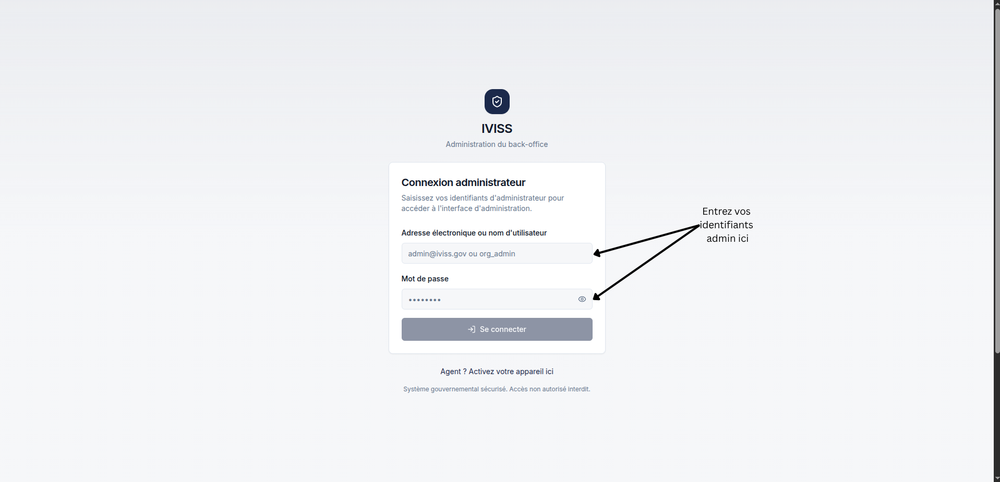

3. Entrez votre **adresse email** et votre **mot de passe**
4. Cliquez sur **Se Connecter**
5. Vous serez redirigé vers le **Tableau de Bord du Back-Office**

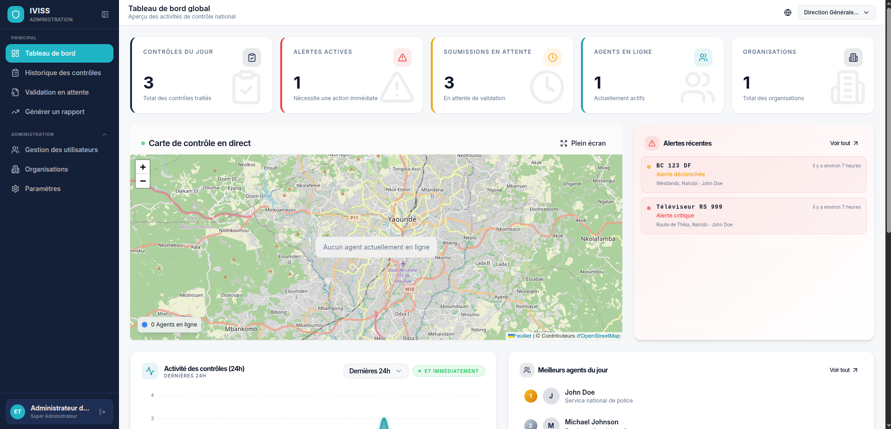

**Ce que vous verrez :**
- Tableau de bord avec les statistiques du système
- Menu de navigation à gauche avec les options Utilisateurs, Organisations, Contrôles, Rapports et Paramètres

---

#### 2. Créer Votre Première Organisation

**Ce dont vous avez besoin :**
- Accès Super Admin
- Détails de l'organisation (nom, coordonnées)

**Étapes :**

1. Depuis le tableau de bord du back-office, cliquez sur **Organisations** dans la barre latérale gauche

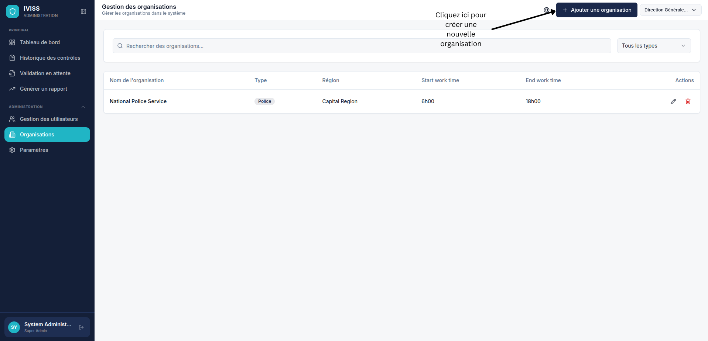

2. Cliquez sur le bouton **Ajouter une Organisation** (en haut à droite)
3. Remplissez les détails de l'organisation :
   - **Nom** : Le nom officiel de l'agence ou du département
   - **Type** : Type d'organisation
   - **Région** : Localisation physique (optionnel)
   - **Heures de travail** : Début et fin du temps de travail

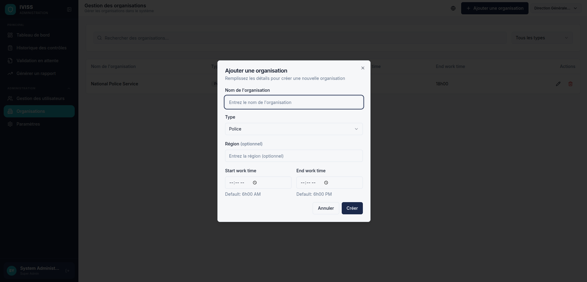

4. Cliquez sur **Créer l'Organisation**
5. La nouvelle organisation apparaît dans votre liste d'organisations

**Ce qui se passe ensuite :**
- L'organisation est maintenant active dans le système
- Vous pouvez maintenant créer un Admin d'Organisation pour cette organisation
- Les données de chaque organisation sont gardées complètement séparées des autres organisations

---

#### 3. Créer des Administrateurs d'Organisation

Les Administrateurs d'Organisation gèrent leur propre organisation - ils créent des agents, consultent des rapports et gèrent les opérations quotidiennes. En tant que Super Admin, vous créerez ces Admins d'Organisation.

**Ce dont vous avez besoin :**
- Accès Super Admin
- Détails de l'utilisateur admin (email, nom)

**Étapes :**

1. Cliquez sur **Utilisateurs** dans la barre latérale gauche
2. Cliquez sur le bouton **Ajouter un Utilisateur**

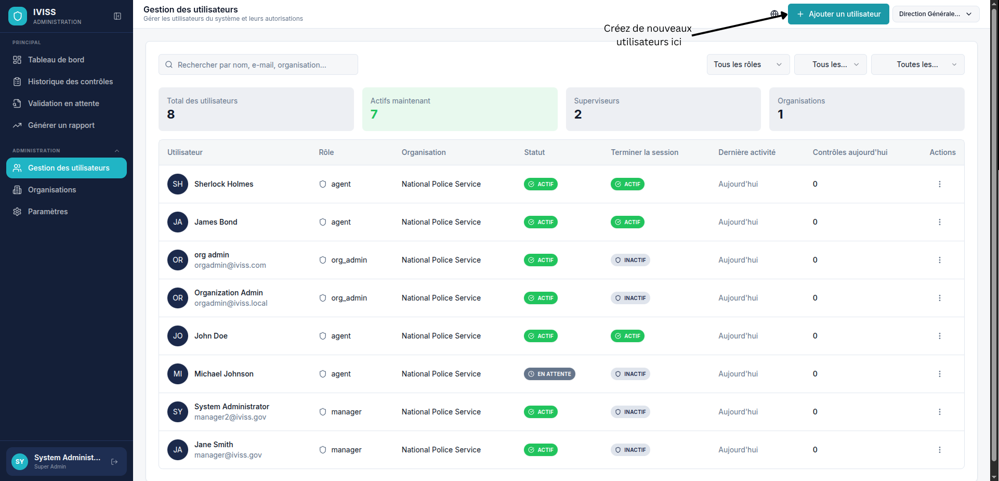

3. Remplissez les informations de l'utilisateur :
   - **Rôle** : Sélectionnez **Admin d'Organisation** dans le menu déroulant
   - **Nom d'Utilisateur** et **Nom Complet**
   - **Numéro de Téléphone** : Numéro de téléphone de l'admin d'organisation
   - **Email** : Adresse email de l'admin d'organisation (ils l'utiliseront pour se connecter)
   - **Organisation** : Sélectionnez quelle organisation cet admin gérera
   - **Numéro de badge** : Numéro de badge de l'admin d'organisation

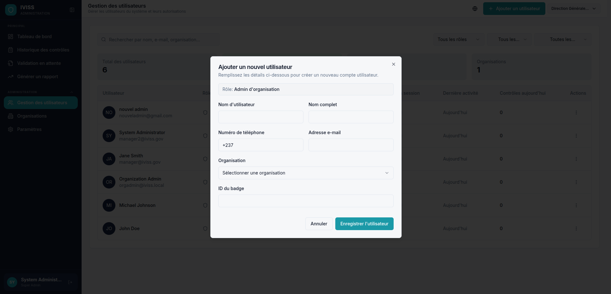

4. Cliquez sur **Enregistrer l'Utilisateur**
5. Le nouvel Admin d'Organisation reçoit ses identifiants de connexion et peut maintenant accéder au système

**Notes importantes :**
- Les Admins d'Organisation ne peuvent voir et gérer que les utilisateurs au sein de leur propre organisation
- Les Super Admins peuvent voir et gérer toutes les organisations et tous les utilisateurs
- Les mots de passe doivent être changés lors de la première connexion (voir Paramètres)

---

### Pour les Administrateurs d'Organisation

Les Administrateurs d'Organisation gèrent les opérations quotidiennes de leur agence. Vous créerez des agents de terrain, surveillerez leur activité et générerez des rapports. Si vous êtes un Admin d'Organisation, commencez ici.

#### 4. Provisionner les Agents de Terrain

**Ce dont vous avez besoin :**
- Accès Admin d'Organisation
- Détails de l'agent (nom, numéro de téléphone, numéro de badge)
- Appareil mobile de l'agent prêt

**Étapes :**

1. Cliquez sur **Utilisateurs** dans la barre latérale gauche
2. Cliquez sur le bouton **Ajouter un Utilisateur**
3. Remplissez les informations de l'agent :
   - **Rôle** : Sélectionnez **Agent** dans le menu déroulant
   - **Nom d'Utilisateur** et **Nom Complet**
   - **Numéro de Téléphone** : Doit être exact (nous enverrons un SMS à ce numéro)
   - **Adresse email** : Adresse email de l'agent
   - **Numéro de badge** : Numéro d'identification officiel de l'agent

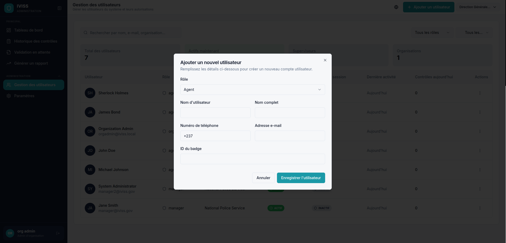

4. Cliquez sur **Enregistrer l'Utilisateur**
5. Le système crée un **code d'activation** et l'envoie par SMS au téléphone de l'agent
6. Donnez à l'agent les instructions pour activer son appareil (voir section Agent ci-dessous)

**Ce qui se passe ensuite :**
- L'agent reçoit un SMS avec son code d'activation
- L'agent peut maintenant activer son appareil et commencer à travailler au sein de votre organisation
- Vous pouvez voir le statut d'activation de l'agent dans la liste des Utilisateurs

---

### Pour les Agents de Terrain

#### 1. Activer Votre Appareil (Première Fois Seulement)

**Ce dont vous avez besoin :**
- Code d'activation reçu par SMS de votre administrateur
- Appareil mobile (smartphone ou tablette)
- Connexion Internet
- Votre numéro de badge

**Étapes :**

1. Ouvrez votre navigateur web sur votre appareil mobile
2. Accédez à l'adresse web de l'application mobile IVISS (votre administrateur vous la donnera)
3. Sur l'écran d'accueil, vous verrez **Activer l'Appareil**

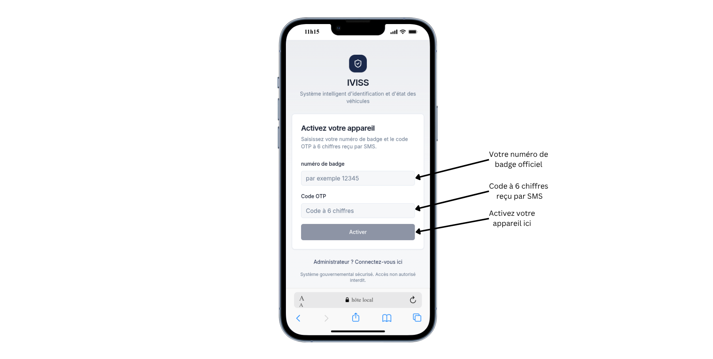

4. Entrez votre **numéro de badge**
5. Entrez le **code d'activation** de votre SMS
6. Appuyez sur **Activer**
7. Votre appareil est maintenant enregistré et vous êtes connecté

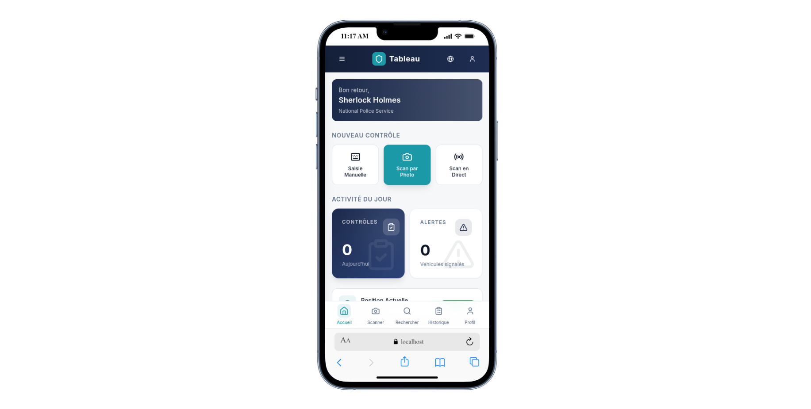

**Ce qui se passe :**
- Votre appareil crée un lien de sécurité unique avec votre compte
- Ce lien reste permanent et garde votre compte sécurisé
- Vous obtenez l'accès pour utiliser l'application
- Le statut de votre appareil est défini sur **ACTIF**

**Important :**
- Cette activation ne se produit qu'une seule fois par appareil
- Si vous effacez les données enregistrées de votre navigateur, vous devrez réactiver
- Gardez votre appareil en sécurité — c'est votre clé du système

---

#### 2. Connexion Quotidienne (Début de Chaque Quart)

**Prérequis :**
- Appareil activé
- Numéro de téléphone enregistré dans le système
- Connexion Internet

**Étapes :**

1. Ouvrez l'application IVISS sur votre appareil
2. Si votre quart précédent est terminé, vous verrez l'écran **Connexion Quotidienne**
3. Entrez votre **Numéro de badge**
4. Appuyez sur **Demander OTP**

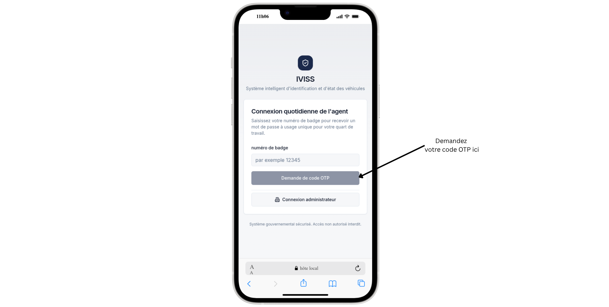

5. Attendez le SMS avec votre code quotidien (arrive dans la minute)
6. Entrez le **code à 6 chiffres** du SMS
7. Appuyez sur **Vérifier**
8. Vous êtes maintenant connecté pour votre quart

**Ce que vous verrez :**
- L'écran principal de recherche de véhicules

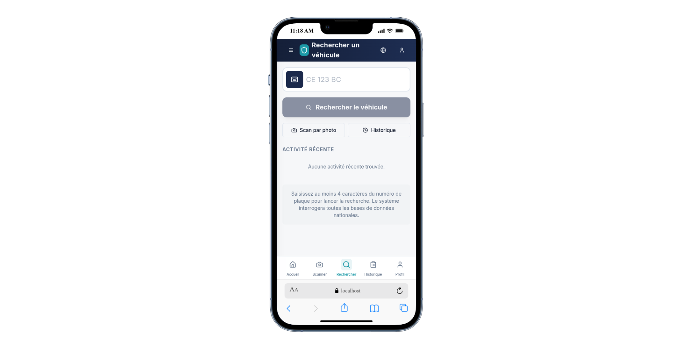

- Accès à toutes les fonctionnalités des opérations sur le terrain

**Notes importantes :**
- Les codes quotidiens expirent après 5 minutes
- Vous pouvez demander un nouveau code si le premier expire
- Maximum 3 demandes de code par 10 minutes (prévient les abus)
- Votre quart se termine automatiquement à l'heure prévue
- Vous devrez vous reconnecter pour votre prochain quart

---

#### 3. Contrôler un Véhicule

**Prérequis :**
- Quart actif (connecté)
- Numéro de plaque d'immatriculation du véhicule

**Étapes :**

##### Option A : Mode Scan en Direct (Reconnaissance en Temps Réel)

1. Depuis l'écran principal, appuyez sur l'icône **Caméra**
2. Autorisez l'accès à la caméra si demandé
3. Sélectionnez le mode **Direct** en bas de l'écran
4. Appuyez sur **Démarrer le Scan en Direct**
5. Pointez votre caméra vers la plaque d'immatriculation du véhicule
6. Gardez la plaque centrée dans le cadre du viseur
7. L'application scanne et détecte continuellement la plaque automatiquement
8. Lorsqu'une plaque valide est détectée, elle apparaît à l'écran
9. Vérifiez le numéro de plaque détecté
10. Appuyez sur **Confirmer** pour rechercher le véhicule

**Idéal pour :** Contrôles rapides lorsque le véhicule est stationnaire et que la plaque est clairement visible.

##### Option B : Mode Photo (Capture Unique avec Contrôle de Qualité)

1. Depuis l'écran principal, appuyez sur l'icône **Caméra**
2. Autorisez l'accès à la caméra si demandé
3. Sélectionnez le mode **Photo** en bas de l'écran
4. Pointez votre caméra vers la plaque d'immatriculation du véhicule
5. Gardez la plaque centrée dans le cadre du viseur
6. Appuyez sur le **bouton de capture blanc** pour prendre une photo
7. L'application automatiquement :
   - Évalue la qualité de l'image (luminosité, flou, contraste)
   - Recadre sur la zone du viseur pour une meilleure précision
   - Envoie l'image au moteur OCR
8. Vérifiez le numéro de plaque détecté
9. Si nécessaire, appuyez sur **Modifier** pour corriger les caractères
10. Appuyez sur **Confirmer** pour rechercher le véhicule

**Idéal pour :** Conditions d'éclairage difficiles, véhicules en mouvement, ou lorsque vous avez besoin d'une capture unique de haute qualité.

##### Option C : Saisir la Plaque Manuellement

1. Depuis l'écran principal, appuyez sur le champ **Numéro de Plaque**
2. Tapez le numéro de plaque d'immatriculation
   - L'application formate automatiquement pendant que vous tapez
   - Convertit en majuscules
   - Ajoute des espaces si nécessaire
3. Lorsque la plaque est valide, le bouton **Rechercher** s'active
4. Appuyez sur **Rechercher**

**Formats de plaques supportés :**
- Régional Standard : `CE 1234 A` ou `LT 123 AB`
- Police : `SN 1234`
- Militaire : `1234567` (7 chiffres)
- Gouvernement : `EN1234X`
- Postal : `RT123456`
- Diplomatique : `CD 12 345`

**Ce qui se passe ensuite :**
- Le système recherche dans la base de données nationale des véhicules
- Les contrôles de conformité s'exécutent automatiquement (assurance, douanes, contrôle technique, statut recherché)
- Les résultats apparaissent en 2-3 secondes
- Un enregistrement de contrôle est créé avec votre localisation et horodatage

---

#### 4. Consulter les Informations du Véhicule

**Ce que vous verrez après une recherche :**

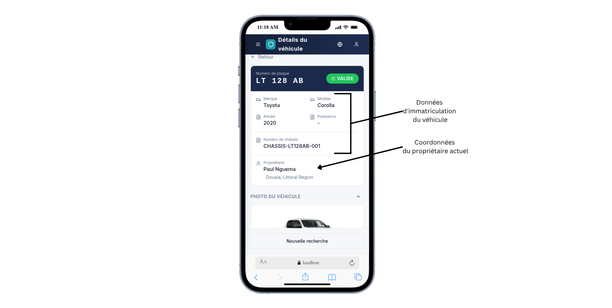

**Détails du Véhicule :**
- Numéro de plaque d'immatriculation
- Marque, modèle et année
- Couleur
- NIV (numéro de châssis)
- Informations sur le propriétaire

**Statut de Conformité :**
- **Assurance** : Valide/Invalide/Expirée avec date d'expiration
- **Dédouanement** : Dédouané/Non Dédouané avec date
- **Contrôle Technique** : Valide/Invalide avec prochaine date d'échéance
- **Statut Recherché** : Signalé/Libre

**Indicateurs de Statut :**
- ✅ **Vert** : Conforme
- ⚠️ **Jaune** : Avertissement (expire bientôt)
- ❌ **Rouge** : Non conforme ou signalé

**Notifications d'Alerte :**
- Si un véhicule est **recherché** ou **volé**, vous verrez une alerte rouge proéminente
- Si l'assurance ou le contrôle technique est **expiré**, vous verrez un avertissement
- Suivez les procédures de votre organisation pour les véhicules signalés

---

#### 5. Enregistrer une Action de Contrôle

**Prérequis :**
- Contrôle de véhicule terminé
- Raison de l'action de contrôle

**Étapes :**

1. Après avoir consulté les détails du véhicule, faites défiler jusqu'à **Actions de Contrôle**
2. Appuyez sur **Ajouter une Action**
3. Sélectionnez le **type d'action** :
   - **Contravention** : Émettre un ticket pour une infraction
   - **Avertissement** : Avertissement verbal ou écrit
   - **Mise en Fourrière** : Véhicule saisi
   - **Signalement** : Marquer pour suivi
4. Entrez les **détails** ou **notes** sur l'action
5. Ajoutez des **photos** si nécessaire (appuyez sur l'icône Caméra)
6. Appuyez sur **Enregistrer l'Action**

**Ce qui se passe :**
- L'action est enregistrée avec horodatage et votre ID d'agent
- L'action est liée à l'enregistrement de contrôle
- Votre administrateur peut examiner toutes les actions dans le back-office

**Meilleures pratiques :**
- Soyez précis dans vos notes
- Incluez les détails pertinents (localisation, circonstances, comportement du conducteur)
- Prenez des photos claires si vous documentez des dommages ou des infractions
- Suivez les directives de contrôle de votre organisation

---

#### 6. Consulter Votre Historique de Contrôles

**Étapes :**

1. Appuyez sur l'icône **Menu** (trois lignes, en haut à gauche)
2. Sélectionnez **Mes Contrôles du Jour**
3. Vous verrez une liste de tous vos contrôles de véhicules

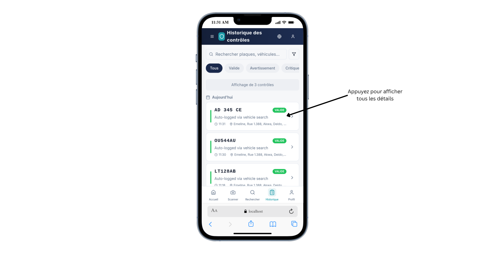

**Ce que vous pouvez faire :**
- **Filtrer** par plage de dates
- **Rechercher** des plaques spécifiques
- **Voir les détails** des contrôles passés
- **Examiner** les actions de contrôle que vous avez prises

**Informations affichées :**
- Date et heure de chaque contrôle
- Numéro de plaque d'immatriculation
- Marque et modèle du véhicule
- Statut de conformité au moment du contrôle
- Localisation où le contrôle a été effectué
- Toutes les actions de contrôle prises

---

### Pour les Administrateurs d'Organisation

Les Administrateurs d'Organisation peuvent surveiller l'activité de leur équipe et générer des rapports depuis le back-office.

#### Surveiller l'Activité des Agents

**Ce dont vous avez besoin :**
- Accès Admin d'Organisation
- Accès au back-office

**Étapes :**

1. Connectez-vous au back-office
2. Cliquez sur **Tableau de Bord** dans la barre latérale gauche
3. Consultez le **Tableau de Bord d'Activité de Contrôle**

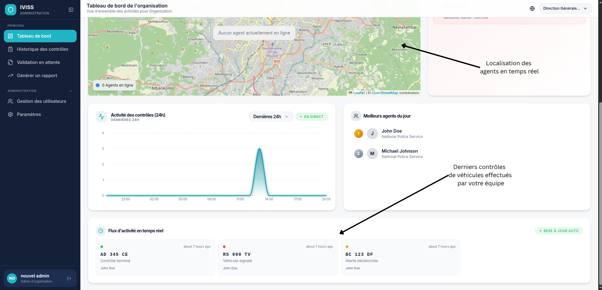

**Ce que vous verrez :**
- Carte en temps réel des localisations des agents et des contrôles récents
- Liste de tous les contrôles effectués par votre équipe
- Statistiques sur les contrôles par agent
- Tendances des violations de conformité
- Actions de contrôle prises

**Options de filtrage :**
- Par plage de dates
- Par agent spécifique
- Par statut du véhicule (conforme/non conforme)
- Par type d'action de contrôle

---

## Flux de Travail Courants

### Flux de Travail 1 : Début de Quart le Matin

**Pour les Agents :**

1. Arrivez à votre poste ou zone de patrouille
2. Ouvrez l'application IVISS sur votre appareil
3. Demandez votre code de connexion quotidien
4. Vérifiez votre téléphone pour le code SMS
5. Entrez le code pour commencer votre quart
6. Commencez la patrouille et les contrôles de véhicules

**Temps requis :** 2-3 minutes

---

### Flux de Travail 2 : Contrôle Routier de Véhicule

**Pour les Agents :**

1. Arrêtez un véhicule pour inspection
2. Ouvrez l'application IVISS (déjà connecté)
3. Scannez la plaque d'immatriculation ou saisissez-la manuellement
4. Attendez 2-3 secondes pour les résultats
5. Examinez les détails du véhicule et le statut de conformité
6. Vérifiez les alertes (recherché, volé, documents expirés)
7. Si non conforme, enregistrez une action de contrôle
8. Si conforme, informez le conducteur et laissez-le partir
9. Passez au véhicule suivant

**Temps requis :** 1-2 minutes par véhicule

---

### Flux de Travail 3 : Gestion d'un Véhicule Signalé

**Pour les Agents :**

1. Recherchez le véhicule (scan ou saisie manuelle)
2. Voyez l'**ALERTE ROUGE** pour le statut recherché/volé
3. **N'approchez pas seul** — suivez les protocoles de sécurité
4. Appelez des renforts si nécessaire
5. Enregistrez l'observation avec les détails de localisation
6. Prenez des photos si c'est sûr de le faire
7. Suivez les procédures de votre organisation pour les véhicules recherchés
8. Complétez l'enregistrement de contrôle avec des notes détaillées

**Important :** Votre sécurité passe en premier. Ne vous mettez jamais en danger.

---

### Flux de Travail 4 : Fin de Quart

**Pour les Agents :**

1. Terminez vos contrôles de véhicules finaux
2. Retournez à votre poste
3. L'application vous déconnecte automatiquement à l'heure de fin de quart
4. Examinez les actions ou rapports en attente
5. Fermez l'application
6. Votre appareil retourne en mode veille

**Pour les Administrateurs d'Organisation :**

1. Examinez l'activité de contrôle de la journée
2. Vérifiez les véhicules signalés ou les problèmes
3. Générez un rapport récapitulatif quotidien
4. Faites le suivi des actions de contrôle
5. Préparez le briefing pour le prochain quart

---

### Flux de Travail 5 : Ajout d'un Nouvel Agent

**Pour les Admins d'Organisation :**

1. Collectez les informations de l'agent (nom, téléphone, numéro de badge)
2. Connectez-vous au back-office
3. Naviguez vers Utilisateurs → Ajouter un Utilisateur
4. Entrez les détails de l'agent et créez le compte
5. Le système envoie le code d'activation par SMS
6. Fournissez à l'agent les instructions d'activation de l'appareil
7. Vérifiez que l'agent active avec succès son appareil
8. Briefez l'agent sur les procédures et les attentes

**Temps requis :** 5-10 minutes

---

## Résolution des Problèmes Courants

### Problème : "Code d'activation non reçu"

**Causes possibles :**
- Mauvais numéro de téléphone saisi
- Retard SMS de l'opérateur
- Le téléphone n'a pas de signal

**Solutions :**
1. Vérifiez que le numéro de téléphone est correct
2. Attendez 2-3 minutes pour la livraison du SMS
3. Vérifiez la force du signal du téléphone
4. Demandez un nouveau code (attendez 10 minutes entre les demandes)
5. Contactez votre administrateur si le problème persiste

---

### Problème : "Code d'activation invalide"

**Causes possibles :**
- Code expiré (5 minutes)
- Code déjà utilisé
- Erreur de saisie du code

**Solutions :**
1. Demandez un nouveau code
2. Entrez le code soigneusement (6 chiffres)
3. Utilisez le code le plus récent reçu
4. Contactez votre administrateur si le problème continue

---

### Problème : "Appareil suspendu"

**Causes possibles :**
- L'administrateur a suspendu votre appareil
- Préoccupation de sécurité
- Appareil signalé perdu ou volé

**Solutions :**
1. Contactez immédiatement votre administrateur
2. N'essayez pas de contourner la suspension
3. Attendez que l'administrateur restaure l'accès
4. Vous devrez peut-être réactiver votre appareil

---

### Problème : "Impossible de scanner la plaque d'immatriculation"

**Causes possibles :**
- Mauvaises conditions d'éclairage
- Plaque sale ou endommagée
- Caméra non focalisée
- Format de plaque non reconnu
- Qualité d'image trop faible (floue, trop sombre, trop lumineuse)

**Solutions :**
1. **Passez en Mode Photo** — fournit des retours de qualité et une meilleure précision
2. Assurez un bon éclairage (utilisez une lampe de poche si nécessaire)
3. Nettoyez la plaque si elle est sale
4. Tenez la caméra stable et attendez la mise au point
5. En Mode Photo, suivez les messages de retour de qualité :
   - "Image trop floue" → Tenez la caméra plus stable
   - "Image trop sombre" → Ajoutez plus de lumière ou rapprochez-vous
   - "Image trop lumineuse" → Réduisez la lumière directe du soleil ou ajustez l'angle
6. Essayez la saisie manuelle à la place
7. Assurez-vous que la plaque est dans un format supporté

---

### Problème : "Véhicule non trouvé"

**Causes possibles :**
- Véhicule non enregistré dans la base de données nationale
- Numéro de plaque saisi incorrectement
- Nouveau véhicule pas encore dans le système
- Véhicule étranger

**Solutions :**
1. Vérifiez que le numéro de plaque est correct
2. Essayez de ressaisir ou de rescanner
3. Vérifiez si le format de plaque est valide
4. Pour les véhicules non enregistrés, suivez les procédures de votre organisation
5. Enregistrez l'incident dans vos notes

---

### Problème : "Le statut de conformité affiche 'Inconnu'"

**Causes possibles :**
- API partenaire temporairement indisponible
- Délai d'attente réseau
- Données du véhicule incomplètes

**Solutions :**
1. Attendez 30 secondes et recherchez à nouveau
2. Vérifiez votre connexion Internet
3. Notez le statut inconnu dans votre rapport
4. Faites un suivi ultérieur ou utilisez des méthodes de vérification alternatives
5. Signalez les problèmes persistants à votre administrateur

---

## Meilleures Pratiques de Sécurité

### Pour Tous les Utilisateurs

1. **Ne partagez jamais vos identifiants** avec qui que ce soit
2. **Déconnectez-vous** lorsque vous n'utilisez pas le système
3. **Signalez immédiatement toute activité suspecte**
4. **Gardez votre appareil sécurisé** — utilisez le verrouillage d'écran
5. **N'écrivez pas les mots de passe** — utilisez un gestionnaire de mots de passe
6. **Changez votre mot de passe** si vous soupçonnez qu'il a été compromis
7. **Méfiez-vous du phishing** — vérifiez les URL avant de saisir les identifiants

### Pour les Agents

1. **Gardez votre appareil avec vous** en tout temps pendant le quart
2. **Ne laissez pas d'autres utiliser votre appareil** pour IVISS
3. **Signalez immédiatement les appareils perdus ou volés**
4. **Effacez les données du navigateur** si l'appareil est compromis
5. **Utilisez un verrouillage d'appareil fort** (PIN, empreinte digitale, Face ID)
6. **Ne partagez pas les codes d'activation** ou les codes de connexion quotidiens
7. **Déconnectez-vous** si vous laissez l'appareil sans surveillance

### Pour les Administrateurs

1. **Examinez régulièrement l'accès des utilisateurs**
2. **Suspendez rapidement les comptes inactifs**
3. **Surveillez les activités inhabituelles** dans les journaux d'audit
4. **Utilisez des mots de passe forts** pour les comptes admin
5. **Activez l'authentification à deux facteurs** si disponible
6. **Limitez les privilèges admin** aux utilisateurs nécessaires uniquement
7. **Gardez les informations de contact** à jour pour tous les utilisateurs

---

## Comprendre les Rôles et les Permissions

### Super Admin

**Qui ils sont :** Administrateurs à l'échelle du système qui configurent et gèrent l'ensemble de la plateforme IVISS.

**Peut faire :**
- Créer et gérer toutes les organisations
- Créer et gérer les Admins d'Organisation pour chaque organisation
- Voir toutes les données système et les journaux d'audit dans toutes les organisations
- Configurer les paramètres à l'échelle du système
- Accéder à tous les rapports et analyses de n'importe quelle organisation
- Suspendre ou restaurer n'importe quel utilisateur ou appareil

**Ne peut pas faire :**
- Effectuer des opérations sur le terrain (fonctions d'agent)

**Utilisateurs typiques :** Administrateurs système, personnel informatique, gestionnaires de plateforme

---

### Admin d'Organisation

**Qui ils sont :** Administrateurs qui gèrent les opérations quotidiennes d'une seule organisation.

**Peut faire :**
- Gérer les utilisateurs au sein de leur organisation uniquement
- Créer et assigner des agents de terrain
- Voir les données et rapports de leur organisation
- Configurer les paramètres de leur organisation
- Suspendre ou restaurer les utilisateurs et appareils dans leur organisation
- Générer des rapports pour leur organisation
- Surveiller l'activité et les performances des agents

**Ne peut pas faire :**
- Accéder aux données d'autres organisations
- Créer ou modifier des organisations
- Effectuer des opérations sur le terrain (fonctions d'agent)
- Modifier les paramètres à l'échelle du système
- Voir ou gérer les utilisateurs d'autres organisations

**Utilisateurs typiques :** Chefs de département, gestionnaires d'opérations, administrateurs d'agence

---

### Agent

**Qui ils sont :** Agents de terrain qui effectuent des contrôles de véhicules et des actions de contrôle.

**Peut faire :**
- Effectuer des contrôles de véhicules (scan ou saisie manuelle)
- Voir les détails des véhicules et le statut de conformité
- Enregistrer des actions de contrôle
- Voir leur propre historique de contrôles
- Mettre à jour leur profil et mot de passe

**Ne peut pas faire :**
- Voir l'activité d'autres agents
- Accéder à l'administration du back-office
- Créer ou gérer des utilisateurs
- Générer des rapports système
- Modifier les paramètres de l'organisation

**Utilisateurs typiques :** Agents de terrain, agents de patrouille, agents de contrôle

---

## Configuration Système Requise

### Pour les Agents Mobiles

**Appareil :**
- Smartphone ou tablette
- Android 8.0+ ou iOS 12.0+
- Caméra (pour le scan de plaques)
- GPS (pour le suivi de localisation)

**Navigateur :**
- Chrome 90+
- Safari 14+
- Firefox 88+
- Edge 90+

**Réseau :**
- Connexion 3G/4G/5G ou WiFi
- Vitesse de téléchargement minimale de 1 Mbps

**Stockage :**
- 50 Mo d'espace libre pour les données de l'application
- Espace supplémentaire pour les photos (si prise de photos de contrôle)

---

### Pour les Utilisateurs du Back-Office

**Appareil :**
- Ordinateur de bureau, ordinateur portable ou tablette
- Windows 10+, macOS 10.14+ ou Linux

**Navigateur :**
- Chrome 90+ (recommandé)
- Firefox 88+
- Safari 14+
- Edge 90+

**Réseau :**
- Connexion Internet haut débit
- Vitesse de téléchargement minimale de 5 Mbps (pour les rapports et tableaux de bord)

**Affichage :**
- Résolution minimale de 1280x720
- 1920x1080 ou supérieur recommandé

---

## Obtenir de l'Aide

### Contacter Votre Administrateur

Pour les problèmes concernant :
- Accès au compte ou mots de passe
- Activation ou suspension d'appareil
- Permissions ou rôles d'utilisateur
- Paramètres de l'organisation

Contactez l'administrateur IVISS de votre organisation.

### Support Technique

Pour les problèmes techniques :
- Erreurs système ou bugs
- Problèmes de performance
- Demandes de fonctionnalités
- Questions d'intégration

Contactez le support technique IVISS (coordonnées fournies par votre administrateur système).

## Foire Aux Questions

**Q : Combien de temps prend l'activation de l'appareil ?**
R : 2-3 minutes une fois que vous recevez votre code d'activation.

**Q : Puis-je utiliser IVISS sur plusieurs appareils ?**
R : Chaque appareil doit être activé séparément. Contactez votre administrateur pour enregistrer des appareils supplémentaires.

**Q : Que se passe-t-il si je perds mon appareil ?**
R : Signalez-le immédiatement à votre administrateur. Ils suspendront l'appareil pour empêcher tout accès non autorisé.

**Q : Puis-je travailler hors ligne ?**
R : IVISS est une Application Web Progressive avec des capacités hors ligne limitées. Vous pouvez consulter les données précédemment chargées, mais les recherches de véhicules nécessitent une connexion Internet.

**Q : Combien de temps durent les codes de connexion quotidiens ?**
R : 5 minutes. Demandez un nouveau code si le vôtre expire.

**Q : Puis-je modifier mes heures de quart ?**
R : Contactez votre administrateur pour ajuster les heures de quart.

**Q : Quelle est la différence entre le Scan en Direct et le Mode Photo ?**
R : Le Scan en Direct détecte continuellement les plaques en temps réel, tandis que le Mode Photo capture une seule image de haute qualité avec des contrôles de qualité et vous permet de modifier le résultat avant la recherche.

**Q : Pourquoi le Mode Photo rejette-t-il mon image ?**
R : Le Mode Photo inclut des contrôles de qualité pour le flou, la luminosité et le contraste. Suivez les messages de retour pour améliorer la qualité de l'image (ajoutez de la lumière, tenez stable, ajustez l'angle).

**Q : Puis-je modifier un numéro de plaque détecté ?**
R : Oui, en Mode Photo, vous pouvez appuyer sur **Modifier** pour corriger manuellement les caractères mal lus avant de confirmer la recherche.

**Q : Que faire si un véhicule a plusieurs problèmes de conformité ?**
R : Enregistrez tous les problèmes dans vos notes d'action de contrôle. Vous pouvez ajouter plusieurs actions à un seul enregistrement de contrôle.

**Q : Comment mettre à jour mes informations de profil ?**
R : Allez dans Paramètres → Profil dans l'application ou le back-office.

**Q : Puis-je supprimer un enregistrement de contrôle ?**
R : Non. Tous les enregistrements de contrôle sont permanents à des fins d'archivage. Contactez votre administrateur si vous devez ajouter des corrections ou des notes.

**Q : Jusqu'où puis-je consulter mon historique de contrôles ?**
R : Tous vos contrôles sont disponibles indéfiniment. Utilisez les filtres de date pour trouver des enregistrements spécifiques.

---

## Glossaire

| Terme | Définition |
|-------|------------|
| **Agent** | Un utilisateur de terrain qui effectue des contrôles de véhicules et des actions de contrôle. |
| **Code d'Activation** | Un code à usage unique envoyé par SMS pour enregistrer un nouvel appareil. |
| **Back-Office** | L'interface administrative basée sur le web pour les administrateurs. |
| **Statut de Conformité** | Si un véhicule répond aux exigences d'assurance, de douanes, de contrôle technique, etc. |
| **Contrôle** | Un contrôle ou une inspection de véhicule effectué par un agent. |
| **Enregistrement de Contrôle** | La documentation complète d'un contrôle de véhicule, incluant l'horodatage, la localisation et les résultats. |
| **Connexion Quotidienne** | La vérification basée sur SMS requise au début de chaque quart. |
| **Liaison d'Appareil** | Le lien sécurisé entre le compte d'un agent et son appareil physique. |
| **Action de Contrôle** | Une action enregistrée prise contre un véhicule (contravention, avertissement, mise en fourrière, signalement). |
| **Multi-Tenant** | Conception système qui garde les données de chaque organisation complètement séparées. |
| **Admin d'Organisation** | Administrateur qui gère les opérations et les utilisateurs d'une seule organisation. |
| **OTP** | Mot de Passe à Usage Unique — un code temporaire envoyé par SMS pour la connexion. |
| **PWA** | Application Web Progressive — une application web qui fonctionne comme une application native avec support hors ligne. |
| **RBAC** | Contrôle d'Accès Basé sur les Rôles — système de permissions basé sur les rôles d'utilisateur. |
| **Quart** | La période de temps pendant laquelle un agent est connecté et autorisé à travailler. |
| **Super Admin** | Administrateur à l'échelle du système avec accès à toutes les organisations. |
| **Statut Recherché** | Indique si un véhicule est signalé volé ou marqué par les autorités. |

---

## Version du Document

**Version :** 1.0
**Dernière Mise à Jour :** 30 avril 2026
**Auteur :** Équipe de Développement IVISS

Pour la dernière version de ce guide, contactez votre administrateur système.

---

**Bienvenue sur IVISS. Nous sommes là pour rendre votre travail plus sûr, plus rapide et plus efficace.**
