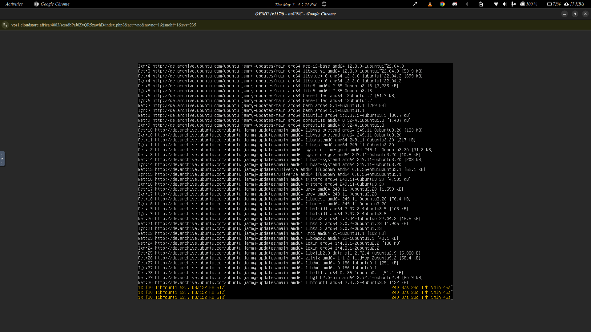

# VPS Infrastructure Benchmark — CloudStore Africa

---

## Objective

Test and compare two deployment scenarios for IVISS on CloudStore VPS Africa:

---

**Setup:** PostgreSQL hosted on CloudStore VPS Africa, application (frontend + backend) remaining on AWS Lightsail.

### Issues Encountered

**1. Bandwidth far below advertised specs**

CloudStore's documentation advertises a bandwidth of **2 Mbps**. During testing, the actual measured speed was **below 1 Mbps**. This made Docker image pulls and package installations extremely slow and in some cases impossible to complete within a reasonable time.
And it happened to vary from time to time. 
Internet speed seemed to be faster at some points that other points.

This is an image sample of `apt update` command

#### Causes of this poor bandwidth

- **Internet provider:** CloudStore uses **Camtel** as their internet provider as backbone and other sub ones like orange etc.

- **Shared Network Uplinks:** Most standard VPS plans share a single physical network port with dozens of other virtual machines. If other users on your "node" are performing heavy tasks, your available bandwidth for downloads can drop to a crawl.

**2. VPS resource considerations**

The VPS plan used had the following specs:

| Resource | Value |
|---|---|
| RAM | 2 GB (includes swap space) |
| Storage | 20 GB (includes swap partition) |
| CPU | 1 vCPU |

These specifications are adequate for the Scenario where we have the database only. However, they would not be sufficient to run the full stack.

---

### Conclusion 

The VPS infrastructure limitations prevented a reliable deployment and meaningful performance measurement. The combination of low bandwidth made the environment unsuitable for this test.

---

## Recommendation

Before retrying this benchmark, the following minimum VPS specifications are recommended:

| Resource | Minimum recommended |
|---|---|
| RAM | 4 GB (dedicated, no swap dependency) |
| Storage | 40 GB SSD |
| CPU | 2 vCPUs |
| Bandwidth | A good and stable internet |

*IVISS Infrastructure Team — May 2026*

---